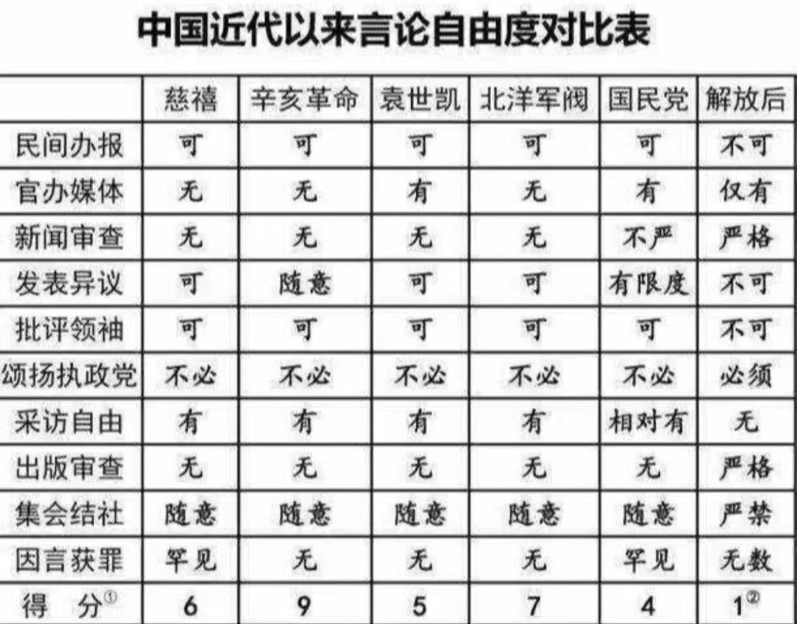
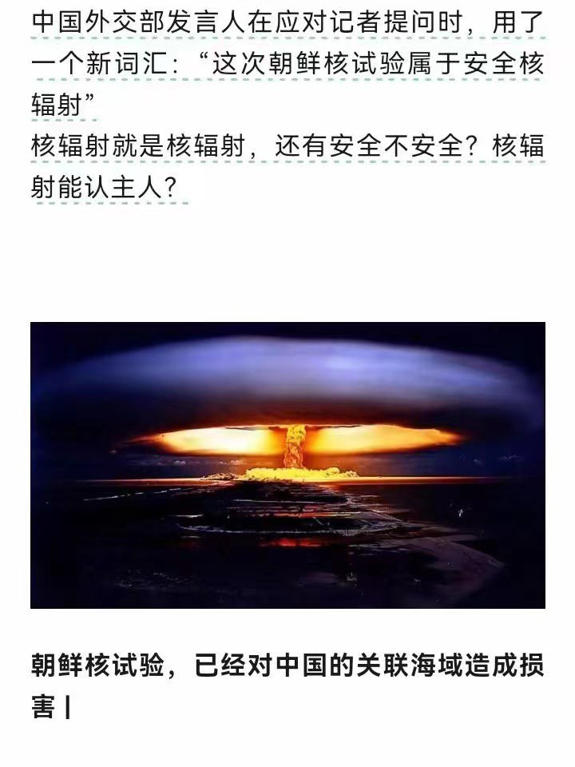

Petrichor 北京时间 2024-02-20T22:41:23Z 1759951387771760795 许多中国人相信未来会更好。其实不然。赶走了恶狼，迎来了暴虎，倒车回去。从民国会过渡到民主法制国家（就如现在台湾），民国毕竟保护私有财产、土地私有、百姓有拥枪自已、新闻自由、大学独立…..从共产独裁体制是过渡不到民主自由的，东朝鲜就是例子，它扼杀一切可能导致民主的小苗。 https://t.co/pFOCN5Y0qa   Petrichor 北京时间 2024-02-20T22:03:23Z 1759941823739383846 许多中国人相信未来会更好。其实不然。赶走了恶狼，迎来了暴虎。从民国会过渡到民主法制国家（就如现在台湾）毕竟保护私有财产、土地私有、百姓有拥枪自已、新闻自由、大学独立…..从共产独裁体制是过渡不到民主自由的，东朝鲜就是例子。 https://t.co/Ebz1el7Ijz   Petrichor 北京时间 2024-02-20T11:12:40Z 1759778065851253059 隋末至唐初，从公元611到628年18年间，兵变、民变和宫廷政变共136次，有50多位称帝称王者，均统兵15万人以上，各据一方，相互混战。全国户数由890万减至290万，人口由公元606年的4602万人，减到639年的1235万人，损失率73%。   Petrichor 北京时间 2024-02-20T11:14:41Z 1759778574263836834 公元2年，全国人口5959万。经过西汉末年的混战，到东汉初的公元57年，人口只剩下2100万，损失率达65%。20年间，西安的人口从68万减到28万，大荔从91万减到14万，兴平县从83万减到9万，绥远县从69万减到2万。   Petrichor 北京时间 2024-02-20T09:24:55Z 1759750947926896905 有的屁臭，有的屁不臭。这话或许还有些道理在。但是说安全核辐射，却是完全错误的。核辐射，都不安全。不能说朝鲜在黄海的核爆炸是安全核辐射，而日本在核电站排水就是危害核辐射。 https://t.co/FVMYyxWWvJ   Petrichor 北京时间 2024-02-20T10:14:13Z 1759763354875293823 中国历史上的战争大多发生在中国人与中国人之间，而不是中国人与外国人之间。中国人杀自己同胞最起劲，胜利者更是以同胞多而骄傲。打开中国电视，电视剧里大多是中共如何打败国军的，消灭“800万蒋匪军”的。1949年后留在中国大陆曾做过国民党村长以上官的都受到清算。中共党史也说共产党为了夺取政权，牺牲了1065万人。无论共产党还是国民党不都是自己同胞吗？与之相比，美国南北战争的结果就非常人性，这就是美国伟大的地方。

中国历史没有改朝换代的战争，人口基本减半。内乱也是对自己同胞杀来杀去。1853年3月太平军攻下南京城杀了40万人。1864年，大清的曾国藩率领湘军收复南京，又杀了60万人。   Petrichor 北京时间 2024-02-20T10:14:40Z 1759763468725465223 今年气候反常，中国许多地方太冷。例如，新疆气温骤降至零下52度，湖里成群的水鸟都冻死了，而北美却不如往年冷。 https://t.co/Qmms5TIjXy   Petrichor 北京时间 2024-02-20T10:16:42Z 1759763982032728484 落后不一定挨打，流氓一定挨打。
晚清挨打，说明这一点。习近平现在在国际上受孤立，在国内也被背亿万老百姓背地里骂，也是他自已原因，不是因为他不强大，而是因为他太强大，太蛮横。 https://t.co/d5bjHYRLNI   Petrichor 北京时间 2024-02-20T03:05:29Z 1759655461903614426 王战狼怎么了？不如往常勇猛好斗了。主子改弦更张了？

“中加经济互补性强，双方不存在根本利益冲突。双方不是竞争对手，更不是敌人，而应该是合作伙伴。中加两国制度、历史、文化不同，双方应相互尊重、相互学习，扩大共识、重建信任，实现合作共赢。” 王毅近日对加拿大外交部长说。就怕加拿大朝野上下没人再相信他了。

只要中共在联合国等国际社会里继续支持俄罗斯、伊朗、朝鲜，只要中共还在资助大外宣黑白颠倒，只要中共还在利用各式社团和所谓的侨领和小粉红监视所在国公民和干涉所在国选举和内政、欧美国家就不可能信任中共，脱钩就势在必然。   