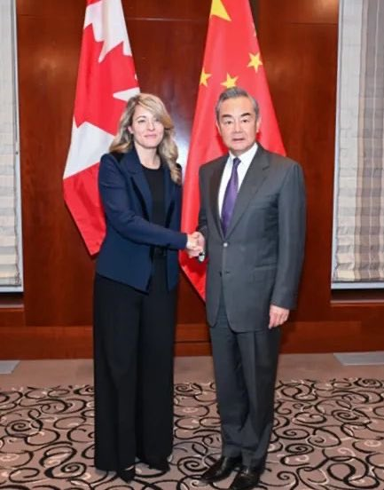
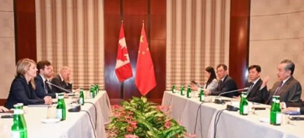

Petrichor 北京时间 2024-02-20T03:05:29Z 1759655461903614426 王战狼怎么了？不如往常勇猛好斗了。主子改弦更张了？

“中加经济互补性强，双方不存在根本利益冲突。双方不是竞争对手，更不是敌人，而应该是合作伙伴。中加两国制度、历史、文化不同，双方应相互尊重、相互学习，扩大共识、重建信任，实现合作共赢。” 王毅近日对加拿大外交部长说。就怕加拿大朝野上下没人再相信他了。

只要中共在联合国等国际社会里继续支持俄罗斯、伊朗、朝鲜，只要中共还在资助大外宣黑白颠倒，只要中共还在利用各式社团和所谓的侨领和小粉红监视所在国公民和干涉所在国选举和内政、欧美国家就不可能信任中共，脱钩就势在必然。   