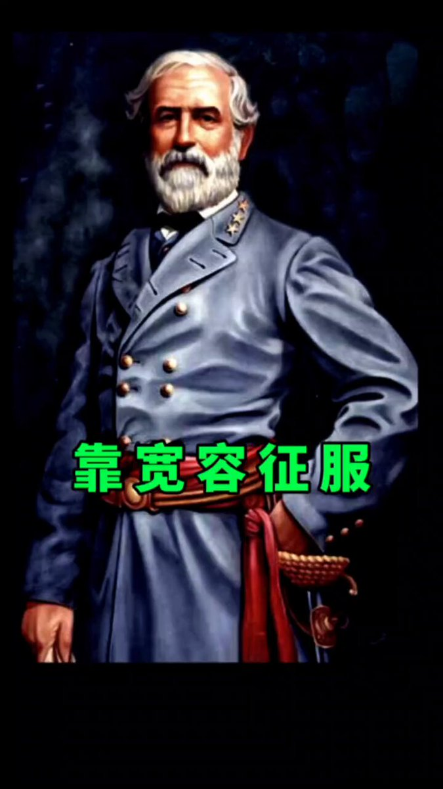

Petrichor 北京时间 2024-02-20T10:14:13Z 1759763354875293823 中国历史上的战争大多发生在中国人与中国人之间，而不是中国人与外国人之间。中国人杀自己同胞最起劲，胜利者更是以同胞多而骄傲。打开中国电视，电视剧里大多是中共如何打败国军的，消灭“800万蒋匪军”的。1949年后留在中国大陆曾做过国民党村长以上官的都受到清算。中共党史也说共产党为了夺取政权，牺牲了1065万人。无论共产党还是国民党不都是自己同胞吗？与之相比，美国南北战争的结果就非常人性，这就是美国伟大的地方。

中国历史没有改朝换代的战争，人口基本减半。内乱也是对自己同胞杀来杀去。1853年3月太平军攻下南京城杀了40万人。1864年，大清的曾国藩率领湘军收复南京，又杀了60万人。   Petrichor 北京时间 2024-02-20T10:14:40Z 1759763468725465223 今年气候反常，中国许多地方太冷。例如，新疆气温骤降至零下52度，湖里成群的水鸟都冻死了，而北美却不如往年冷。 https://t.co/Qmms5TIjXy   Petrichor 北京时间 2024-02-20T10:16:42Z 1759763982032728484 落后不一定挨打，流氓一定挨打。
晚清挨打，说明这一点。习近平现在在国际上受孤立，在国内也被背亿万老百姓背地里骂，也是他自已原因，不是因为他不强大，而是因为他太强大，太蛮横。 https://t.co/d5bjHYRLNI   Petrichor 北京时间 2024-02-20T03:05:29Z 1759655461903614426 王战狼怎么了？不如往常勇猛好斗了。主子改弦更张了？

“中加经济互补性强，双方不存在根本利益冲突。双方不是竞争对手，更不是敌人，而应该是合作伙伴。中加两国制度、历史、文化不同，双方应相互尊重、相互学习，扩大共识、重建信任，实现合作共赢。” 王毅近日对加拿大外交部长说。就怕加拿大朝野上下没人再相信他了。

只要中共在联合国等国际社会里继续支持俄罗斯、伊朗、朝鲜，只要中共还在资助大外宣黑白颠倒，只要中共还在利用各式社团和所谓的侨领和小粉红监视所在国公民和干涉所在国选举和内政、欧美国家就不可能信任中共，脱钩就势在必然。   