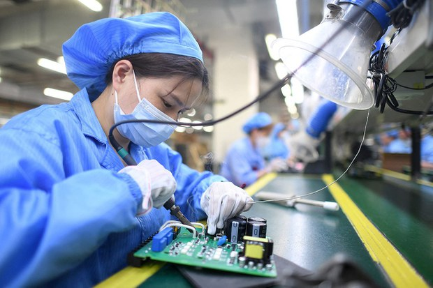
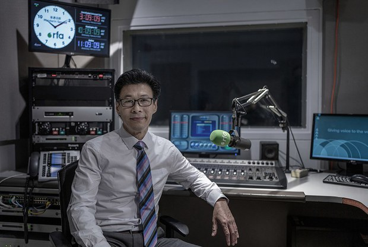

自由亚洲电台 北京时间 2024-02-20T00:30:55Z 1759616565153341446 台湾政府发布，#台商 对中国 #大陆投资 占所有对外投资的金额及比重，持续探底，从十三年前占比超过八成到去年创下历史新低只剩约一成。美国媒体也报道指出，外商对中国新增直接投资大幅骤减超过八成，创下 #三十年来新低。https://t.co/nlXUJYEBPQ https://t.co/2WBvc1gyMj   自由亚洲电台 北京时间 2024-02-20T00:32:25Z 1759616942049276244 专栏 | #劳工通讯：广东奋达科技公司员工罢工 （一） https://t.co/PaHgpViFwH   