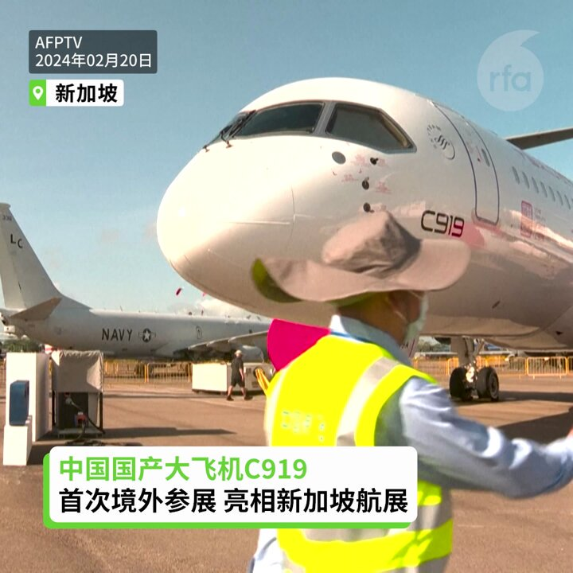
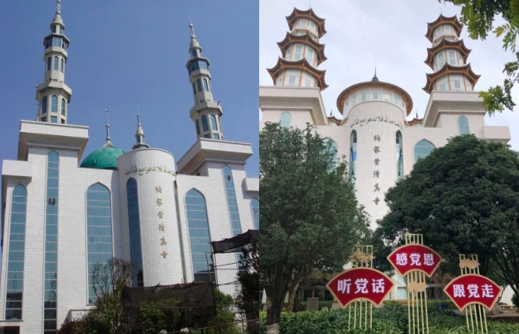
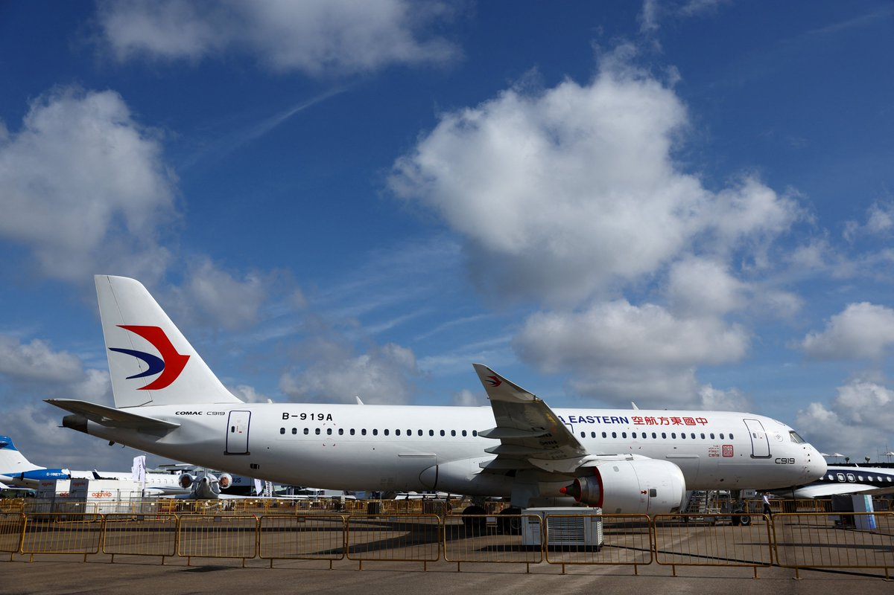
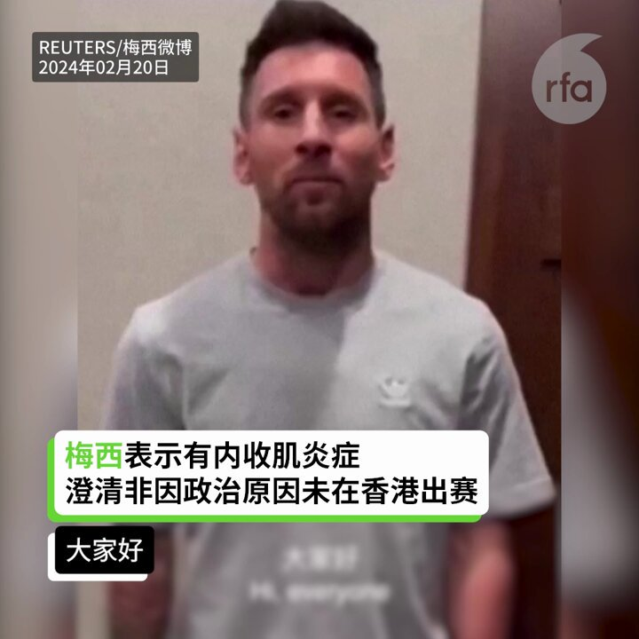
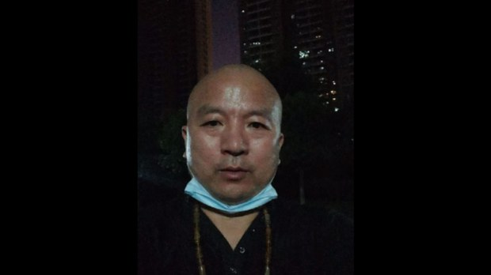
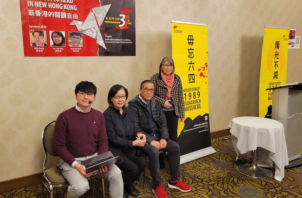
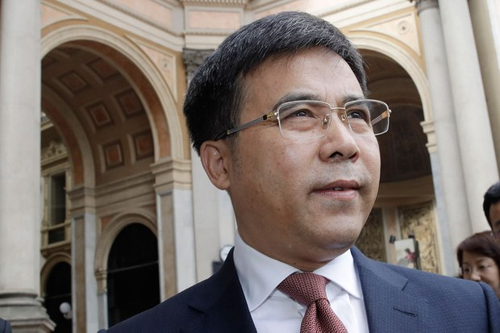
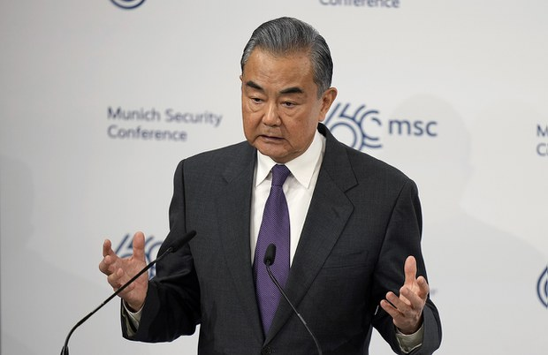
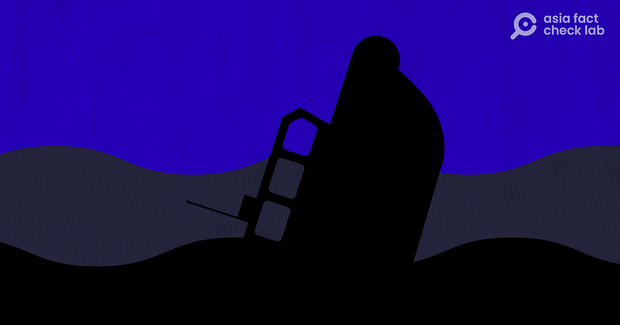

自由亚洲电台 北京时间 2024-02-20T17:21:15Z 1759870823392055613 【C919首次境外参展 亮相新加坡航展】
【海外市场销售有多大空间？】
中国2架大型客机C919和3架支线客机ARJ21首次亮相新加坡航展，中国媒体高调宣传。不过，C919关键零部件大多来自欧美，而且还没有取得欧美适航认证，对海外市场销售有多大空间，有待观察。 #C919 https://t.co/1C3DA7kTlL   自由亚洲电台 北京时间 2024-02-20T14:56:16Z 1759834335379902527 【云南通海九成清真寺“中国化”】
【纳家营清真寺门口现“感恩党”标牌】
中国云南 #纳家营 #清真寺 的阿拉伯式外观，去年遭当局强行拆除，引发警民冲突；如今纳家营清真寺原有翡翠色的 #穹顶 和宣礼塔被改为中式古塔建筑。清真寺门口还竖立起“#听党话”等标牌。当地穆斯林披露，九成清真寺已经“中国化”。
#宗教中国化
https://t.co/80PtyyrEst   自由亚洲电台 北京时间 2024-02-20T16:11:32Z 1759853276915552496 【C919等两款中国客机亮相新加坡】
【专家：飞机无欧美适航认证难销海外】
中国产两款商用飞机 #C919 和ARJ21，本周二（20日）首次亮相 #新加坡航展。据中国专家说，中国商用飞机的发动机等重要部件来自美国和欧美，一旦被“卡脖子”，很难量产，而且中国商用客机未通过美国和欧盟 #适航认证，在海外市场难有销售空间。
https://t.co/fi9YM6ei29   自由亚洲电台 北京时间 2024-02-20T14:12:03Z 1759823209615196211 RT @RFA_Chinese: 【冯客看后毛时代中国 西方误认改开放后中国会民主化】
【因拒绝相信中共是“真的”共产主义者】
最近出版新书《毛泽东之后的中国--一个强国崛起的真相》的历史学家 #冯客 (Frank Dikötter)在接受自由亚洲电台专访时指出，西方学者误判中…   自由亚洲电台 北京时间 2024-02-20T11:11:36Z 1759777797642596480 【梅西澄清非因政治原因未在香港出赛】
【梅西表示有内收肌炎症】
【梅西说对中国球迷有特别的感情】
梅西录制视频在他的微博帐号发布，引起网友关注。梅西说有人说他因为政治原因或许多其他原因不想(在香港)参赛，这些都不是真的。真实的情况是，他有内收肌炎症。梅西最后强调: “一如既往的，我想向中国的所有球迷送上最好的祝福，我一直对你们抱有特别的感情，并将继续如此，希望不久我们能再见，大大的拥抱，保重！” #梅西   自由亚洲电台 北京时间 2024-02-20T07:16:07Z 1759718537273454609 以高姿态声言退出中国共产党的湖北异议人士 #毛善春 在湖北召开两会期间被当局扣押。家属透露，他涉及的控罪与 #颠覆国家政权 有关。据了解，毛善春的父亲其后被发现在家中死亡。https://t.co/pB1PkBajuP https://t.co/TJTDkvF526   自由亚洲电台 北京时间 2024-02-20T07:17:12Z 1759718807533502895 2024年是"#六四"”事件三十五周年、香港 #雨伞运动 十周年以及 #香港反修例运动 五周年。#温哥华支援民主运动联合会(温支联)举办首场纪念活动 -"新香港的阅读自由"讲座，希望民众不要忘记历史，继续发挥对抗极权的力量。https://t.co/zJD1cPaRkv https://t.co/6s8NQHolPa   自由亚洲电台 北京时间 2024-02-20T07:19:08Z 1759719296538907131 原中国银行党委书记、董事长 #刘连舸 被起诉 涉嫌受贿、违法发放贷款 https://t.co/TGqpy2U1RJ https://t.co/V6mwUSXUdQ   自由亚洲电台 北京时间 2024-02-20T07:19:49Z 1759719465850466334 专栏 | #夜话中南海：王毅又在给乌克兰和西方世界灌迷魂汤 https://t.co/2qwstVX16e https://t.co/wfdwqRHrmJ   自由亚洲电台 北京时间 2024-02-20T07:20:58Z 1759719756855415001 #事实查核｜在 #金门 死亡的 #中国渔民 是 #台湾 "海巡队长"造成？ https://t.co/Bh5Ss6VARi https://t.co/m1h7yWVWPI   自由亚洲电台 北京时间 2024-02-20T07:33:28Z 1759722901660405936 欢迎收听和订阅播客【#亚太报道】 https://t.co/fqGW80PkrV 
湖南要在全省开展 #解放思想大讨论 活动；#上海 的经济状况到底如何？官方数字与民间感受大不相同；湖北异议人士 #毛善春 因涉及颠覆罪被扣押；中国将在厦门-金门海域加强执法巡查；台商和外资投资中国占比皆创新低；布林肯和王毅 #慕尼黑 会晤 聚焦台湾和去风险议题   自由亚洲电台 北京时间 2024-02-20T09:13:06Z 1759747976430305775 RT @RFA_Chinese: 【中国运8缅甸坠毁，为什么运8总出事？| 兵家常事】
近几年来，运8运输机多次发生事故：1月23日，缅甸一架 #运八 运输机在印度东北部的伦普机场降落时，突然发生发动机故障；2022一架 #中国造 运8反潜机在 #南海 坠机，机组人员全部丧生；…   自由亚洲电台 北京时间 2024-02-20T09:13:17Z 1759748019329646788 RT @RFA_Chinese: 欢迎收听和订阅播客【#亚太报道】 https://t.co/MjLNSvVeAE 
湖南要在全省开展 #解放思想大讨论 活动；#上海 的经济状况到底如何？官方数字与民间感受大不相同；湖北异议人士 #毛善春 因涉及颠覆罪被扣押；中国将在厦门-金门…   自由亚洲电台 北京时间 2024-02-20T00:28:43Z 1759616009433227341 荷兰中国近代史专家 #冯客 接受本台访问，谈 #后毛泽东时代 的 #中国，是否逃不过历史重演的命运，回到 #毛泽东 时代？https://t.co/q1AqPIM1I5 https://t.co/5vdRe6mkzE   自由亚洲电台 北京时间 2024-02-20T00:30:03Z 1759616343966687343 #台湾 海巡部门驱离闯入 #金门 海域的中国三无船舶，期间发生 #翻船，导致两人溺水而亡。中方事后表示，厦金海域没有"禁限区"，并以维护渔民生命财产安全为由，在厦金海域开展执法巡查。另外，中方2月20日将派员陪同船员家属前往金门接回两名生还者并处理善后。https://t.co/H5gct0E1Ix https://t.co/4HsCBZoLAW   自由亚洲电台 北京时间 2024-02-20T00:30:55Z 1759616565153341446 台湾政府发布，#台商 对中国 #大陆投资 占所有对外投资的金额及比重，持续探底，从十三年前占比超过八成到去年创下历史新低只剩约一成。美国媒体也报道指出，外商对中国新增直接投资大幅骤减超过八成，创下 #三十年来新低。https://t.co/nlXUJYEBPQ https://t.co/2WBvc1gyMj   自由亚洲电台 北京时间 2024-02-20T00:32:25Z 1759616942049276244 专栏 | #劳工通讯：广东奋达科技公司员工罢工 （一） https://t.co/PaHgpViFwH   