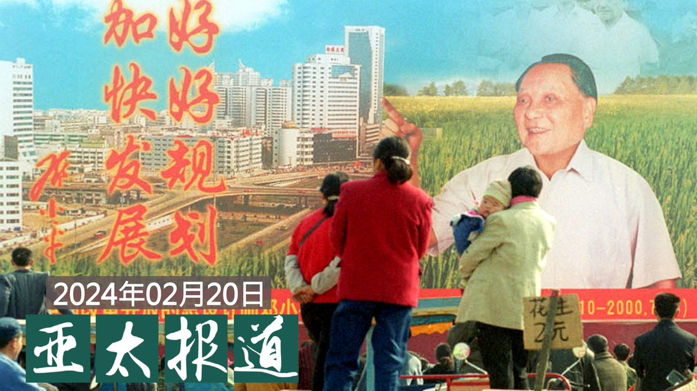
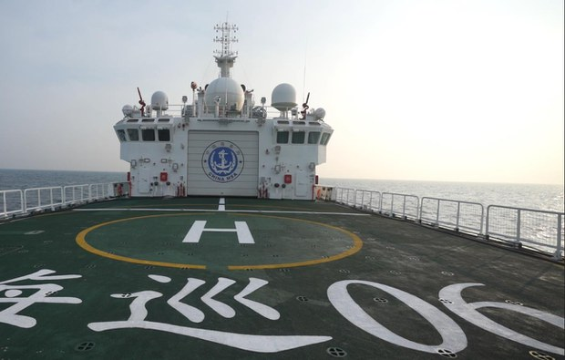

自由亚洲电台 北京时间 2024-02-20T07:33:28Z 1759722901660405936 欢迎收听和订阅播客【#亚太报道】 https://t.co/fqGW80PkrV 
湖南要在全省开展 #解放思想大讨论 活动；#上海 的经济状况到底如何？官方数字与民间感受大不相同；湖北异议人士 #毛善春 因涉及颠覆罪被扣押；中国将在厦门-金门海域加强执法巡查；台商和外资投资中国占比皆创新低；布林肯和王毅 #慕尼黑 会晤 聚焦台湾和去风险议题   自由亚洲电台 北京时间 2024-02-20T09:13:06Z 1759747976430305775 RT @RFA_Chinese: 【中国运8缅甸坠毁，为什么运8总出事？| 兵家常事】
近几年来，运8运输机多次发生事故：1月23日，缅甸一架 #运八 运输机在印度东北部的伦普机场降落时，突然发生发动机故障；2022一架 #中国造 运8反潜机在 #南海 坠机，机组人员全部丧生；…   自由亚洲电台 北京时间 2024-02-20T09:13:17Z 1759748019329646788 RT @RFA_Chinese: 欢迎收听和订阅播客【#亚太报道】 https://t.co/MjLNSvVeAE 
湖南要在全省开展 #解放思想大讨论 活动；#上海 的经济状况到底如何？官方数字与民间感受大不相同；湖北异议人士 #毛善春 因涉及颠覆罪被扣押；中国将在厦门-金门…   自由亚洲电台 北京时间 2024-02-20T00:28:43Z 1759616009433227341 荷兰中国近代史专家 #冯客 接受本台访问，谈 #后毛泽东时代 的 #中国，是否逃不过历史重演的命运，回到 #毛泽东 时代？https://t.co/q1AqPIM1I5 https://t.co/5vdRe6mkzE   自由亚洲电台 北京时间 2024-02-20T00:30:03Z 1759616343966687343 #台湾 海巡部门驱离闯入 #金门 海域的中国三无船舶，期间发生 #翻船，导致两人溺水而亡。中方事后表示，厦金海域没有"禁限区"，并以维护渔民生命财产安全为由，在厦金海域开展执法巡查。另外，中方2月20日将派员陪同船员家属前往金门接回两名生还者并处理善后。https://t.co/H5gct0E1Ix https://t.co/4HsCBZoLAW   自由亚洲电台 北京时间 2024-02-20T00:30:55Z 1759616565153341446 台湾政府发布，#台商 对中国 #大陆投资 占所有对外投资的金额及比重，持续探底，从十三年前占比超过八成到去年创下历史新低只剩约一成。美国媒体也报道指出，外商对中国新增直接投资大幅骤减超过八成，创下 #三十年来新低。https://t.co/nlXUJYEBPQ https://t.co/2WBvc1gyMj   自由亚洲电台 北京时间 2024-02-20T00:32:25Z 1759616942049276244 专栏 | #劳工通讯：广东奋达科技公司员工罢工 （一） https://t.co/PaHgpViFwH   