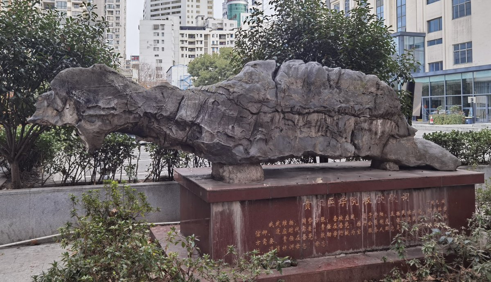
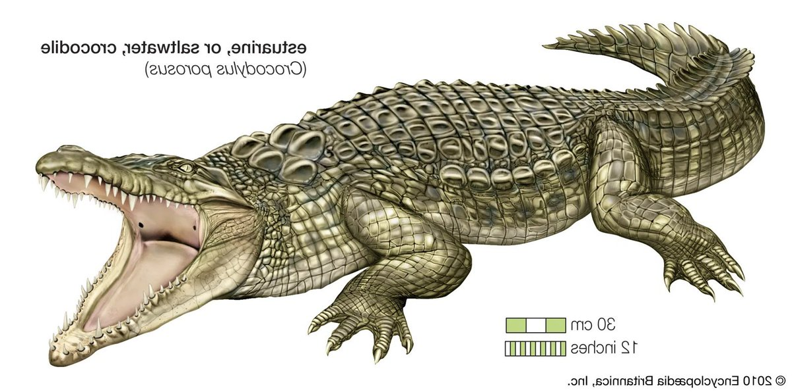
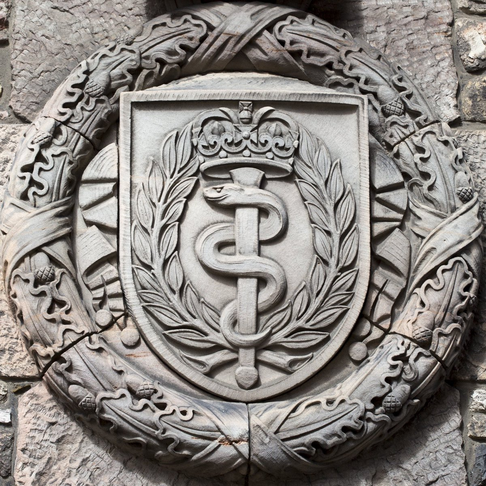
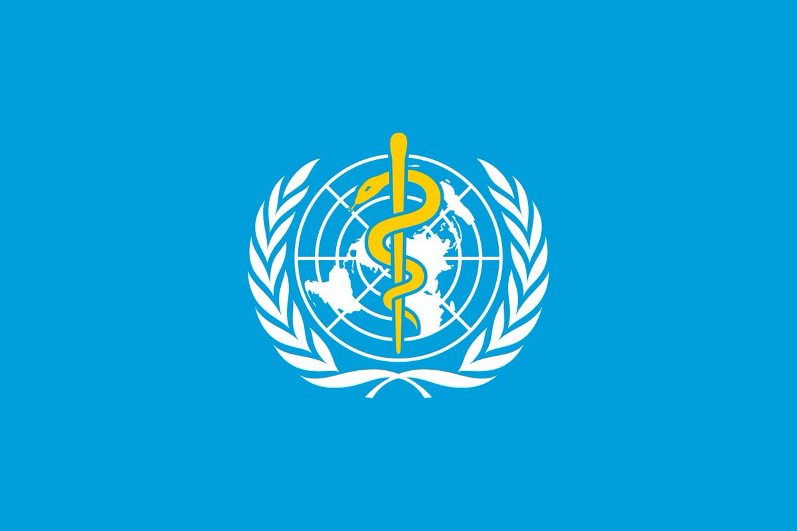

Petrichor 北京时间 2024-02-19T06:40:11Z 1759347106261725212 贵阳医学院校园里有个大鳄鱼石头，碑文是该校校歌歌词。有什么寓意吗？

欧美国家医学院或医院的符号是蛇杖。希腊伟大诗人荷马，在史诗中赞颂民间医生阿斯扣雷波为伟大的十全的医生。传说，他是公元前400年被奉为医神的阿波罗的儿子。阿斯扣雷波是一个庄严、文雅、慈祥的医生，他手持一根盘绕着灵蛇的神杖，云游四方，治病救人。因为医术高明，为人善良，特别受人拥戴。后世出于对神医和灵蛇的崇敬，也为了纪念阿斯扣雷波，便以“蛇杖”作为医学标记，这就是蛇徽的来历。   Petrichor 北京时间 2024-02-19T07:46:58Z 1759363912212828455 中共贪官很多选择自杀的，这是欧美少有的现象。为什么宁愿自杀，也不愿受审坐牢？他们大权在握时不是口口声声中国是全方位民主和法制国家吗？其实，他们心中最清楚中共是如何对待囚犯的，被抓之后要受的活罪：受辱受刑。

从经济的角度看，选择跳楼，效果最好：快、慘，可望得到同情。自杀后，中纪委就会不再调查下去，于是就保护了其他贪腐官员，尤其是保护在这条贪腐链上的更高级别的官员，这些人今后会照顾他的家庭。另外，贪腐官员自杀后，还能保住一部分贪腐钱财，可以留给自己的家人。孩子已经出国，财产也已经转移海外。

经过一番计算后，贪官选择自杀，因为“收益大于付出”。   Petrichor 北京时间 2024-02-19T02:55:33Z 1759290573838573573 男女老少抓间谍的国家，人民必然傻逼无比，经济必然落后异常，统治必然独裁残忍，科技必无创新能力，愚昧无知大行其道。国内人大量走线异国，外国人避而远之，不再入境。

进水脑袋也不想想，你有啥有价值的情报，值得间谍去收集？居民小区，有啥重要军事政治经济情报？自己傻逼以为外国间谍也是傻逼。凡是都讲信价比的。

小偷偷人家技术，总想赢人家两次的人，才以为别人也像他一样时时刻刻做小偷。你的技术太落后，人家需要偷落后几十年的技术，再说本来你的技术就是从人家那里偷过去的。   Petrichor 北京时间 2024-02-19T00:38:34Z 1759256100510011701 走社会主义道路，不如走线。
共产党好，党员也往美帝跑。
习近平领导好，大量中国人从中国逃跑了。
不做被中共官员服务的主人，却冒危险去美国做难民。
宁做美国难民，不做中国“公民”。宁做资本主义草，不做社会主义的苗。
宁让服从痴呆老头的领导，不愿服从英明伟大、扛200斤不换肩的领袖。
四个自信碎了一地。   Petrichor 北京时间 2024-02-19T00:44:34Z 1759257612829266354 家养好吃好喝的无论狗还是猫，到屋外都不知道怎么猎食了。
中国不能用纳税人的钱养着银洋蜡枪头的足球队了，解散，自生自灭去。 https://t.co/82ioRhk2U3   Petrichor 北京时间 2024-02-19T01:35:51Z 1759270516156764344 30岁之前不做左派，是没理想。
35岁之后不做右派，是没大脑。 https://t.co/EYdy4KaUwj   Petrichor 北京时间 2024-02-19T02:18:33Z 1759281262311698827 梁家河那位也是这么想的。 https://t.co/AUVQXQYLbT   