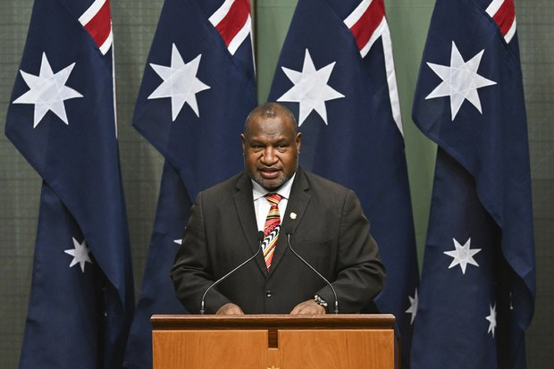
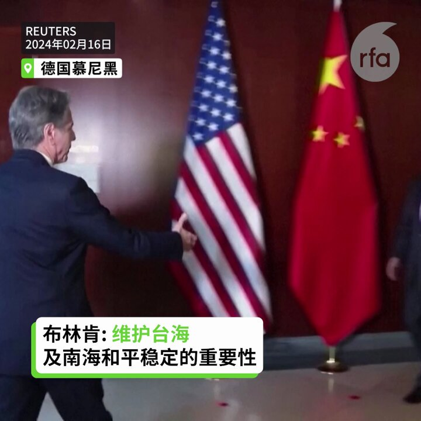
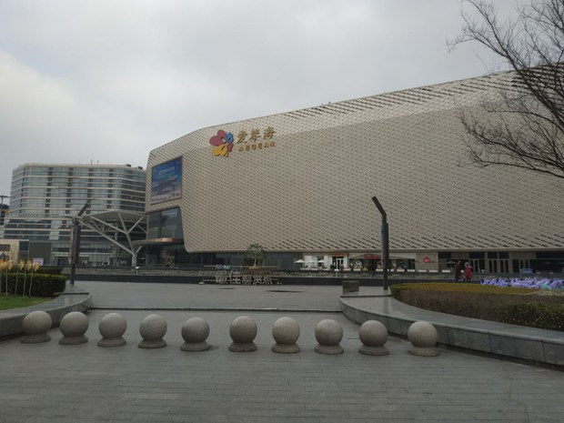

自由亚洲电台 北京时间 2024-02-19T23:09:11Z 1759595992792572287 #巴布亚新几内亚 总理 #马拉佩(James Marape)近日于 #澳大利亚 国会发表演说, 强调巴新致力与澳大利亚维持安全关系。 在此之前，中国加强在南太平洋地区的影响力，越来越成为人们关注的议题。https://t.co/w2XnQ7VJDA https://t.co/2uzIVBwaHF   自由亚洲电台 北京时间 2024-02-19T23:26:38Z 1759600387462427060 RT @asiafactcheckcn: 【查核回顾】
【中国外交部再次错误引用历史事件】

微博帐号玉渊谭天在2月17号发布一则影片，标题为 #王毅称统一必将实现，内容引用《开罗宣言》和《波茨坦公告》证明台湾回归中华人民共和国的正当性。

去年四月，时任中国外长秦刚也发表了相…   自由亚洲电台 北京时间 2024-02-19T23:26:50Z 1759600435151659078 RT @asiafactcheckcn: 【精选译稿】
【主权网路是什么】

1月30日晚上，#俄罗斯 网路出现大规模中断，情况之严重，连有“俄罗斯谷歌”之称的最大搜寻引擎Yandex，也和国内数十家最大、最知名的网路公司一起断网，甚至专门追踪网路中断情况的热门网站www.fa…   自由亚洲电台 北京时间 2024-02-19T23:26:58Z 1759600468513223131 RT @asiafactcheckcn: 【查核回顾】
【英国打造海上监狱关押移民？ 】

本篇回顾去年七月的查核。中通社旗下通传媒推特帐号发表一则短视频，称英国为关押非法移民，在海上打造了一座漂浮监狱，微博上也有多位大V纷纷转发。

❌经核实，相关报导为错误信息。 https…   自由亚洲电台 北京时间 2024-02-19T21:25:26Z 1759569885963645045 RT @RFA_Chinese: “比起强大的俄罗斯，西方更害怕强大的中国，因为俄罗斯只有1.5亿人口，而中国有15亿” — #普京 道出了中俄关系的实质 — 互相拿对方做挡箭牌：中俄虽本性都反西方，但出于生存策略，又争相对美国和西方示好。习近平思谋与美国缓和关系，普京何尝又不…   自由亚洲电台 北京时间 2024-02-19T21:30:19Z 1759571115486417181 【冯客看后毛时代中国 西方误认改开放后中国会民主化】
【因拒绝相信中共是“真的”共产主义者】
最近出版新书《毛泽东之后的中国--一个强国崛起的真相》的历史学家 #冯客 (Frank Dikötter)在接受自由亚洲电台专访时指出，西方学者误判中国会走向政治改革进步的原因是不相信中共的 #共产主义 本质，而活在自己的幻想世界里。只要回顾历史就可看到，中共历来领导人从来没有说要资本主义制度，而中共经济实力增强只是为了之后有能力重启控制权。 #毛泽东   自由亚洲电台 北京时间 2024-02-19T21:32:12Z 1759571588356153513 RT @RFA_Chinese: 央视《天下足球》杯葛 #梅西，把梅西捧世界杯的镜头，换成了前德国队长 #拉姆 的捧杯镜头。然而，拉姆曾在2022年《时代周报》发文批评中国人权，并呼吁民主国家运动员在北京冬奥会表态 ...
详阅：https://t.co/PNPXIeWA5E   自由亚洲电台 北京时间 2024-02-19T21:37:17Z 1759572866960380135 RT @RFA_Chinese: 面对 #房地产 危机，国家主席习近平希望重拾社会主义住房观，重新由政府来掌管房地产市场。该战略有两大方案作支柱：
方案1：国家收购民营房产市场上的不良项目，并将其改造成住房，由政府出租或出售；
方案2：国家为中低收入家庭建造更多保障性住房。
详…   自由亚洲电台 北京时间 2024-02-19T21:45:29Z 1759574928993538389 RT @RFA_Chinese: 身障律师陈俊翰因疑似感冒引起并发症逝世。不久前在电视节目上模仿 #陈俊翰 而引发争议的前中央电视台职员 #王志安 发表评论，称陈俊翰参加民进党的造势晚会 “健康风险实在是太高了”，“从维护 #身障人士 健康的角度讲，都非常不恰当”。又称起草了一…   自由亚洲电台 北京时间 2024-02-19T21:52:28Z 1759576688915013713 RT @RFA_Chinese: 中国西藏雅江县一名叫 #丹增谦绕 的青年僧人只因在手机内存有达赖喇嘛的照片，便遭到中国当局的非法拘捕。
详阅：
https://t.co/o4n8abGdVu   自由亚洲电台 北京时间 2024-02-19T22:00:18Z 1759578657553633476 RT @RFA_Chinese: 吴啸雷庭审过程中，检控方播放了一段对话。录音上，吴啸雷说张贴争取中国自由民主的标语，是抹黑中国的行为，损害海外华人和中国留学生的声誉。警员另在 #吴啸雷 手机中，发现吴通过社媒与母亲商议如何收集证据，举报受害人。
详阅：https://t.co…   自由亚洲电台 北京时间 2024-02-19T19:22:28Z 1759538938480591017 【王毅借慕尼黑安全会议批驳“脱钩论”】
【批评民进党在改变一中搞独立】
美国国务卿布林肯16日在德国“慕尼黑安全会议”与中国外长王毅场边晤谈，布林肯与王毅都称会谈“坦诚、具建设性”。在台海议题上，布林肯重申台海、南海和平稳定的重要性，王毅则再次呼吁美方勿支持台独，并停止经济“去中国化”。此外，王毅借慕尼黑安全会议批驳“脱钩论”，并批评民进党在改变一中搞独立。 #布林肯 #王毅   自由亚洲电台 北京时间 2024-02-19T15:25:25Z 1759479284417360377 【邓小平逝世27周年日前夕】
【党报刊文“解放思想”】
中共前领导人邓小平逝世27周年纪念日前夕，《湖南日报》刊载中共湖南省委通知，全省开展解放思想大讨论活动为期一个月。与此同时，左派网站红色中国则发文指邓小平是侏儒。详细报道：https://t.co/QqaNvIpKFH
#邓小平 #解放思想 https://t.co/bJjPMBNdX0   自由亚洲电台 北京时间 2024-02-19T16:22:04Z 1759493542291091701 【上海春节报喜 消费增长逾一成】
【上海居民感叹顾客流量少三至四成】
中国经济最繁华的上海，春节过后，官方公布除夕至16日初七，全市消费金额为569亿元，35个商圈客流量近三千万人次，比去年农历同期增长11.9%，上海居民告诉本台，官方数据不能反映当地消费情况，许多商场客流量较过往低三至四成。详细报道：https://t.co/c6Vq6qEXMy   自由亚洲电台 北京时间 2024-02-19T05:12:04Z 1759324930192118272 生前遭中国当局监控的西藏导演 #万玛才旦 的影片《#雪豹》近日获得法国第30届维苏尔亚洲国际电影节的 “金三轮车荣誉奖”。
详阅：
https://t.co/wZWvW5p77T   自由亚洲电台 北京时间 2024-02-19T05:16:04Z 1759325937722634711 台湾国宝集团总裁 #朱国荣 去年畏罪潜逃，近日可能在中国落网。台湾刑事警察局已紧急透过管道向中国 #公安部 查证有关消息。
详阅：
https://t.co/EpXZxAyHTR   自由亚洲电台 北京时间 2024-02-19T05:22:11Z 1759327477359386719 新加坡航展将于下周开幕，来自50个国家和地区的上千家企业机构参展。中国 #C919 客机周日在 #新加坡 樟宜国际机场附近上空进行了预演飞行。
详阅：
https://t.co/kw59rRwaj1   自由亚洲电台 北京时间 2024-02-19T05:30:02Z 1759329450624188445 台湾 #蔡英文: 感谢侨界过去8年一起打拼，让台湾与美国有越来越多的交流合作。
候任总统 #赖清德: 将在蔡英文8年执政的基础上，组建最强团队守护台湾。
详阅：https://t.co/YWp7uiBvI2   自由亚洲电台 北京时间 2024-02-19T05:31:59Z 1759329940695081409 海安亚太轻合金 #南通科技股份有限公司 车间内生产铝棒的铸造井区域发生爆炸，救援工作目前已超13个小时。
详阅：https://t.co/kSgUoKy0iG   自由亚洲电台 北京时间 2024-02-19T00:22:32Z 1759252064054432089 王毅在与美国国务卿布林肯会晤中表示，#华盛顿 应该取消对中国企业和个人的制裁。其后 #王毅 又公开警告，“任何人以去风险为名尝试去中国化，都将犯历史性错误。”
详阅：
https://t.co/IsiP0sGcSP   自由亚洲电台 北京时间 2024-02-19T00:28:22Z 1759253535294697958 王丹披露，原八九学运领袖 #吾尔开希 在台湾大选前一天下楼梯的时候不慎摔落，情况一度危急。手术后，#王丹 和颜柯夫守候在医院，非常焦虑。
详阅：
https://t.co/NeCpA9VLZr   自由亚洲电台 北京时间 2024-02-19T00:34:14Z 1759255010926367002 春节期间，中国 #国内旅游 出游4.74亿人次，较2019年同期增长19.0%；国内游客出游总花费6326.87亿元，较2019年增长7.7%。
详阅：
https://t.co/2aZXTOfwC6   自由亚洲电台 北京时间 2024-02-19T00:11:11Z 1759249210132570442 近日维权人士春节聚会交流活动，但聚会通知发出后，组织者 #王忠祥 本人却与外界失联。
详阅：
https://t.co/iMuQWNtepU   自由亚洲电台 北京时间 2024-02-19T00:15:45Z 1759250360164655321 福建 #海警局 将加强海上执法力量，在厦金海域开展常态化执法巡查行动，维护渔民生命财产安全。台湾 #陆委会 回应，中方长期纵容“三无”船舶违法滥捕，台湾将持续严正稳健执法。
详阅：
https://t.co/f62RxhAvJz   