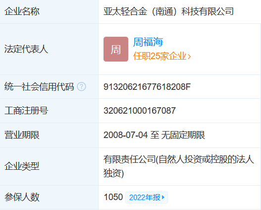
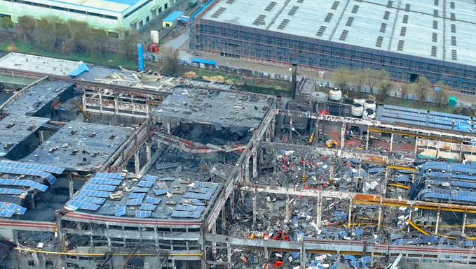
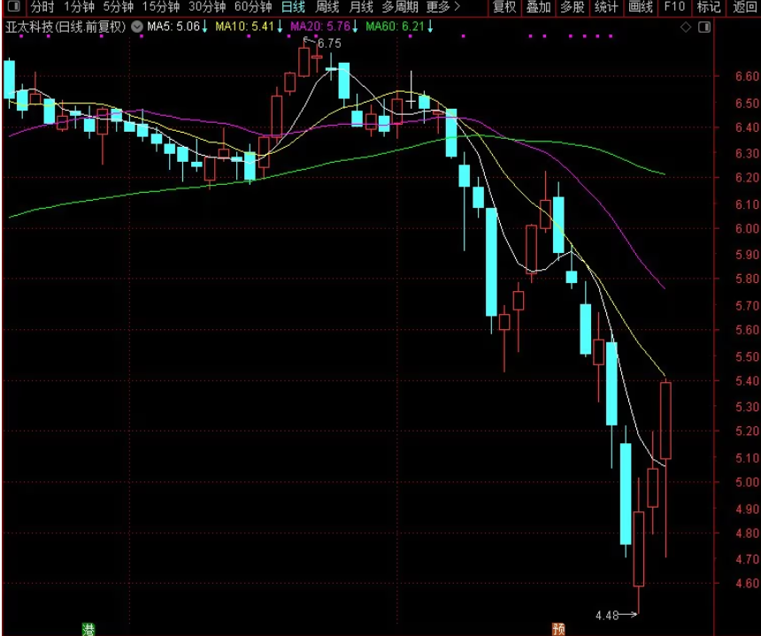

谁将十万横扫三江 北京时间 2024-02-19T09:33:29Z 1759390717494092088 RT @YesterdayBigcat: 2月18日，死者亲属继续到长庆油田第六炼油厂讨说法，在油厂大门摆放了花圈。 https://t.co/M1J21VTxir   谁将十万横扫三江 北京时间 2024-02-19T09:14:38Z 1759385971811107042 2月18日凌晨2点左右，江苏南通海安市一家工厂发生爆炸，爆炸已致3人死亡、13人受伤、2人失联（有当地人透露死亡数字不实），涉事建筑物屋顶、墙壁坍塌，坍塌面积超过80%。该工厂为ngsi亚太科技全资子公司，根据公司公告透露，一期项目损坏，按照它的工艺，二期没有坏，但生产不起来，那些爆炸的厂房恢复，设备维修都需要时间，一切完好再通过应急局复查验收，至少半年。根据该公司公开的参保人数1050人，将造成一千多人实质性失业   