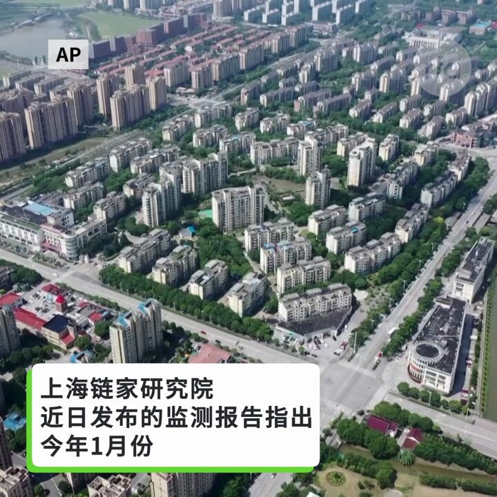

自由亚洲电台 北京时间 2024-02-18T09:00:00Z 1759019902655242305 【中国运8缅甸坠毁  为什么运8总出事？｜兵家常事】
1月23日，缅甸一架运八运输机在印度东北部的伦普机场降落时，突然发生发动机故障，最近几年来，运8运输机多次发生事故，2022一架中国的运8反潜机在南海坠机，机组人员全部丧生。2017一架缅甸运8在空中解体，为什么 #运8 运输机总出事？
#兵家常事 https://t.co/JB4G4pfIJG   自由亚洲电台 北京时间 2024-02-18T00:34:28Z 1758892679713194354 RT @RFA_Chinese: 【谷爱凌又夺冠】
2月16日，谷爱凌在2024国际雪联自由式滑雪U型场地世界杯卡尔加里站比赛中，再次夺冠。
日前 #谷爱凌 曾表示，她将继续代表中国参加2026年意大利的冬奥会。
#您怎么看？ https://t.co/VyjlFE65zb   自由亚洲电台 北京时间 2024-02-18T00:34:35Z 1758892712382631998 RT @RFA_Chinese: 【上海的房子也卖不动了？】
上海链家研究院近日发布的监测报告指出，今年1月份，上海全市共成交新建商品房3786套，环比下降44%，同比下降55%；成交金额290亿元，环比下降47%，同比下降58%。 https://t.co/WhQhsU9vmY   自由亚洲电台 北京时间 2024-02-18T00:37:56Z 1758893552002547826 RT @RFA_Chinese: 「龙行龘龘，前程朤朤，生活䲜䲜」是今年拜年的高頻詞。
中国媒体说，生僻字的流行，与中国文化传承、文化自信扣连，体现了中华文化的博大精深。
有网民说, 这是“学渣整新词儿，差生文具多”“字糊在一起还以为是QR码……”
有港台学者说，既然觉得繁体字…   自由亚洲电台 北京时间 2024-02-18T00:39:50Z 1758894033676501376 #微软 称俄罗斯、伊朗、中国和朝鲜军事情报部门黑客正利用 #OpenAi 完善他们的黑客攻击。其中，俄罗斯使用这些大型语言模型来研究乌克兰常规军事行动的卫星和雷达技术。
详阅：https://t.co/vt5VkBPqup   自由亚洲电台 北京时间 2024-02-18T01:04:42Z 1758900289011122337 RT @RFA_Chinese: 【中国Z世代：极简地活着】
中国Z世代，生于1995年到2010年之间，2.8亿人口，是所有年龄组中最悲观的一群。38个主要城市的2023年新员工平均预期薪资出现自2016年以来最糟糕的下滑。
一些年轻人对职业机会越来越不感兴趣，“躺平”，极简…   自由亚洲电台 北京时间 2024-02-18T01:15:02Z 1758902890180055509 前美国交通部、劳工部部长赵小兰的妹妹、福茂集团董事长兼执行长赵安吉(Angela Chao)2月12日意外离世。多家媒体报道是车祸所致，但赵家对具体情况保持缄默，坊间各种猜测。⁣ 
 2月15日，美国得州《奥斯汀美国政治家报》（Austin American-Statesman）昨天引述得州布兰科郡警方消息，赵安吉的死因虽仍未确定，但据信她是开车驶入德州布兰科郡私人农场一处水域后溺水而亡。警方接到报警后曾进行水上救援，但回天乏术。   自由亚洲电台 北京时间 2024-02-18T01:17:49Z 1758903590301671699 美国影视平台 #Netflix，于1月份公布2024年多部中文原创新片多是台湾作品。Variety报道，由于愈来愈难在中国做生意，西方娱乐企业在大陆缩减了活动规模。
详阅：
https://t.co/qgw1XGvomW   自由亚洲电台 北京时间 2024-02-18T01:24:08Z 1758905180588781955 湖北省两会开幕当天，“秦永敏中国人权观察团”成员 #毛善春 被要求离开武汉，次日被国保带走并关进了看守所。
详阅：
https://t.co/D8nNeTDjGv   自由亚洲电台 北京时间 2024-02-18T01:28:40Z 1758906320181252452 台湾海巡发现中国4000吨级综合资源调查船大洋号在 #花莲港 东南方航行后，派遣 #桃园舰 前往监控，目前仍在持续监控对峙中。
详阅：
https://t.co/IqpVHPNiwW   自由亚洲电台 北京时间 2024-02-18T01:38:12Z 1758908719339815116 【俄反对派狱中死亡，中国各界反应有异】
《环时》前主编 #胡锡进：纳瓦利内在狱中突然死亡会让俄罗斯在西方主导的国际舆论中更加被动。
中国 #外交部 发言人办公室：这是俄罗斯的内政，不会对此发表评论。
详阅：https://t.co/0wepXHTUDC   自由亚洲电台 北京时间 2024-02-18T01:49:44Z 1758911623035572725 【多数美国年青人不认为台海问题重要】
美国皮尤研究中心发布全球三大热点调查显示，52%的30-49岁之间 #美国 人认为台海紧张对美国国家利益不重要，18-29岁之间认为不重要的更达60%。
详阅：
https://t.co/cmP1tZ81iz   自由亚洲电台 北京时间 2024-02-18T00:06:15Z 1758885579956097147 16天的春运中，人员流动量已经近33亿人次，官方估计今年春运可望突破90亿，远超去年40天 #春运 期间的47亿人次。然而，中国 #居民消费价格 指数CPI同比下降0.8%，降幅比上个月扩大0.5个百分点，连续4个月处于通缩区间。
详阅：
https://t.co/KzJXoYzRE3   自由亚洲电台 北京时间 2024-02-18T00:21:29Z 1758889414720127299 央视《天下足球》杯葛 #梅西，把梅西捧世界杯的镜头，换成了前德国队长 #拉姆 的捧杯镜头。然而，拉姆曾在2022年《时代周报》发文批评中国人权，并呼吁民主国家运动员在北京冬奥会表态 ...
详阅：https://t.co/PNPXIeWA5E   