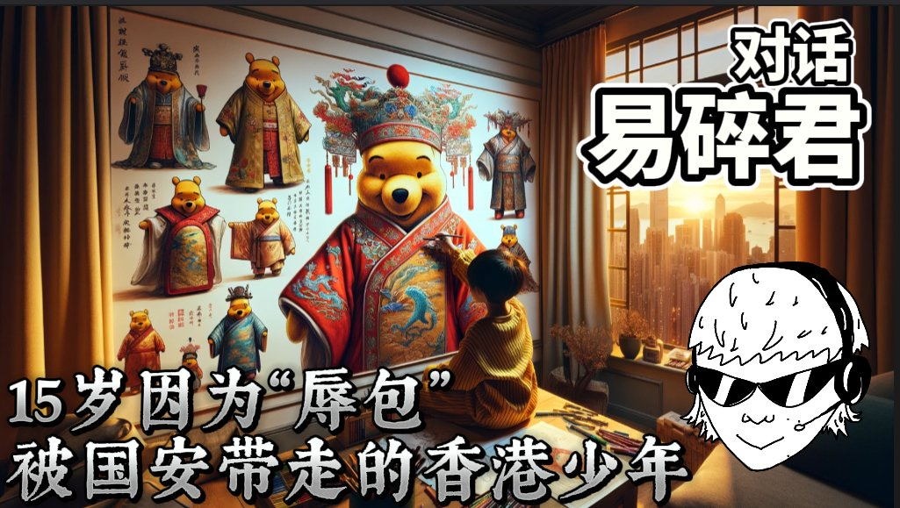
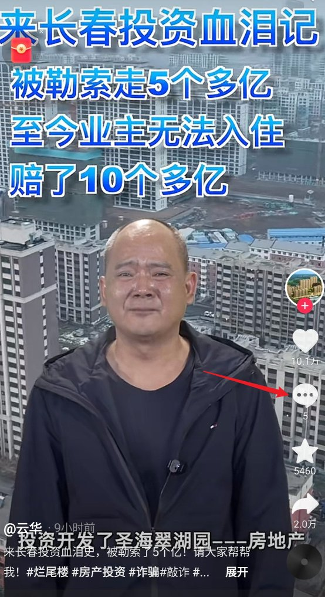
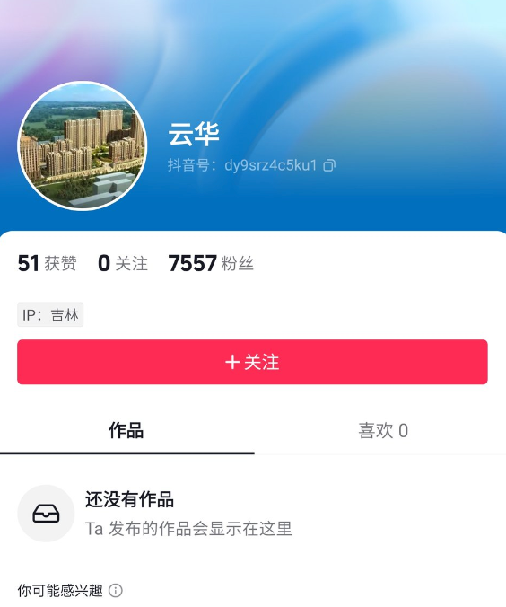

A李老师不是你老师 北京时间 2024-02-17T20:20:00Z 1758828641306468622 年仅15岁的易碎君@FIC_HK因无法忍受香港课堂中不断加入的爱国教育而走上了“辱包”之路，并因此被国安带走。
从此，他的人生发生了彻底的改变：年幼的他中断学业，孤身一人逃亡美国，并几经磨难与挫折。
今天，易碎君希望向大家讲述他的故事
https://t.co/oDUxPx4wdQ https://t.co/LJCRwfK3k9   A李老师不是你老师 北京时间 2024-02-17T09:16:50Z 1758661750650708092 后续，该视频在获得超10万点赞后先是评论区消失，然后是视频消失 https://t.co/Jb2v8WeWm7   A李老师不是你老师 北京时间 2024-02-17T01:57:09Z 1758551101417087134 RT @xiaojingcanxue: 翻译一下，这是纳瓦尔尼回答“如果你死于狱中，有什么遗言给大家”：“我遇害时的遗言非常简单：不要放弃。我要讲一件理所当然的事情。你们不要放弃，如果这件事发生，如果他们决定杀我，就意味着我们无比强大。我们要利用这股力量，不要放弃。要记得我们是…   