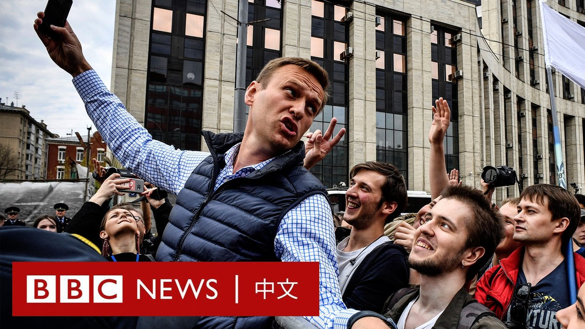

D英国广播公司BBC 北京时间 2024-02-17T21:30:43Z 1758846438136742010 【精选回顾】九年前，俄罗斯反对派人物涅姆佐夫（Boris Nemtsov）在克里姆林宫前的一座桥上被当街枪杀，震惊了俄国社会。

2022年，BBC与多家媒体通过调查，揭露了在这位普京政敌遇害前一年，一名与秘密暗杀小组有关的安全局特工一直在全俄各地跟踪他。

▶️观看全片：https://t.co/BCb4x8D2xq   D英国广播公司BBC 北京时间 2024-02-17T15:58:26Z 1758762817883418886 俄罗斯反对派领袖、普京最尖锐的批评者纳瓦尔尼（Alexei Navalny）据报在位于北极圈的监狱猝逝，终年47岁。

十多年来，他揭露了俄罗斯权力核心的腐败问题，其影片在网上获得了数千万次观看。2020年，他遭神经毒剂毒害，在国外治疗后回国，随即被监禁至今。

据报导，在他去世后，俄罗斯有100多名街头抗议者被拘留。当局警告人们不要参与集会。   