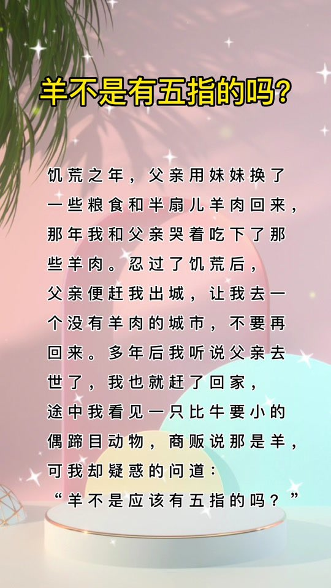
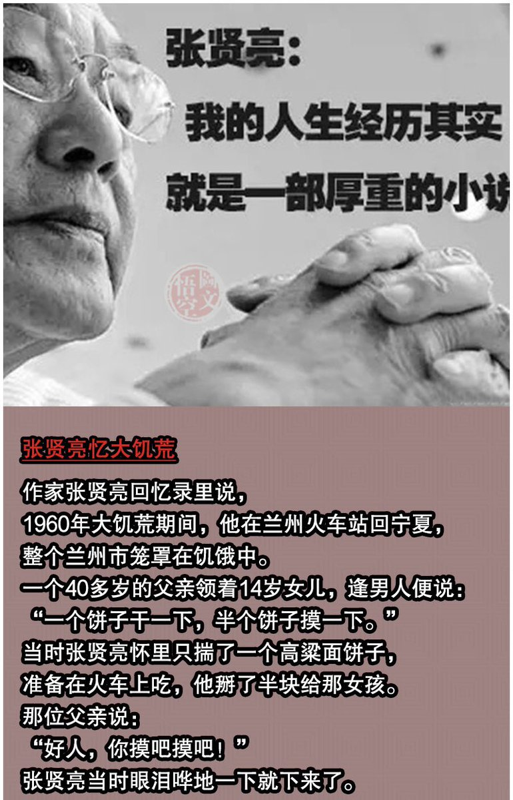
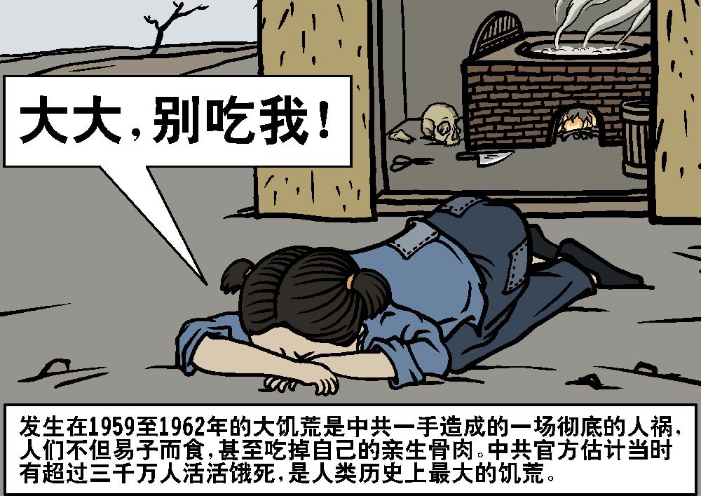
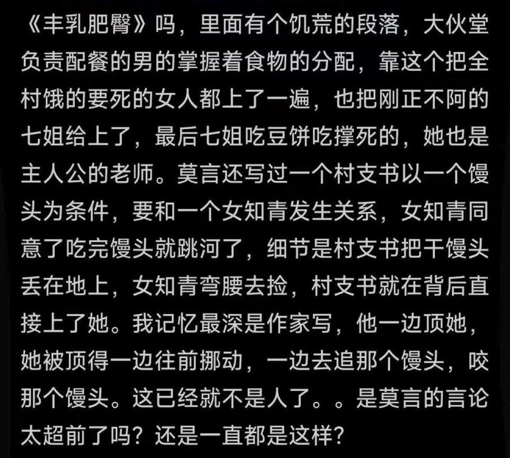
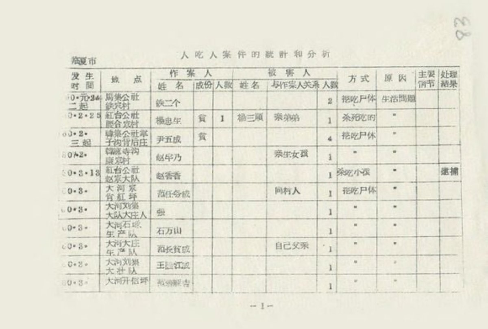
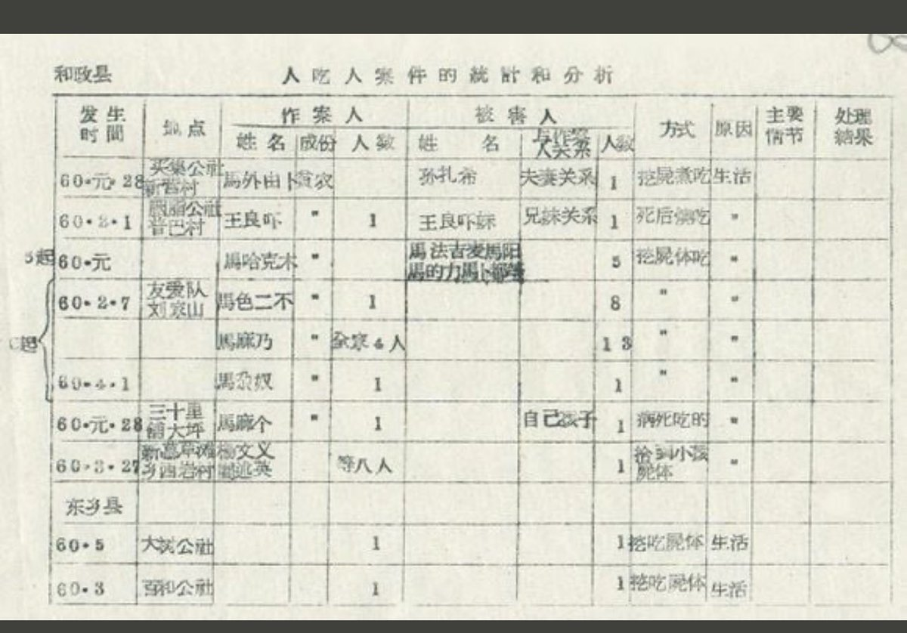
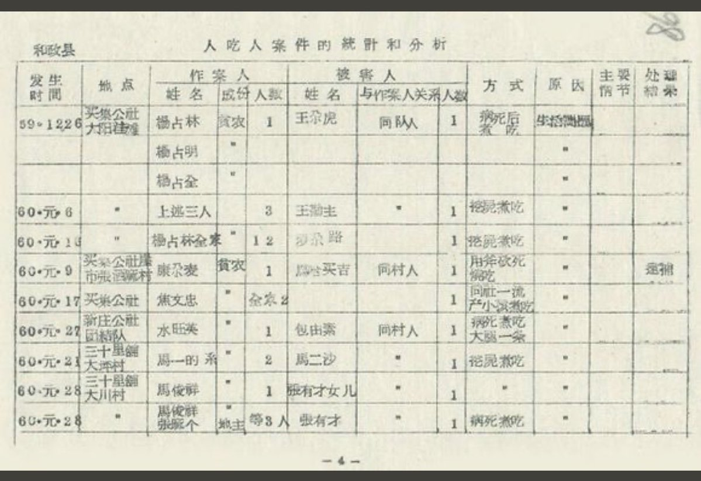
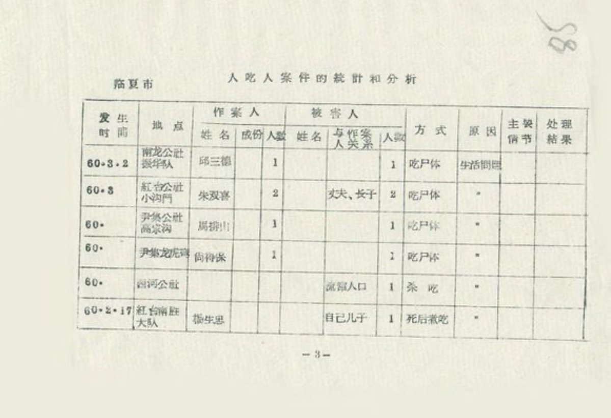
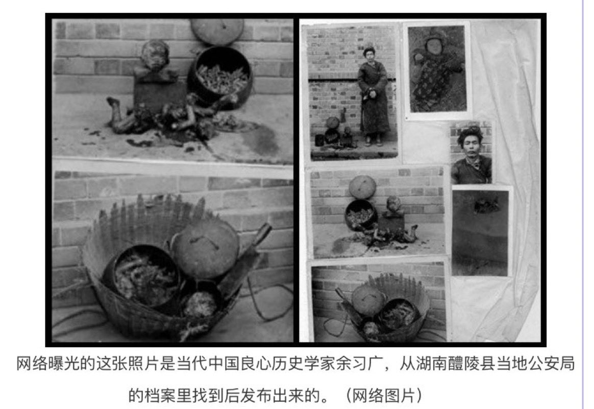
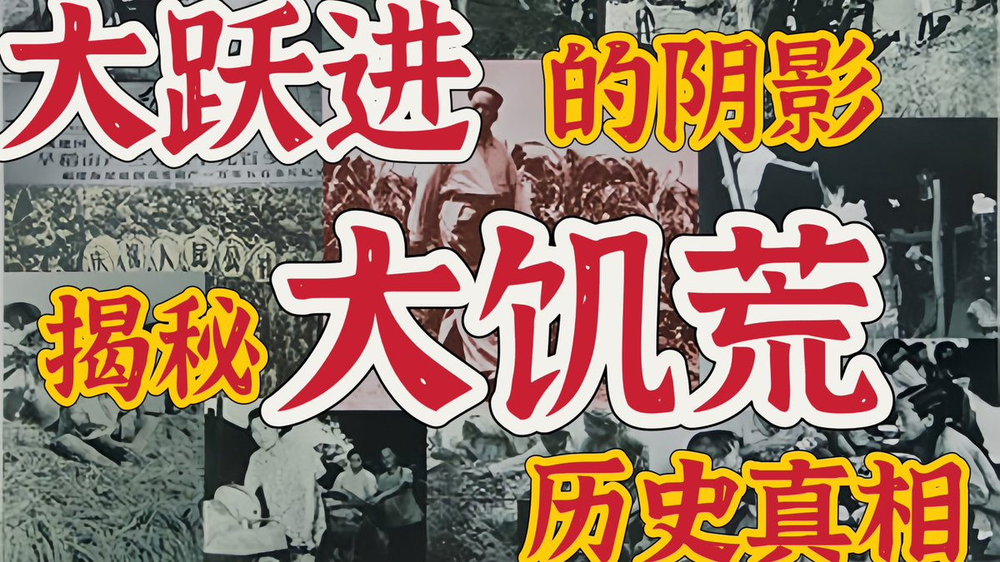

Ivy未央 北京时间 2024-02-17T14:09:21Z 1758735367455351061 RT @Ivy01011: 大跃进的野心与现实的悖离导致了历史上最严重的人为饥荒。这个以高速工业化为目的的政策，初期在钢铁等基础工业上取得进展，但很快演变成了对资源的极端浪费和生态破坏。农业领域的不切实际目标和高征购政策，造成了粮食产量的虚报和分配不均，削弱了农业生产，导致农民…   Ivy未央 北京时间 2024-02-17T14:09:26Z 1758735388355522604 RT @Ivy01011: 《三年大饥荒时期 基层干部拿块饼就能诱奸妇女》一文中，说“受辱”和“饥饿”是莫言文学创作中的核心，在他笔下大饥荒的1960年，有权势的男人常常以食物为钓饵诱奸女性。而这钓饵，只是一个馒头，一块饼，一碗鸡汤，引诱妇女、强奸妇女的有很多，给她块饼，跟她睡…   Ivy未央 北京时间 2024-02-17T14:09:30Z 1758735403014590932 RT @Ivy01011: 有人问莫言：人死后真的会有地狱吗？
莫言回答：不用死后，你活着就能看到地狱。
下面四幅图每个都让我感觉：大饥荒时期的中国简直就是地狱
https://t.co/xyU77CIVwl https://t.co/pbEuvWgOCj   Ivy未央 北京时间 2024-02-17T11:50:44Z 1758700481134706830 有人问莫言：人死后真的会有地狱吗？
莫言回答：不用死后，你活着就能看到地狱。
下面四幅图每个都让我感觉：大饥荒时期的中国简直就是地狱
https://t.co/xyU77CIVwl https://t.co/pbEuvWgOCj   Ivy未央 北京时间 2024-02-17T09:25:07Z 1758663836947939829 三年大饥荒，牺牲农民保城市，饿死农民也在所不惜，很多地方出现人吃人，以下是当年人吃人的一些证据，小粉红还不信吗？ https://t.co/N65TRSVtQv   Ivy未央 北京时间 2024-02-17T09:26:52Z 1758664278150901767 大饥荒年代，最血腥父子合影：父食子
刘家远站在墙边，手戴铁铐，身边是他儿子的头颅和骨架，还有一个铁锅，锅里面炖着他从快饿死的儿子身上割下来的肉，和胡萝卜一起炖，刘想在饿死前吃一顿肉
图片是刘被枪毙前的留影。是当时枪毙他的人，给他和儿子的遗骸拍照存档，该图片成为大饥荒年代人相食的铁证 https://t.co/itqEhLlvXl   Ivy未央 北京时间 2024-02-17T09:46:42Z 1758669266214396278 《三年大饥荒时期 基层干部拿块饼就能诱奸妇女》一文中，说“受辱”和“饥饿”是莫言文学创作中的核心，在他笔下大饥荒的1960年，有权势的男人常常以食物为钓饵诱奸女性。而这钓饵，只是一个馒头，一块饼，一碗鸡汤，引诱妇女、强奸妇女的有很多，给她块饼，跟她睡觉。 https://t.co/1juP1jYroE   Ivy未央 北京时间 2024-02-17T09:06:19Z 1758659105139368219 大跃进的野心与现实的悖离导致了历史上最严重的人为饥荒。这个以高速工业化为目的的政策，初期在钢铁等基础工业上取得进展，但很快演变成了对资源的极端浪费和生态破坏。农业领域的不切实际目标和高征购政策，造成了粮食产量的虚报和分配不均，削弱了农业生产，导致农民粮食短缺。政府和基层干部在执行政策时的极端手段，如虚报产量和强制征收，加剧了饥饿和死亡。人民公社制度和食堂集中供饭制度剥夺了农民的自救可能…… https://t.co/zNpv155Ce8   