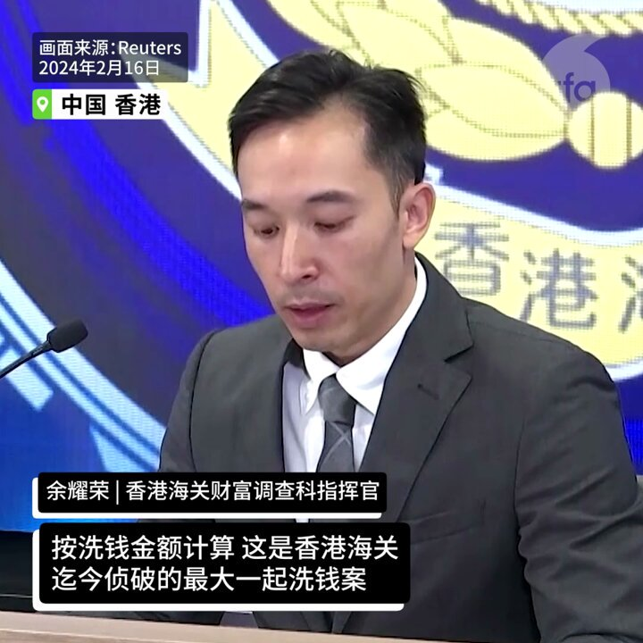
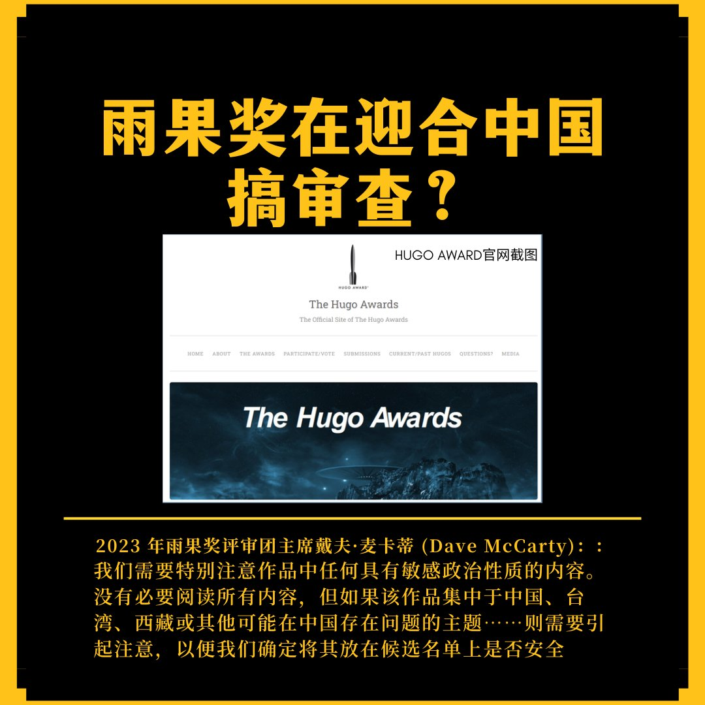

自由亚洲电台 北京时间 2024-02-17T15:31:17Z 1758755984627925284 中国国安部微信公众号发文，指网络空间已经成为境外间谍情报机关对中国进行 #间谍活动 的“重要阵地”，网络安全形势日趋严峻。
详阅：
https://t.co/XpxWIa9F1E   自由亚洲电台 北京时间 2024-02-17T15:39:39Z 1758758092030837030 获刑5年6个月的前麦当劳东北营运经理，沈阳法轮功学员 #李方芳 在辽宁省女子监狱遭严管迫害，其家属投诉监狱违法。
详阅：https://t.co/3Ttxzr4Y9c   自由亚洲电台 北京时间 2024-02-17T15:43:44Z 1758759116338495737 面对 #房地产 危机，国家主席习近平希望重拾社会主义住房观，重新由政府来掌管房地产市场。该战略有两大方案作支柱：
方案1：国家收购民营房产市场上的不良项目，并将其改造成住房，由政府出租或出售；
方案2：国家为中低收入家庭建造更多保障性住房。
详阅：
https://t.co/gKjObZUbH9   自由亚洲电台 北京时间 2024-02-17T15:44:57Z 1758759422673797307 中国外交部部长助理 #农融 内定将接替杨万明，升任港澳办副主任，预计将在春节之后上任。56岁的农融曾经长期在广西工作，后担任中国驻巴基斯坦大使。
详阅：
https://t.co/sJMg9Xs1gM   自由亚洲电台 北京时间 2024-02-17T15:46:00Z 1758759687963455555 调查显示，年轻的Z世代是中国所有年龄段中最悲观的。这些在1995年至2010年间出生的中国 #年轻人 约有2.8亿。
详阅：https://t.co/uoTI9TwLKW   自由亚洲电台 北京时间 2024-02-17T14:19:35Z 1758737938966364656 身障律师陈俊翰因疑似感冒引起并发症逝世。不久前在电视节目上模仿 #陈俊翰 而引发争议的前中央电视台职员 #王志安 发表评论，称陈俊翰参加民进党的造势晚会 “健康风险实在是太高了”，“从维护 #身障人士 健康的角度讲，都非常不恰当”。又称起草了一份道歉信一直没发出。
详阅：https://t.co/V2rC7uomki   自由亚洲电台 北京时间 2024-02-17T10:30:03Z 1758680177608118596 欢迎收听和订阅播客【＃亚太报道】 https://t.co/MjLNSvVMqc
上海新商品房成交额腰斩；中国多地机票、车票涨价；美国会通过涉疆、涉藏政策法案；俄罗斯反对派领袖 #纳瓦利内 狱中死亡；蔡英文再谈两岸对话。 https://t.co/PLo0oo31x1   自由亚洲电台 北京时间 2024-02-17T11:51:59Z 1758700795049173403 “辱共事件在全球的频频发生，正是表明，习式中共当局、李家超香港当局已经到了到了神憎鬼厌的地步。这正如纳粹政权在上世纪三十年代，虽然由于封闭与洗脑，它在国内人气很旺，但在世界各国却是遭遇到普遍恐惧和仇视的。”
专栏 | #中国透视：#梅西 现象的全球化 https://t.co/fy8kF9rjBq https://t.co/91OstSUL3d   自由亚洲电台 北京时间 2024-02-17T10:01:23Z 1758672962457047384 前运输部、劳工部部长赵小兰的妹妹、福茂集团董事长兼执行长赵安吉(Angela Chao)2月12日意外离世。多家媒体报道是车祸所致，但赵家对具体情况保持缄默，坊间各种猜测。
2月15日，德州《奥斯汀美国州人报》(Austin American-Statesman)报道，赵安吉的死因虽仍未确定，但据信她是开车驶入德州布兰科郡私人农场一处水域后溺水而亡。
赵安吉身分敏感，是中国银行独立董事，还是中国船舶工业总公司的董事会成员。她的丈夫布雷耶（Jim Breyer）长期在中国进行风险投资。赵安吉的姊姊赵小兰的中国造船公司，最近被美国政府制裁。
#赵小兰 #赵安吉 #AngelaChao   自由亚洲电台 北京时间 2024-02-17T10:04:57Z 1758673860688269636 专栏 | #夜话中南海：中共新防长 #董军 与他的"中国海军黄埔" https://t.co/D35frDlbvx   自由亚洲电台 北京时间 2024-02-17T10:07:45Z 1758674565620719903 专栏 | #周末茶馆：#河南寄宿小学火灾 13死  中国农村教育哪些问题令人担忧？(2) https://t.co/NgtZvtpWlj   自由亚洲电台 北京时间 2024-02-17T10:12:55Z 1758675863892013393 美国和西方国家领导人对以中国为主要代表的农历新年表达祝贺，是因为我们自己越来越优秀？还是人家越来越优秀？在这次的“#周嘉有话说”栏目里，我和 #周孝正 教授就来聊聊，在接纳和拥抱多元文化方面，中国和西方，为什么存在差距？

https://t.co/p6NMkY69Mb   自由亚洲电台 北京时间 2024-02-17T06:20:52Z 1758617466370941336 中国官媒今年特别强调以中文音译字“loong”取代“dragon”，是意在区分中国“龙”与西洋“龙”的不同。 此举引发中国网民热议。有人认为这是展现官方营造的“文化自信”，但也有人批评此举稀奇古怪，太过“爱国主义”。
https://t.co/Z9uVSqB6O6   自由亚洲电台 北京时间 2024-02-17T07:29:57Z 1758634852872822817 【上海的房子也卖不动了？】
上海链家研究院近日发布的监测报告指出，今年1月份，上海全市共成交新建商品房3786套，环比下降44%，同比下降55%；成交金额290亿元，环比下降47%，同比下降58%。 https://t.co/WhQhsU9vmY   自由亚洲电台 北京时间 2024-02-17T07:52:37Z 1758640557923184653 【Sora会端走谁的饭碗？】
ChatGPT和图像生成器DALL-E的创建者OpenAI正在测试一种名为 Sora的文本到视频模型，Sora可根据简单的提示创建逼真的视频，高清流畅，令人惊艳。 https://t.co/QG5PGwWgdt   自由亚洲电台 北京时间 2024-02-17T08:02:15Z 1758642982369259632 【谷爱凌又夺冠】
2月16日，谷爱凌在2024国际雪联自由式滑雪U型场地世界杯卡尔加里站比赛中，再次夺冠。
日前 #谷爱凌 曾表示，她将继续代表中国参加2026年意大利的冬奥会。
#您怎么看？ https://t.co/VyjlFE65zb   自由亚洲电台 北京时间 2024-02-17T08:08:09Z 1758644465718464722 【香港史上最大跨国洗钱案告破】
在这桩价值18亿美元的洗钱案中，香港当局逮捕七人。 https://t.co/YkXvRYrWJH   自由亚洲电台 北京时间 2024-02-17T08:16:17Z 1758646513373229545 【余茂春评梅西事件】
美国智库哈德逊研究所中国中心主任余茂春2月14日在《华盛顿时报》撰文解读梅西事件。
他认为“这场争议的核心在于中国共产党对国际社会的深刻怀疑。其根源在于共产党总是相信存在破坏共产党政权的阴谋，而且这种阴谋是普遍存在和预谋好了的。”
他认为，这种心态促使共产党将鸡毛蒜皮的小事件都解读为庞大的反党计划，并配以夸张和荒谬的反应...这种意识形态偏执荒诞地把国际巨星梅西变成了抗共的“超级反派”。
您知道还有谁被生生逼成了反贼？
#梅西 #西太后 #英国钢琴师 #余茂春   自由亚洲电台 北京时间 2024-02-17T08:38:53Z 1758652198840303742 【又要打又要爱，拜登开TikTok帐户为哪般?】
从台湾到印尼，从欧盟到非洲，近年来参与大选的政治人物似乎都难以摆脱 #抖音 国际版TikTok的阴影，就连对TikTok连番打压的美国也不例外。超级碗橄榄球赛开锣之际，总统拜登出人意料地发布一条 #TikTok 视频，内容不仅涉及运动，更幽默风趣地触及今年与 #特朗普(Trump)可能的第二次大选对决。有分析指 #拜登 此举是要提升自己在年青选民中的亲和力，这条视频有没有达到这个目的呢？   自由亚洲电台 北京时间 2024-02-17T05:01:44Z 1758597554625728931 2月15日，美国国会众议院一致通过《维吾尔政策法案》及《促进解决西藏-中国争端法案》。两项立法旨在发挥美国的软实力，促使中国政府结束在新疆、西藏地区的侵犯人权行径。
#维吾尔政策法案 #促进解决西藏中国争端法案
#新疆 #西藏人权  https://t.co/0iFu9yfEX7   自由亚洲电台 北京时间 2024-02-17T05:58:45Z 1758611902064701846 据《卫报》报道，泄露的电子邮件显示，去年有几位作家因评论或作品在中国可能被视为敏感而被排除在入围名单之外。包括《纽约时报》畅销书上榜作者、美籍华裔作家匡灵秀（R. F. Kuang）、加拿大籍华裔作家赵希然（Xiran Jay Zhao）在内的多位作者虽然获得了足够的提名，可以参加各自类别的投票，但被该奖项管理人员视为“不符合资格”，没有进一步的说明解释。
您认为，雨果奖筛除“敏感”作品，是否是在迎合中国搞审查？   自由亚洲电台 北京时间 2024-02-17T03:15:10Z 1758570736350834771 美国国务卿布林肯（Antony Blinken）2月16日在慕尼黑安全会议期间会见了中共中央外事办主任兼外长王毅。双方就一系列问题进行了讨论，其中，#布林肯 强调维护台海与南海和平与稳定的重要性。
#王毅 
 https://t.co/4w9CMwbYpJ   自由亚洲电台 北京时间 2024-02-17T03:51:43Z 1758579933293515067 长期揭发俄罗斯普京政府贪腐问题的著名反对派领袖纳瓦利内据报于本周四在监狱中死亡，该事件迅速引发国际社会关注。截至目前，中国官方尚未就这起突发事件发表评论。
#纳瓦利内  #普京 #Putin #Navalny
https://t.co/HPV1owcknv   自由亚洲电台 北京时间 2024-02-17T04:14:03Z 1758585554008957302 有来难回！ 
三亚直飞哈尔滨的航班票价甚至普遍在一两万元人民币。 截止到2月16日，滞留在三亚的游客人数还有8万左右之多。
 #三亚机票 #海南 #春运 https://t.co/xoB1Y80bJY   自由亚洲电台 北京时间 2024-02-17T01:32:49Z 1758544977821397168 2月16日，台湾的海基会举办“2024大陆台商春节活动”，蔡英文总统任内最后一次出席台商春酒。她表示，台湾从未停下寻求两岸对话可能性的脚步。
#大陆台商春节活动
https://t.co/oNibhYVffG   自由亚洲电台 北京时间 2024-02-17T01:35:19Z 1758545606300090399 艾蜜莉的丈夫、美国公民伦特（Mark Lent）对《卫报》表示，他的妻子艾蜜莉乘班机在南京禄口机场落地后，曾发信息给家人表示已抵达，但她后来却未现身。4天后，她的儿子收到大连市国家安全部门的一封信，称她在12月30日因涉嫌非法向海外提供国家机密而被拘留...https://t.co/r61eauYYJJ   自由亚洲电台 北京时间 2024-02-17T00:21:18Z 1758526977915425073 香港资深社运人士 #古思尧 因被控”作出具煽动意图的作为”，2月16日被香港法院判有罪，将入狱9个月。他被定罪的关键之一是在去年香港区议会选举前，计划带棺材做为抗议道具，被认为其目的是推翻中央政府。

https://t.co/QhoRQPObjz   