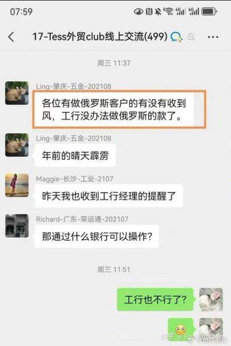
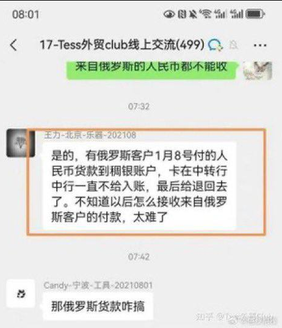
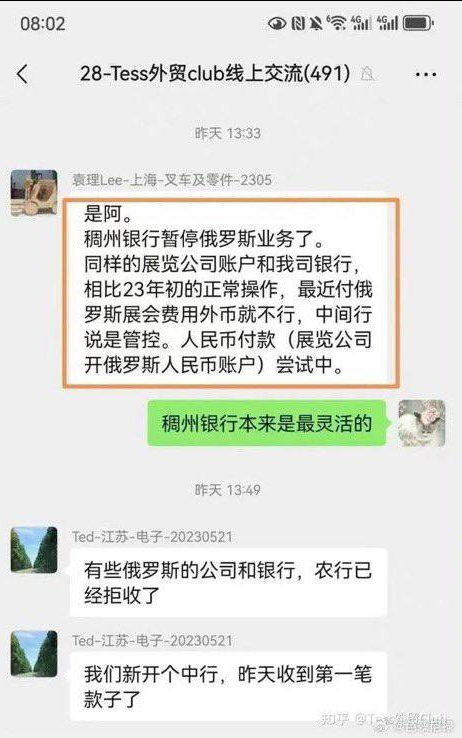
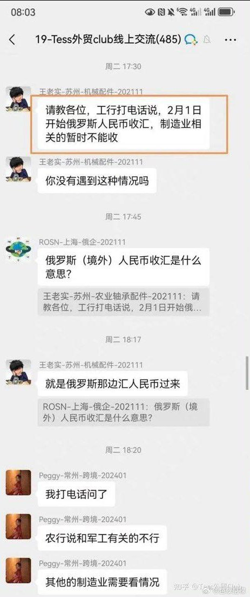

谁将十万横扫三江 北京时间 2024-02-17T20:52:51Z 1758836911056261210 RT @starlightcaesar: 主频道也更新啦~~过年这些天一直在忙碌，我去歇两天了。😁https://t.co/hhIIMryThI   谁将十万横扫三江 北京时间 2024-02-17T12:28:11Z 1758709907937964100 此事引起了网络上批判消防政策的热潮，可以看到，不管是水管没水，设备不合规，基本上都是出现在住宅物业消防，正常博主能说到商品房消防验收怎么过的就算观点犀利了，但我要说这是税法乃至政治参与问题。

从房屋建筑成本来看，消防在整个项目成本中占比大约3%，这还是非住宅项目拉高了平均数，在住宅项目中通常是50%，根据《GB 50016-2014》 规定住宅消防投入占建安成本比例应为5%，省下的每一分钱都是风险。但这些和物业以及负责消防验收的公安部门没有关系，死几个人而已，翻不了天，不能影响我赚钱。

如果有正常的业主委员会监督，不管成本几何，业主是本小区实际居住者，发生问题自己家也遭殃，和全体业主都有利益关联，更何况，大多数业主委员会的实践都是成本降低，甚至可以在接广告的情况下达成0物业费，住宅消防问题的重点是，要搞政务公开的小政府模式，真正的还政于民，主张政府严加管理，靠运动解决问题，只会在相当长的时间内维持高死亡率，不利于向公民社会转型   谁将十万横扫三江 北京时间 2024-02-17T10:42:06Z 1758683209897066732 2月7日，路透社引述俄罗斯媒体报道，中国浙江稠州商业银行已暂停与俄罗斯的业务，该行是俄罗斯进口商的主要结算渠道 https://t.co/gszr68KWDE   谁将十万横扫三江 北京时间 2024-02-17T12:06:59Z 1758704570405101593 正因为打耳光不算杀人，所以打耳光才成为如此常见的现象。因此应当决定，打耳光就是杀人。
试图靠重刑遏制乃至消灭犯罪是错误的想法，一时有效，政权总会付出代价   