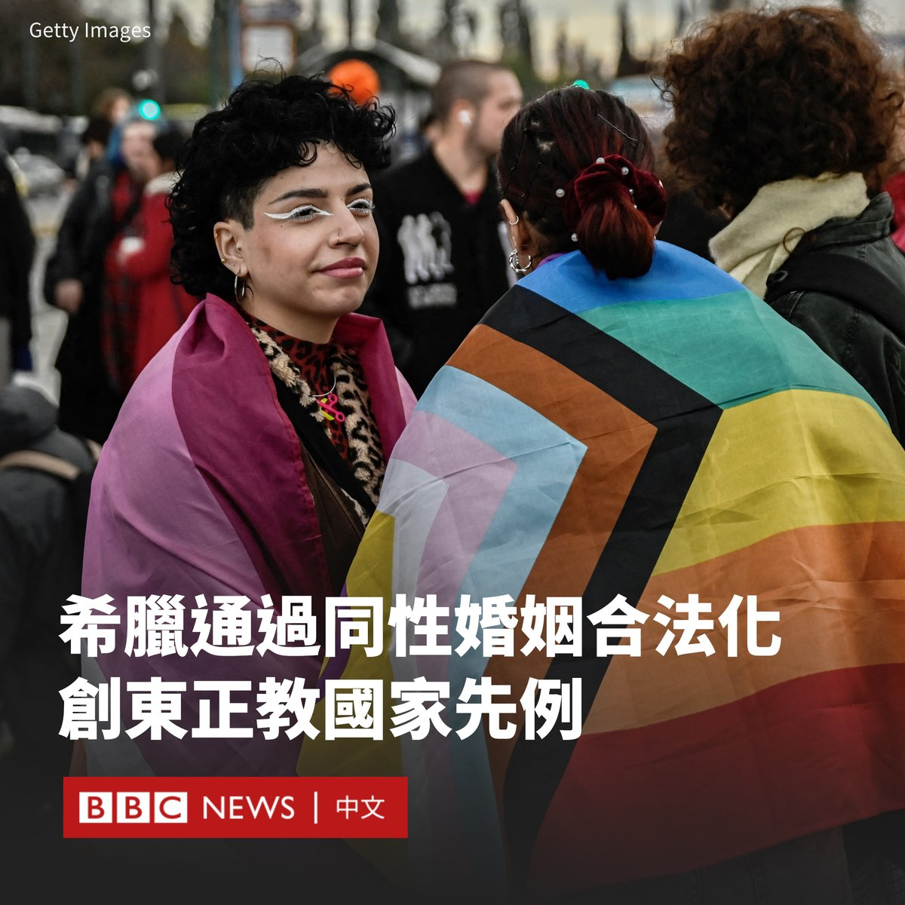
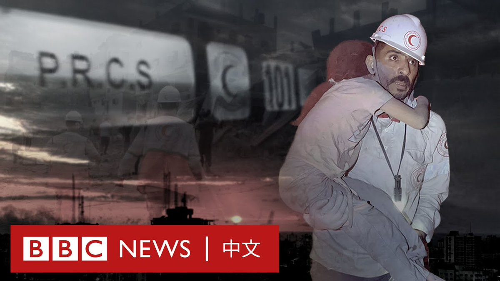

D英国广播公司BBC 北京时间 2024-02-16T14:07:17Z 1758372456002183507 二代台湾移民历经的故事，与他们的父母渐渐有所区隔。后者可能多半挣扎于漂泊在外的乡愁，而新一代的人更多时候是在探索自己生长于美国的身份认同，或如何在美国找到自己的一片天空。https://t.co/M224jWSMlr   D英国广播公司BBC 北京时间 2024-02-16T11:53:39Z 1758338827901632858 希腊议会周四（2月15日）通过将同性婚姻合法化并允许同性伴侣收养孩子的法案。

经过两天的辩论，该法案在出席的245名议员中，以176票获得通过。

尽管希腊是第16个允许同性婚姻的欧盟国家，但它是首个通过此类法案的东正教占多数国家。

不过，该法案在该国引起民意分裂，并引发强大的东正教会的强烈抵制。反对者在雅典举行了抗议集会。

希腊总理基里亚科斯·米佐塔基斯（Kyriakos Mitsotakis）在X上写道：“这是人权上的一个里程碑，反映了今天的希腊——一个进步和民主的国家——热情地致力于欧洲价值观。”

米佐塔基斯在去年以压倒性优势连任后，曾承诺通过该法案。他表示，同性婚姻是平权问题，并指出其他30多个国家也有类似立法，指不应有“二等公民”或“失宠于上帝的孩子”。

此次投票受到希腊LGBTQ组织的欢迎，但东正教会大主教伊罗尼莫斯（Ieronymos）表示，该措施将“破坏祖国的社会凝聚力”。

在雅典的宪法广场上，许多人手举横幅和十字架，诵读祷文，唱着《圣经》中的段落。   D英国广播公司BBC 北京时间 2024-02-16T08:48:41Z 1758292277645254993 在哈马斯与以色列开战的第一个月，加沙北部遭到以色列的猛烈轰炸。

BBC阿拉伯语组获得罕有机会，近距离接触巴勒斯坦红新月会医疗救护人员的工作。他们是平民拨打加沙紧急电话101后的最先响应者。

当地电影制作人费拉斯·阿拉米（Feras Al-Ajrami）跟随这些救护员，记录下他们在加沙空袭重灾区亲历的残酷战争。   