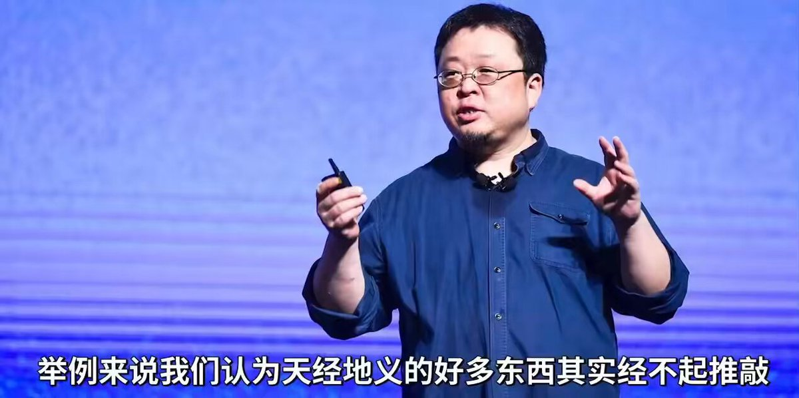
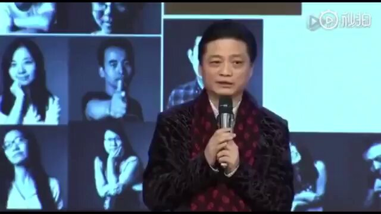

Ivy未央 北京时间 2024-02-16T23:18:47Z 1758511246230339776 罗永浩：爱国主义是狭隘的民族主义
中国的爱国主义诞生于战争期间，首先是为了权力永久化，为了控制人民。将愤怒、羞耻、自豪与多年的民族主义教育结合在一起，让他们为潜在的冲突和战争做好准备，结果就是这样的：一个年轻人举着一个牌子，让另一个人在他的主子面前跪下。成为中共永远的奴隶还不自知。   Ivy未央 北京时间 2024-02-16T12:39:36Z 1758350389773029682 《金瓶梅》中李瓶儿跟潘金莲说：“莲妹妹，记住姐一句话：这世上的事儿，凡是禁止的，往往是有好处但不想分给你。凡是提倡的，大概率是有坑需要你去填。“瓶儿的一句话，说破了中国金融的真相，韭菜们醍醐灌顶了吗？
https://t.co/jSaqqrjrYM   Ivy未央 北京时间 2024-02-16T10:27:45Z 1758317208168484878 转）崔永元：文革已经开始了，主动积极制止它！
不要让中国倒退回朝鲜，打倒全民公敌习特勒，已经成为体制内外最大的共识。 https://t.co/nYYZ4EUbIp   Ivy未央 北京时间 2024-02-16T09:27:47Z 1758302118480343198 这份“23种顶级思维”清单，不仅是一份简单的指南，每一种思维方式都是对日常问题的独到解答，帮助你在复杂的世界中找到清晰的方向。例如，吉德林法则教我们，问题的明确化是解决问题的一半；而福尔摩斯原则则启示我们，剥离不可能的因素，真相就浮出水面。这些看似简单的原则，实则蕴含了深刻的生活智慧。

更重要的是，这些思维模式不仅仅停留在理论层面。它们是实际可行的策略，能够在我们的日常生活和职业生涯中找到应用。无论是提升个人效率，还是提高决策质量，这份清单都能提供有效的指导。
简而言之，这份“23种顶级思维”清单，绝对值得每个追求成功和卓越的人仔细阅读和实践。   Ivy未央 北京时间 2024-02-16T09:11:48Z 1758298097904431189 这份“23种顶级思维”清单真是太棒了，简直就像人生成功的秘籍！从应对乱世的墨菲定律到聪明投资的巴菲特定律，它应有尽有，教你怎么在生活各种挑战中游刃有余。这些思维方式就像是生活的瑞士军刀，这清单不光是理论，更是实用的人生攻略，绝对值得一看！
https://t.co/J5jWD80ZfH   