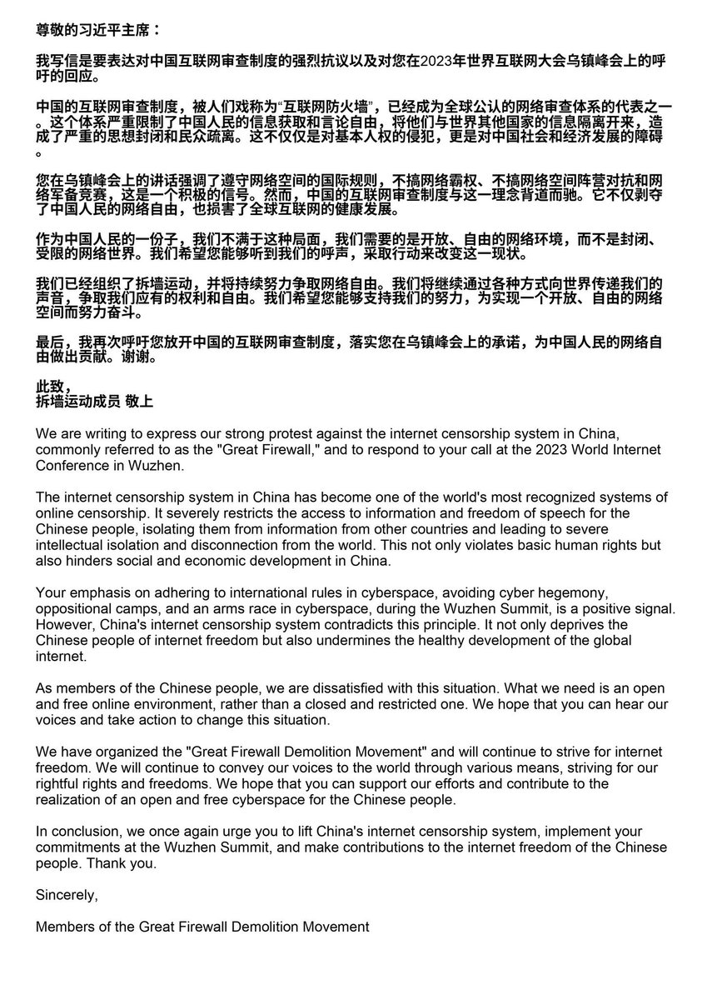
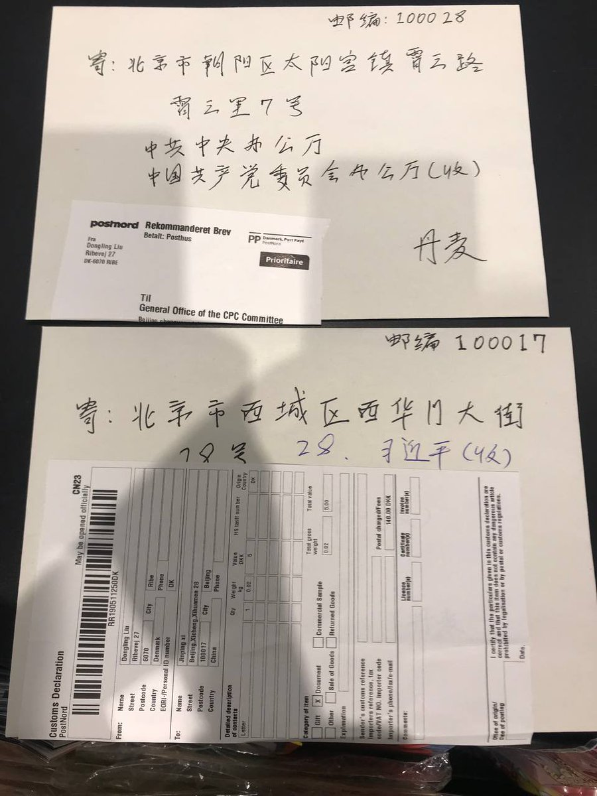
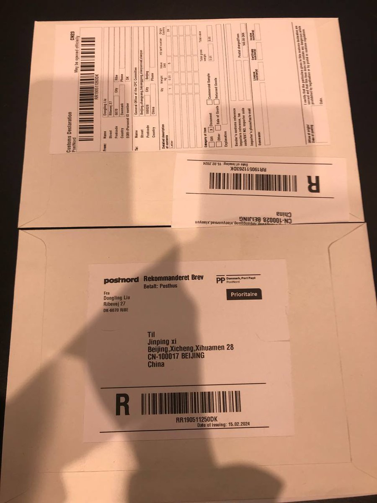
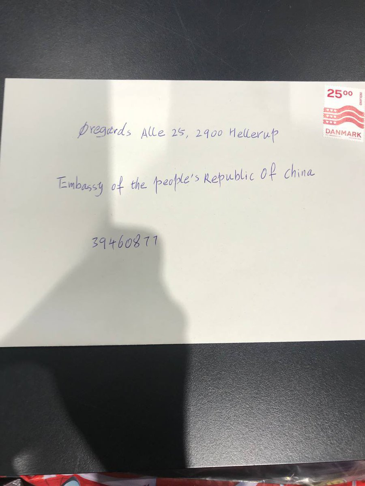

拆墙运动公号 北京时间 2024-02-16T03:22:15Z 1758210129030189259 #拆墙运动 给习近平的公开信

尊敬的习近平主席：

我写信是要表达对中国互联网审查制度的强烈抗议以及对您在2023年世界互联网大会乌镇峰会上的呼吁的回应。

中国的互联网审查制度，被人们戏称为“互联网防火墙”，已经成为全球公认的网络审查体系的代表之一。这个体系严重限制了中国人民的信息获取和言论自由，将他们与世界其他国家的信息隔离开来，造成了严重的思想封闭和民众疏离。这不仅仅是对基本人权的侵犯，更是对中国社会和经济发展的障碍。

您在乌镇峰会上的讲话强调了遵守网络空间的国际规则，不搞网络霸权、不搞网络空间阵营对抗和网络军备竞赛，这是一个积极的信号。然而，中国的互联网审查制度与这一理念背道而驰。它不仅剥夺了中国人民的网络自由，也损害了全球互联网的健康发展。

作为中国人民的一份子，我们不满于这种局面，我们需要的是开放、自由的网络环境，而不是封闭、受限的网络世界。我们希望您能够听到我们的呼声，采取行动来改变这一现状。

我们已经组织了拆墙运动，并将持续努力争取网络自由。我们将继续通过各种方式向世界传递我们的声音，争取我们应有的权利和自由。我们希望您能够支持我们的努力，为实现一个开放、自由的网络空间而努力奋斗。

最后，我再次呼吁您放开中国的互联网审查制度，落实您在乌镇峰会上的承诺，为中国人民的网络自由做出贡献。谢谢。

此致，
拆墙运动成员 敬上

We are writing to express our strong protest against the internet censorship system in China, commonly referred to as the "Great Firewall," and to respond to your call at the 2023 World Internet Conference in Wuzhen.

The internet censorship system in China has become one of the world's most recognized systems of online censorship. It severely restricts the access to information and freedom of speech for the Chinese people, isolating them from information from other countries and leading to severe intellectual isolation and disconnection from the world. This not only violates basic human rights but also hinders social and economic development in China.

Your emphasis on adhering to international rules in cyberspace, avoiding cyber hegemony, oppositional camps, and an arms race in cyberspace, during the Wuzhen Summit, is a positive signal. However, China's internet censorship system contradicts this principle. It not only deprives the Chinese people of internet freedom but also undermines the healthy development of the global internet.

As members of the Chinese people, we are dissatisfied with this situation. What we need is an open and free online environment, rather than a closed and restricted one. We hope that you can hear our voices and take action to change this situation.

We have organized the "Great Firewall Demolition Movement" and will continue to strive for internet freedom. We will continue to convey our voices to the world through various means, striving for our rightful rights and freedoms. We hope that you can support our efforts and contribute to the realization of an open and free cyberspace for the Chinese people.

In conclusion, we once again urge you to lift China's internet censorship system, implement your commitments at the Wuzhen Summit, and make contributions to the internet freedom of the Chinese people. Thank you.

Sincerely,

Members of the Great Firewall Demolition Movement   拆墙运动公号 北京时间 2024-02-16T16:44:11Z 1758411944652927218 RT @ABCChinese: 被泄露出来的2023年雨果奖评委会负责人戴夫·麦卡蒂的电邮写道：

“我们需要特别注意作品中有没有任何具有敏感政治性质的内容。没必要把所有内容都读一遍，但如果作品是关于中国、台湾、西藏或其他可能在中国引发争议的话题……那就特别注意，是不是可以将其…   拆墙运动公号 北京时间 2024-02-16T16:54:04Z 1758414430465917386 https://t.co/SY6F9ckZOE   