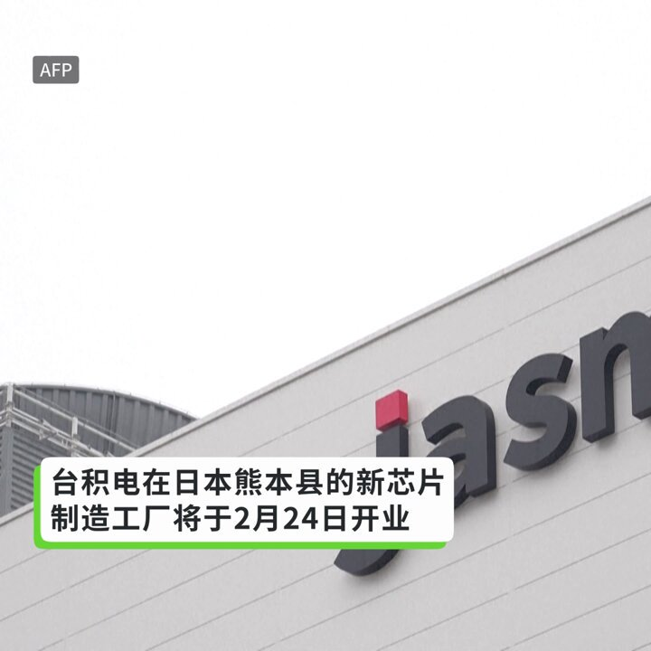
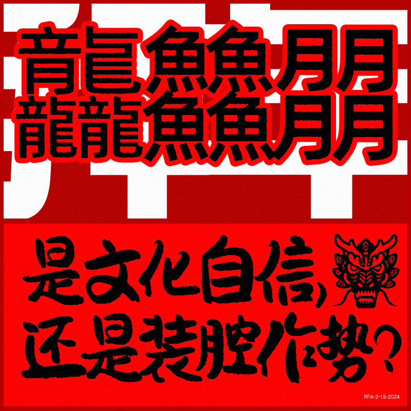

自由亚洲电台 北京时间 2024-02-16T05:28:08Z 1758241807513874723 据法新社报道，台积电在日本熊本县的新芯片制造工厂将于2月24日开业 https://t.co/YBqK8wppjR   自由亚洲电台 北京时间 2024-02-16T05:32:08Z 1758242814272422199 英国外相 #卡梅伦（David Cameron）将于本周和中国外长 #王毅 会面，卡梅伦称将与中方讨论 #台海"航行自由"问题。 中国驻英国大使馆则"先发制人"，发声明强调中方对台湾海峡享有"主权、主权权利和管辖权"。

https://t.co/v6WyzVPOaE   自由亚洲电台 北京时间 2024-02-16T05:49:50Z 1758247268262527250 本周四，国际知名调研机构经济学人智库（EIU）发布 #2023年民主指数（Democracy Index），为全世界167个国家及地区进行民主排名。其中，中国被列为"#独裁政权"，排名跌落148；台湾则被归类为"完全民主"，位居亚洲第一。

https://t.co/1xujyzfxrh   自由亚洲电台 北京时间 2024-02-16T05:53:09Z 1758248104266997965 “中国实施了世界上最复杂、最全面的跨国镇压运动，中国跨国镇压案件占据记录在册总数的30%。”
国际人权组织“自由之家”（Freedom House）执行副总裁Nicole Bibbins Sedaca说。
https://t.co/X1e8mlpQKt   自由亚洲电台 北京时间 2024-02-16T06:15:02Z 1758253613523386816 「龙行龘龘，前程朤朤，生活䲜䲜」是今年拜年的高頻詞。
中国媒体说，生僻字的流行，与中国文化传承、文化自信扣连，体现了中华文化的博大精深。
有网民说, 这是“学渣整新词儿，差生文具多”“字糊在一起还以为是QR码……”
有港台学者说，既然觉得繁体字有文化，不如恢复繁体字。
#您怎么看？ https://t.co/17Kgrdx3pw   自由亚洲电台 北京时间 2024-02-16T02:36:49Z 1758198697345618383 专栏 | #军事无禁区：#俄乌战争 进入转折期－看瑟尔斯基接掌兵符  https://t.co/8odFuDZZJk   自由亚洲电台 北京时间 2024-02-16T03:33:17Z 1758212904929656980 新春佳节对中国人来说原本是阖家团圆的时刻，但在今年过年期间，"#断亲"一词却成了很多中国网民热议的话题。那么，到底什么是"断亲"？这一现象显示了怎样的社会变迁？而这种变化究竟是好还是坏呢？

https://t.co/o6T67t4JiL   自由亚洲电台 北京时间 2024-02-16T03:55:55Z 1758218602753274033 #马斯克 邀请 #中国 供应商在 #墨西哥 设厂　引发华盛顿担忧  https://t.co/94kOHLCNVz   自由亚洲电台 北京时间 2024-02-16T00:54:38Z 1758172979182154196 调查报道 | 独家：商业伙伴称失踪的石油大亨曾是中共代理人 https://t.co/JF2tBXcpKF   自由亚洲电台 北京时间 2024-02-16T02:12:50Z 1758192661515612600 《经济学人（The Economist）》报道指出，在新冠疫情肆虐的3年期间，#习近平 几乎没有出国。他待在国外的天数，2023年只有13天，2019年28天。去年9月，习近平还缺席了印度主办的20国集团峰会。https://t.co/NEEX9RdA9P   自由亚洲电台 北京时间 2024-02-16T00:01:45Z 1758159673092448715 #梅西 疑遭 #央视 封杀，或永久失去中国市场 
面对北京的经济胁迫，“#迈阿密国际”会选择让步吗？ https://t.co/8UPhYtlMxZ   