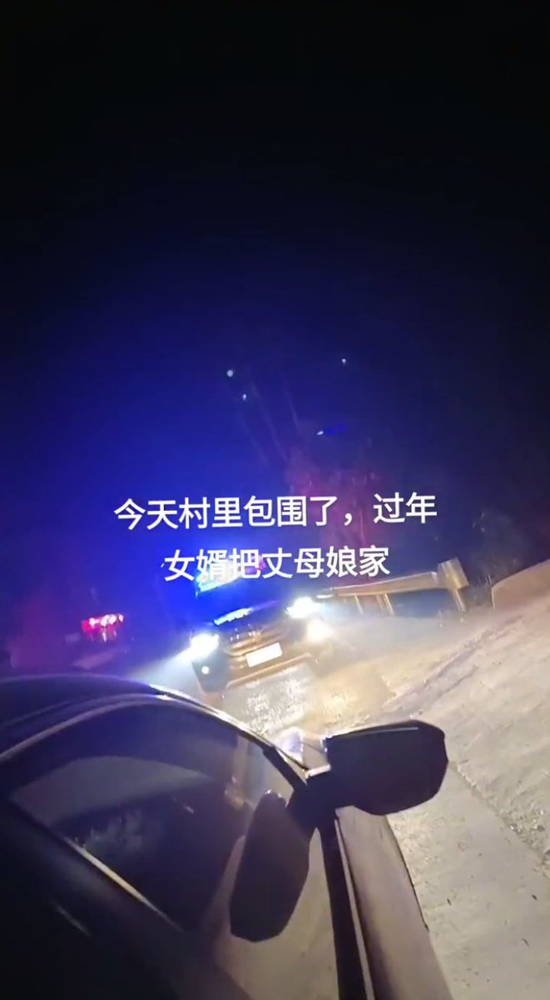
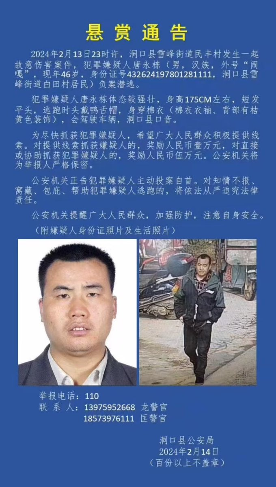
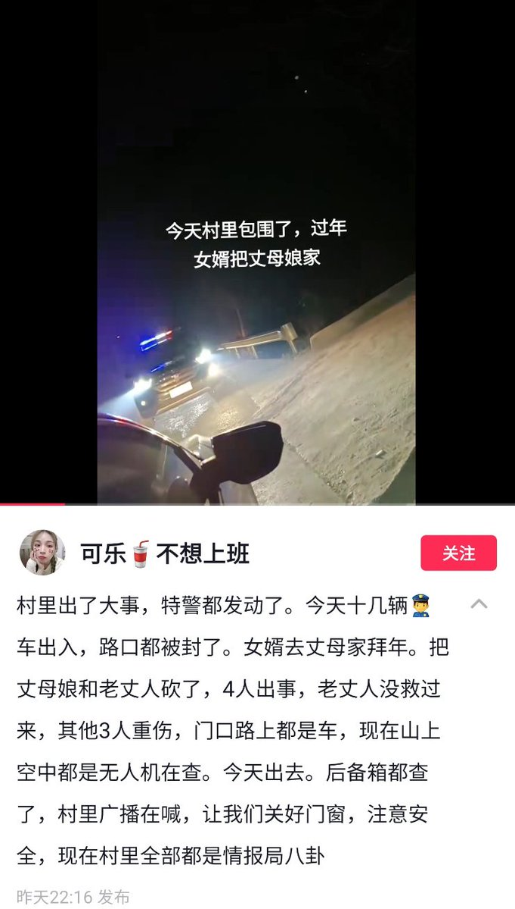
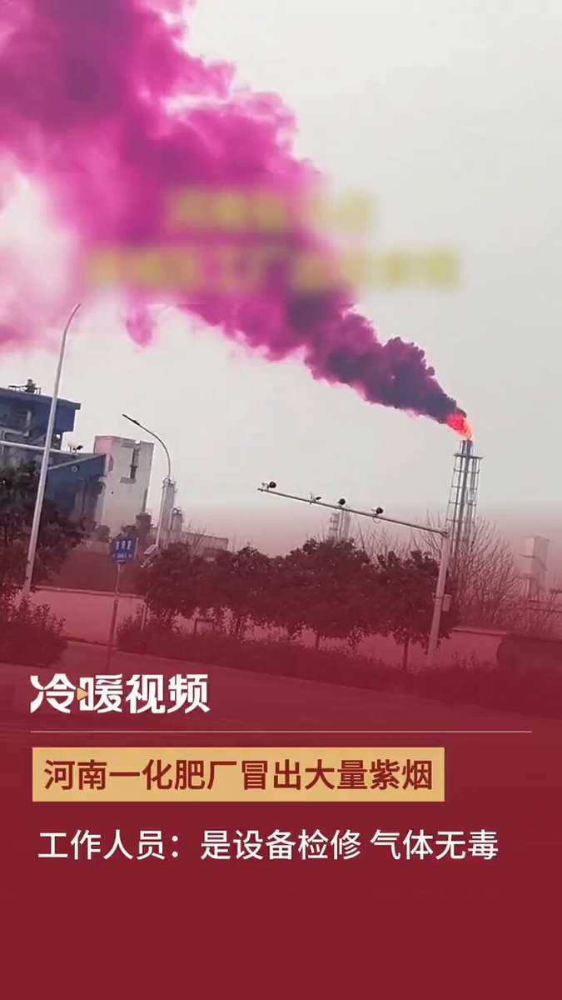
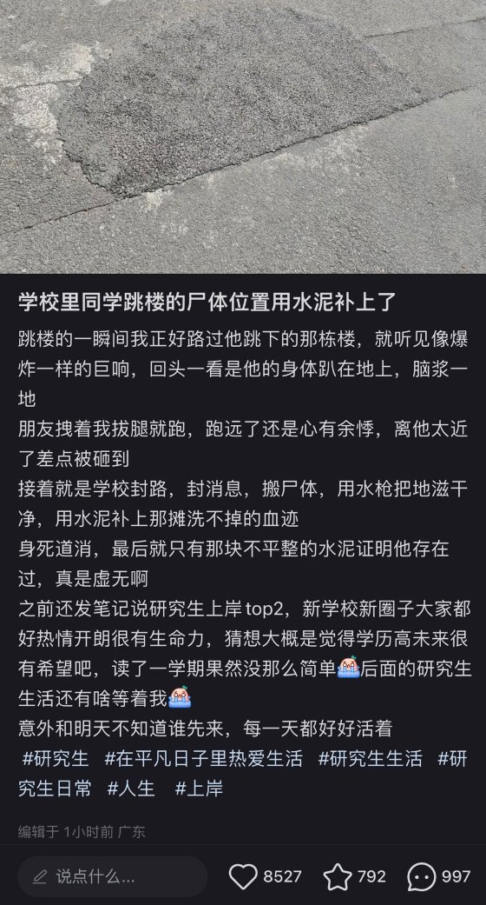
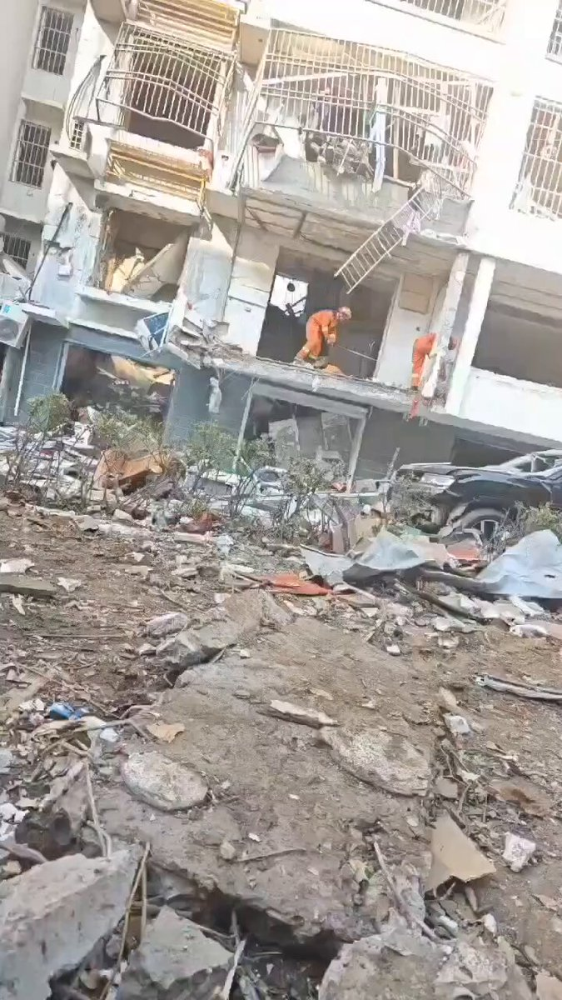
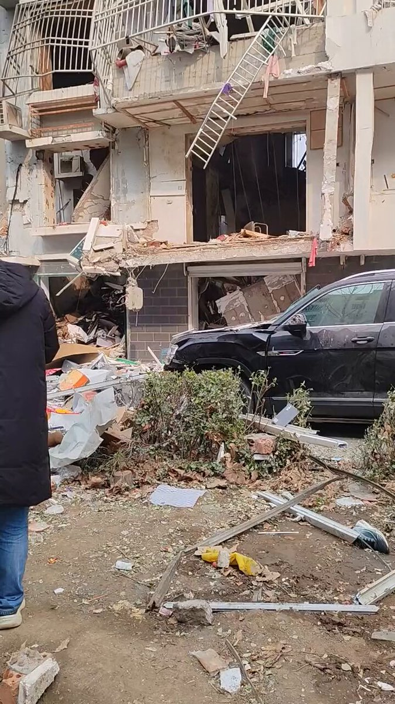
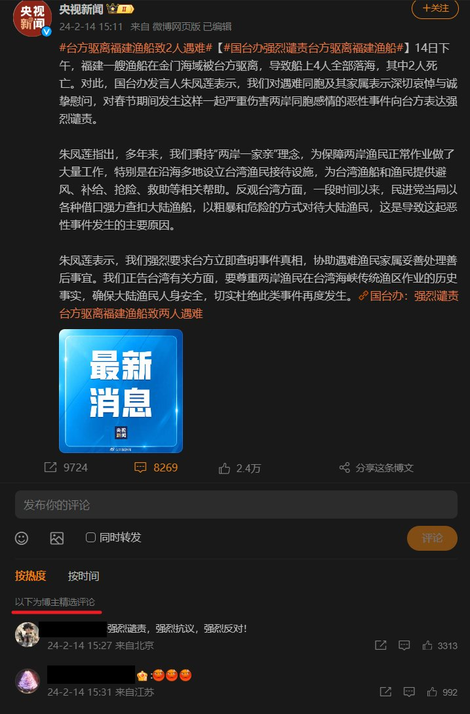
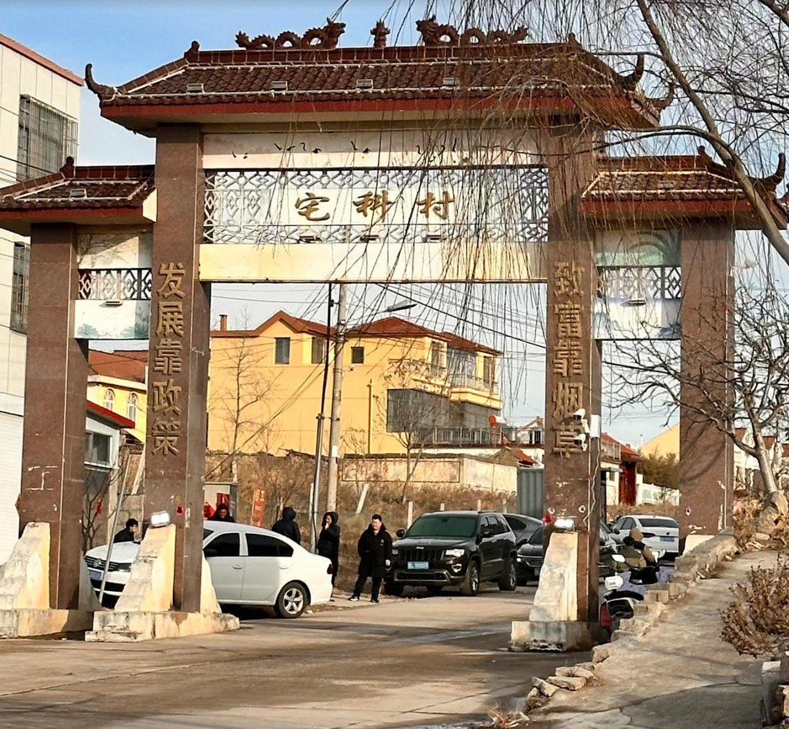

A李老师不是你老师 北京时间 2024-02-15T18:23:15Z 1758074487356965246 RT @chinalabour: "Unpaid wages are currently the leading cause of industrial disputes across China, according to the Hong Kong-based China…   A李老师不是你老师 北京时间 2024-02-15T18:25:07Z 1758074953402888455 2月14日，湖南邵阳洞口县民丰村。当地居民发视频称村里发生凶杀案，女婿去丈母娘家拜年，把丈母娘和老丈人砍了，一共4人受伤，老丈人没救过来，其他3人受伤。今天村里有十几辆警车出入，路口都被封了。现在山上空中全是无人机在查，今天出门汽车后背箱都被查了，村里的广播提醒村民们关好门窗，注意安全。
 据了解。洞口县公安局在14日发布了一则悬赏通告。通告称，2024年2月13日23时许，洞口县雪峰街道民丰村发生一起故意伤害案件，犯罪嫌疑人唐永栋（男，汉族，外号“闹嘎”，现年46岁）负案潜逃。
 另一位洞口县居民称，“该嫌犯已经潜逃到我们镇上了”他表示自己在高沙镇。还有一位网友透露：嫌犯经常家暴妻子，上次家暴打断了妻子好几根肋骨，女方家里一直想让女方离婚，但男方不准，所以发生了这件事。   A李老师不是你老师 北京时间 2024-02-15T18:45:56Z 1758080193711726941 2月14日，河南驻马店。多名网友拍下驿城区化肥厂烟囱不断向外冒出紫色烟雾。有网友质疑这是有毒气体。河南骏化化肥厂一员工回应称，当时是因为设备检修，将需要置换的气体放入火柜中燃烧，释放的气体无毒无害。 https://t.co/6vNRbayhmV   A李老师不是你老师 北京时间 2024-02-15T18:58:20Z 1758083312793313598 12月19日，清华大学深圳研究生院一名学生因长期被导师许诺博士名额画饼没有实现加上些许感情问题而跳楼
2月15日，有校内学生称，该学生坠楼的位置已经用一块水泥补上了。
“只有那块水泥证明他存在过” https://t.co/0Ankp4zCju   A李老师不是你老师 北京时间 2024-02-15T19:15:07Z 1758087538747548130 邢家湾小区金湾梦都9号楼爆炸更多现场画面 https://t.co/hAzPb7EWpN   A李老师不是你老师 北京时间 2024-02-15T19:27:38Z 1758090689621917964 有网友发现，2月14日台方驱离福建渔船致2人遇难的相关评论区已经全部禁止评论或精选评论，相关话题已经全部撤出热搜榜，试图对事件降温。
但2020年3月国内媒体曾鼓吹过大陆渔船强势冲撞台湾海巡艇，当时弹幕却是一片叫好。 https://t.co/TTLoEBYLYA   A李老师不是你老师 北京时间 2024-02-15T19:35:06Z 1758092566799466710 2月15日河北廊坊高铁站，一男子因孩子携带儿童玩具枪被警方拦住。男子愤而当场把枪踹碎。 https://t.co/XIE7qq6Vam   A李老师不是你老师 北京时间 2024-02-15T19:44:51Z 1758095019758473559 2月15日，宅科村目前依然有黑衣人在村口把守，只有当地村民或当地村民的亲友才可以进村。 https://t.co/1GbzOwSsD3   A李老师不是你老师 北京时间 2024-02-15T07:23:26Z 1757908438896562580 RT @YesterdayBigcat: 「四川甘孜上百藏民集会要求当局停建水电站（2月14日）」2月14日，四川省甘孜州德格县汪布顶乡的上百名藏民到德格县政府集会，要求政府停止岗托水电站的建设。… https://t.co/9TxeyrZOvI   A李老师不是你老师 北京时间 2024-02-15T01:40:15Z 1757822071973769433 RT @bbcchinese: 据台湾中央社周三（2月14日）报导，一艘载有四人的中国大陆快艇闯入金门海域，在遭台湾海巡署人员驱离时翻覆，导致两人死亡。

中国国务院台湾事务办公室对该事件表示“强烈谴责”，并称出事的船只是一艘福建渔船，要求台方“立即查明事件真相”。… http…   