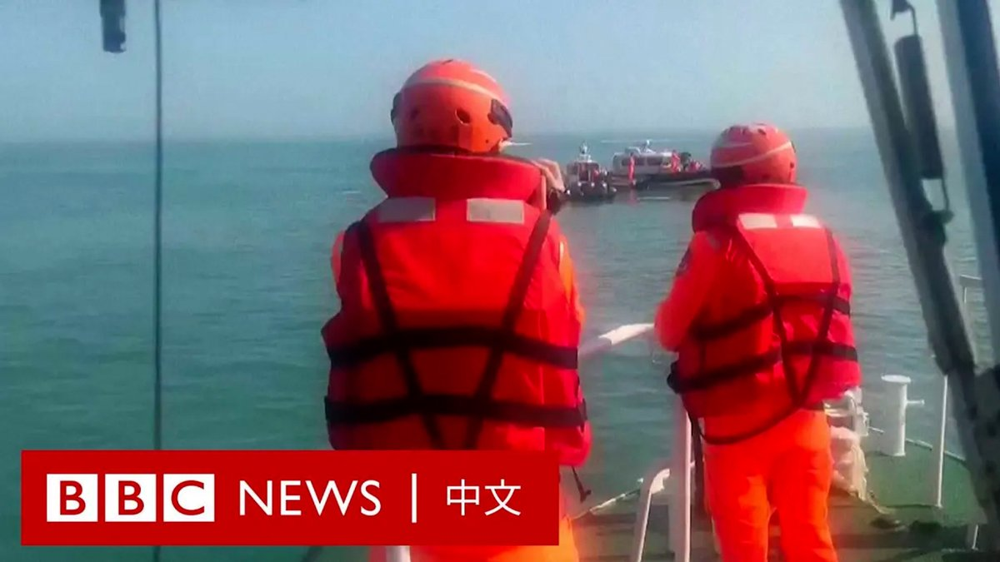
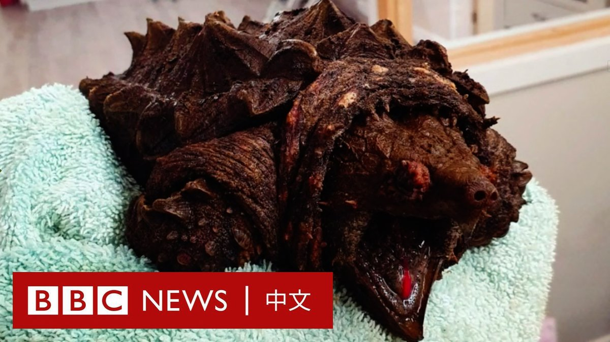
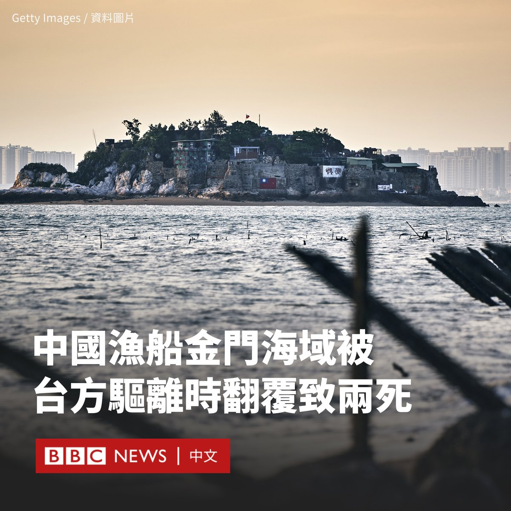

D英国广播公司BBC 北京时间 2024-02-15T19:36:25Z 1758092899517071546 台湾海巡署周三（2月14日）表示，两名中国大陆船员在金门海域被海巡队驱离时溺水身亡。

台湾海巡署指控该船非法“越界作业”，在遭驱离时，“拒检”并蛇行，其后翻覆。落水者一共四人，其中两人幸存，另两人送医后宣告不治。

中国国台办对该事件表示“强烈谴责”，并表示出事的船只是一艘福建渔船。 https://t.co/0V7LeNsgcf   D英国广播公司BBC 北京时间 2024-02-15T17:52:38Z 1758066779706794418 两年过去，在百万难民逃往欧洲的中转地利沃夫，战争已成为这里的车站难以抹去的时代印迹。人们疲惫不堪，到处都是生离死别的故事。https://t.co/sNICCfTsRd   D英国广播公司BBC 北京时间 2024-02-15T15:36:26Z 1758032504102240521 印尼总统大选初步点票结果显示，该国国防部长普拉博沃（Prabowo Subianto）预计赢得过半选票，料将成为下一任印尼总统。

现年72岁的普拉博沃曾是令人望而生畏的铁腕将军，在苏哈托时代饱受侵犯人权的指控。短暂流亡海外后，他重返印尼政坛，三度参选总统。

他在此次大选中改头换面，在社交媒体上对年轻人展开攻势，用跳舞打造自己的“可爱老爷爷”人设。   D英国广播公司BBC 北京时间 2024-02-15T11:07:45Z 1757964890235625882 “它可能会狠狠地咬你一口。”

在英格兰坎布里亚郡的一个湖泊中，人们惊奇地发现了一只鳄龟。这种体型巨大的乌龟主要栖息在美国南部的沼泽和河流中，据信是有人饲养后遗弃。 https://t.co/MbFVNTZ15j   D英国广播公司BBC 北京时间 2024-02-15T00:51:02Z 1757809688018850237 据台湾中央社周三（2月14日）报导，一艘载有四人的中国大陆快艇闯入金门海域，在遭台湾海巡署人员驱离时翻覆，导致两人死亡。

中国国务院台湾事务办公室对该事件表示“强烈谴责”，并称出事的船只是一艘福建渔船，要求台方“立即查明事件真相”。

金门是由台湾管辖的岛屿，距离中国厦门不到10公里，而距台湾本岛却有200多公里。

中央社引述台湾海巡署金马澎分署的声明称，这艘没有名字的船只当日“越界作业”，在遭驱离时，该船“拒检”并蛇行，其后翻覆。

金门海巡队副队长陈建文对台湾媒体说，该船只上的四人落海，后被海巡人员救起，但两人送医后宣告不治。

中国国台办发言人朱凤莲在一份声明中称，台湾当局“以各种借口强力查扣大陆渔船，以粗暴和危险的方式对待大陆渔民，这是导致这起恶性事件发生的主要原因”。

朱凤莲补充说，台方要尊重“两岸渔民在台湾海峡传统渔区作业的历史事实”，确保大陆渔民人身安全，杜绝此类事件再度发生。

据台湾媒体报导，被救起的两人“生命迹象稳定”，被金门海巡队带回调查。该案件已被报请金门地检署调查。   