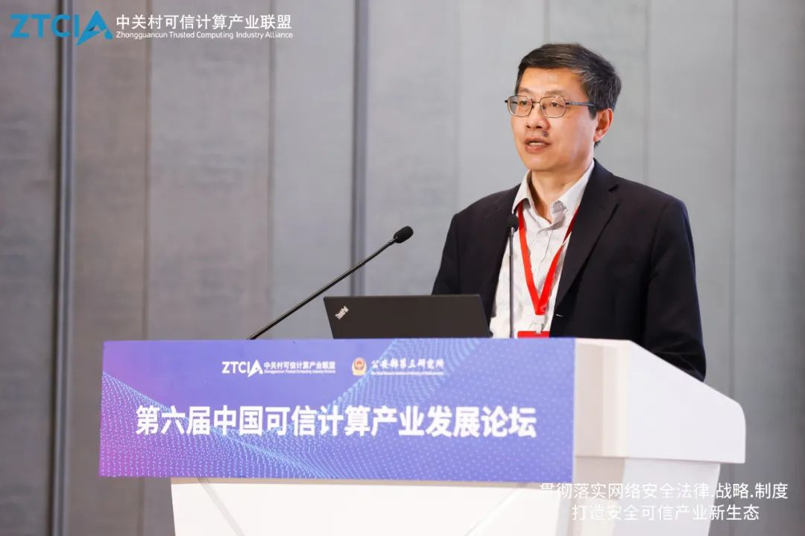

拆墙运动公号 北京时间 2024-02-15T00:38:40Z 1757806574637093263 RT @RFA_Chinese: 下月10日是 #西藏抗暴日65周年，台湾的藏人团体展开每年一度的"#为西藏自由而骑"活动，希望通过骑乘自行车，展现藏人不放弃争取自由民主的精神，同时也为被中国压迫的不同政见人士发声。
https://t.co/vUn7wZd044   拆墙运动公号 北京时间 2024-02-15T00:08:41Z 1757799030409605476 【 #2259专案组 互联网防火墙第124号嫌犯 #顾健】    性别：男
学历：博士，研究员。
电话：021-64335070
传真：021-64335838
E-mail：mail@mctc.org.cn
职务：现任公安部信息安全产品检测中心副主任。

邮箱 ：sansuo@trimps.ac.cn 
地址：上海市岳阳路76号 
邮编：200031

官网：https://t.co/LZ1NK8udKm
详细资料见: #BanGFW拆墙运动（建墙罪犯录）：https://t.co/u6Pqwf0iON

顾健，男，博士，研究员，公安部第三研究所检测中心(公安部计算机信息系统安全产品质量监督检验中心，公安部等级保护评估中心，公安部信息安全产品检测中心)副主任。主要研究方向：信息网络安全、软件测试。

博士，研究员。
1979-1983年就读于江苏大学工业电气自动化专业，留校任教，
1992年获硕士学位，任教研室副主任、副教授。
1997-2001年在华中科技大学计算机科学与技术专业全日制博士研究生学习，获博士学位，毕业后在公安部第三研究所检测中心工作至今。主要从事信息安全产品、信息网络安全的测试/评估方法、标准和工具的研究工作，担任公安部信息网络安全重点实验室学科带头人，专业技术职务高级评审委员会委员。
战略合作伙伴：1、中共恶人榜：#ccpevils          
      2、#zhinawiki   