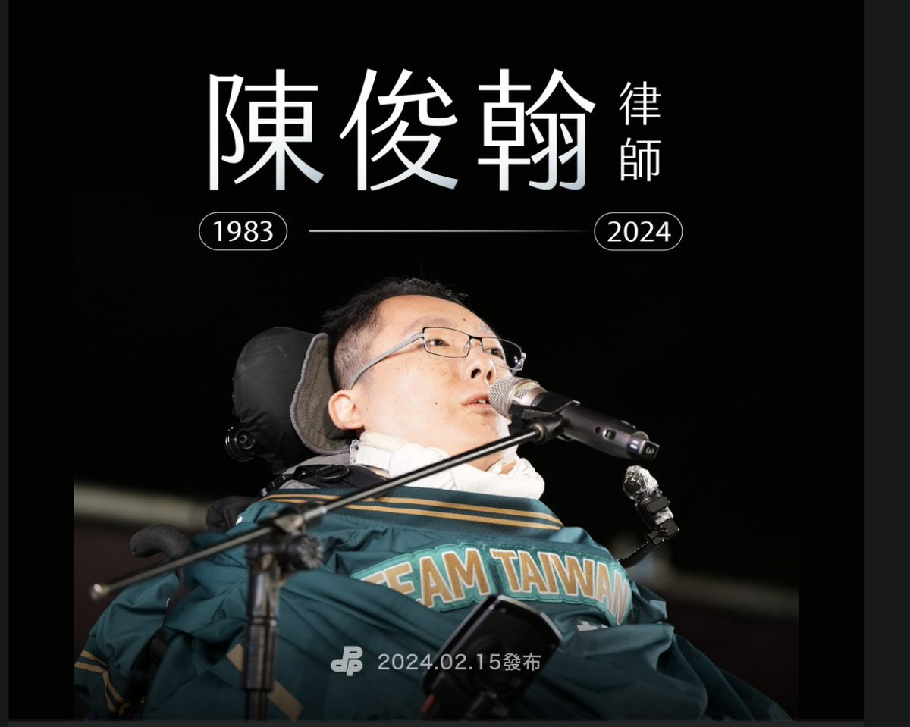
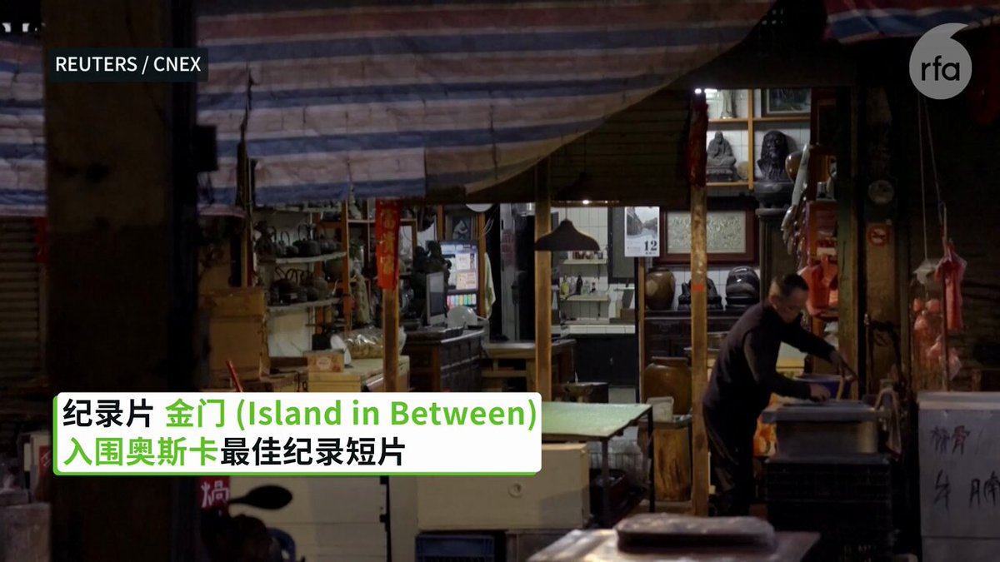

自由亚洲电台 北京时间 2024-02-15T23:36:44Z 1758153377744130323 RT @asiafactcheckcn: 【查核回顾】
【中国官媒民调自我代表全亚太意见】

本篇回顾去年六月的查核。中国环球电视网（CGTN）引述自己的民调报导称：日本首相岸田文雄证实北约（NATO）计划今年在东京设联络处后，有高达七成的受访者表达 #强烈反对 的立场。

❌…   自由亚洲电台 北京时间 2024-02-15T23:36:58Z 1758153436602970368 RT @asiafactcheckcn: 【查核回顾】
【美国经济制裁影响多少人】

本篇回顾去年六月的查核。五月下旬的G7高峰会在一份声明中提及，各国关切中国在贸易上对他国的经济胁迫。中国外交部回应反指美国施加的经济制裁“影响了近一半世界人口”。

❌经核实，中国声明中提到的…   自由亚洲电台 北京时间 2024-02-15T23:38:13Z 1758153748428247130 专栏 | #报导者时间：直播天安门示威与寻找习近平金库的方法──专访齐迈可： 中共眼皮底下挖真相的中国报导任务 https://t.co/cVEwhRLzMb   自由亚洲电台 北京时间 2024-02-15T18:38:58Z 1758078440811712851 【曾遭王志安嘲讽 民进党不分区立委提名人陈俊翰过世  】
民进党中央15号傍晚发布，#陈俊翰 律师因疑似感冒引起并发症，于2/11凌晨不幸逝世。民进党表示，闻讯感到无比震惊与悲伤。俊翰的家人低调办理后事，年节期间未对外公布，15日委由民进党党中央代为发布消息，感谢各界关心，也请给家属空间处理相关事宜。

陈俊翰患有先天性“脊髓性肌肉萎缩症”，全身只有眼睛、嘴巴以及一根小指头可以活动。他在家人的支持下，突破身体限制，考取律师高考榜首与会计师执照，并取得哈佛法学院硕士、密西根大学法学院博士，后进入中研院法学研究所，专精国际人权法、身心障碍政策与法律等研究。

民进党在第11届立委选举邀陈俊翰加入不分区立委提名名单，名列第16名。

日前脱口秀节目“贺珑夜夜秀”来宾、前中国央视记者 #王志安 因批评民进党的提名政策，并模仿陈俊翰的言行，引起舆论挞伐。王志安也表示歉意。

王志安在听闻陈俊翰去世信息后表示震惊和遗憾。指出半个月前，已起草了道歉信，但一直没有修改定稿发出。他说，歉意再也无法抵达，令人无限的懊悔和遗憾。
（图片取自民进党脸书）   自由亚洲电台 北京时间 2024-02-15T16:49:13Z 1758050821215010893 【美众院美中战略竞争特设委员会主席 #加拉格尔 将率团访台】
【关切台湾选后局势】
【三党不过半 关切台湾国会会被渗透统战成“红色国会”？】
美国德州山姆休士顿州立大学政治系副教授翁履中指出，访团此行的目的，应是要观察台湾大选后的走向，想要了解 #赖清德 520的 #就职演说，以及未来的路线。此外，台湾的国会改选后，三党不过半，访团与 #韩国瑜 会面，应想了解未来国会是否会继续在军购方面强化军备。
台湾政治大学国际关系研究中心研究员宋国诚表示，台湾国会三党不过半，其中有两个政党被视为较亲中，他将此称为“#红色国会”。他认为，中共未来对台湾不会轻易动用武力，但是会以国会渗透的方式，用最低的成本，破坏台湾的民主制度。
“中国以台湾国会乱局的策略，造成政党斗争，进而形成 ‘台湾的民主颠覆台湾的民主’的最高对台统战战略，台湾内部社会并没有警觉到这样的危机，而且危机已开始产生。”宋国诚进一步表示，“美国会忧虑台湾的国会，被中共赤化或者是造成一种亲共的国会结构，这涉及到军售、美台的关系以及国会外交等。”
https://t.co/iQTBW20xJo   自由亚洲电台 北京时间 2024-02-15T15:09:25Z 1758025707408777390 【中国快艇闯金门海域 拒检蛇行翻覆酿2死】 
【国台办谴责台湾 台：依法执行职务无不当】
一艘中国籍 #快艇 载4人，14日下午1时许越界闯入 #金门 海域，行经金门县北碇东1.1浬时，遭台湾海巡署人员追缉，该船拒检蛇行翻覆酿2死。
中国 #国台办 发言人 #朱凤莲 随后发布新闻表达哀悼与慰问。并表示，“对春节期间发生这样一起严重伤害两岸同胞感情的恶性事件向台方表达强烈谴责”。
台湾陆委会则表示，主管机关依法执行职务，过程并无不当。支持主管机关严正执法，保护民众权益。
台湾海巡署副署长张忠龙之处，执法过程中，陆船蛇行拒检，不慎翻覆，造成4人落海，海巡署巡防艇立即搜救；嗣后陆续救起4人，并紧急送往署立金门医院检伤及急救，其中2人急救无效宣告死亡。
他表示，本次涉案船舶，系属 #三无船舶（无船名、无船舶证书、无船籍港登记），为两岸协同执法共同关注对象，双方对于该类船舶均会加强取缔。   自由亚洲电台 北京时间 2024-02-15T14:02:38Z 1758008901164056668 【记录短片“金门” 入围奥斯卡最佳纪录短片】
【导演：为国际观众讲述台湾故事】
《金门》入围奥斯卡最佳纪录短片，台湾出生，美国长大的导演江松长接受访问时表示，他借着金门的战争和中国意象，向国际观众介绍台湾的故事，而他自己则会明白表达自己是“台湾人”。
#金门
#江松长
#奥斯卡 https://t.co/bTHP3oXfU7   自由亚洲电台 北京时间 2024-02-15T09:35:39Z 1757941711626498105 RT @RFA_Chinese: 据金融时报报道，美国国会众议院“美国与中共战略竞争特设委员会”共和党籍主席迈克·#加拉格尔（Mike Gallagher）将在2月21日率团访问台湾，以表达对台湾即将上任的民进党籍总统 #赖清德 的支持。他将会见赖清德和新上任的国民党籍立法院长…   自由亚洲电台 北京时间 2024-02-15T09:36:08Z 1757941833504596018 RT @RFA_Chinese: 本周三，德国 #大众汽车（Volkswagen）向媒体表示，正与其中国合资方商量未来新疆的业务走向。根据路透社报道，这是因为德国《商报》披露，有研究显示，大众及上海汽车集团（SAIC）合资的“#上汽大众”在吐鲁番市的试车场项目，涉嫌使用 #强迫…   自由亚洲电台 北京时间 2024-02-15T10:10:48Z 1757950558584049914 欢迎收听和订阅播客【＃亚太报道】 https://t.co/MjLNSvVMqc
#美中战略竞争特设委员会 主席 #加拉格尔 将于下周访台；台湾纪念 #西藏抗暴65周年；“#保护卫士”推出 #制止引渡至中国援助中心；#大众汽车 参与 #新疆强迫劳动 曝光；#伦敦市长 与中国大使等同台庆新春引争议 https://t.co/ZibgcyWvoo   自由亚洲电台 北京时间 2024-02-15T10:17:56Z 1757952350168195232 RT @RFA_Chinese: 【#诚征受访人】
龙年春节刚过，您有没有发现生活在中国的年轻一代，越来越多出现“#断亲”现象，就是越来越不喜欢拜年走亲戚，甚至和很多亲戚几乎都断了联系？您觉得为什么会这样？如果您有切身体会，欢迎在评论区留言，或与我们的记者凯迪 @KittyWa…   自由亚洲电台 北京时间 2024-02-15T10:18:24Z 1757952469106073945 RT @RFA_Chinese: 在去年经历了 #失业潮 以及 #讨薪 困境的中国农民工，这个新春到底怎么过？他们内心真实的感受是什么？
本台记者王允 @Jeff23Wang 报道
https://t.co/veCcURplmD   自由亚洲电台 北京时间 2024-02-15T04:46:07Z 1757868848978497880 本周三，德国 #大众汽车（Volkswagen）向媒体表示，正与其中国合资方商量未来新疆的业务走向。根据路透社报道，这是因为德国《商报》披露，有研究显示，大众及上海汽车集团（SAIC）合资的“#上汽大众”在吐鲁番市的试车场项目，涉嫌使用 #强迫劳动。 https://t.co/q1d1u9DfWP   自由亚洲电台 北京时间 2024-02-15T05:17:26Z 1757876728389877819 据法广报道，法国世界报上海通讯员西蒙·勒普拉特（Simon Leplâtre）周二就中国经济状况在其专栏中写道，“中国经济唯一的安慰是：2024年是龙年”。
您认为，对中国来说，龙年真的好兆头吗？ https://t.co/23oH8AMxdw   自由亚洲电台 北京时间 2024-02-15T05:29:19Z 1757879718974484704 据金融时报报道，美国国会众议院“美国与中共战略竞争特设委员会”共和党籍主席迈克·#加拉格尔（Mike Gallagher）将在2月21日率团访问台湾，以表达对台湾即将上任的民进党籍总统 #赖清德 的支持。他将会见赖清德和新上任的国民党籍立法院长韩国瑜。

中国驻美国大使馆发言人刘鹏宇反对说：“北京坚决反对美国与台湾有任何形式的官方互动，以及以任何方式或借口干预台湾事务。美国在处理与台湾相关的问题时需要极度谨慎，绝不能以任何形式模糊和空洞化一个中国原则，也不能向‘台独’分裂势力发出任何错误信号。”

今年39岁的加拉格尔在担任众议员期间被视为是对华鹰派，于2023年成立跨党派的美国与中国共产党战略竞争特设委员会，不断对北京当局提出批评以及有关的反制措施，同时频繁表达对台湾的支持。上周六，他表示将于明年1月自国会退休，不会在今年参宇竞选、寻求连任。   自由亚洲电台 北京时间 2024-02-15T05:40:40Z 1757882575941709872 【美参议院通过950亿美元援助乌以台法案】
参议院多数党领袖查克·舒默喊话习近平：不要考验美国的决心！ https://t.co/bxRj6VTrxf   自由亚洲电台 北京时间 2024-02-15T05:44:43Z 1757883592833703948 今年以来中国股市的暴跌有哪些经济情况以外的特殊因素？那些被屏蔽的微博内容都说了什么？今天的 #网络博弈 节目我们请现在美国的资深财经分析人士 #秦鹏 来一起分析。

https://t.co/FICfdTR93Y   自由亚洲电台 北京时间 2024-02-15T05:47:43Z 1757884350631182816 国际人权组织"#保护卫士"最新推出 #制止将异议人士引渡至中国 的信息和援助中心，为在海外遭到中国当局跨国镇压的群体免费提供法律援助。有分析指出，这对流亡海外的异见群体而言无疑是一大利好消息。

https://t.co/2W9PtgQEEv   自由亚洲电台 北京时间 2024-02-15T02:30:10Z 1757834633109004713 专栏 | #中国最钱线：新年 #股灾--小行星撞地前那一晚  https://t.co/wltmuFemZU   自由亚洲电台 北京时间 2024-02-15T03:13:34Z 1757845555760320740 2023年，中国成为 #世界最大造船国，负责全世界一半以上的船舰制造。
据华尔街日报本周二报道，中国海军目前拥有370艘战舰，预计到2030年将增至435艘。中国的造船厂正在建造越来越先进的战舰，如装备精良的大型 “仁海级”水面战舰。它们还建造了世界上最大的海岸警卫队和捕鱼船队，以及庞大的商船队。
而未来几年内，预计美国海军的规模将保持不变，或从目前的292艘舰艇变小，退役舰艇的数量将超过服役舰艇数量，后勤保障和海上补给船队也在老化。
去年5月，美国海军少将、时任美国海军舰船项目的执行官安德森（Thomas J. Anderson）曾就此表示，美中造船的主要区别，是中国受益于庞大的商业造船业务，若是美中爆发冲突，中国海军将得利于既有的商业造船业的能力，迅速加快生产战舰，替补并修复受损船只，帮助中国解放军在战时取得巨大优势。   自由亚洲电台 北京时间 2024-02-15T03:31:30Z 1757850070194495533 #伦敦 市长萨迪克·汗（Sadiq Khan）11日出席由伦敦华埠商会主办的新春庆祝活动，更不避嫌在社交平台上，发布他和中国驻英大使 #郑泽光 及力挺《港区国安法》的商会主席 #邓柱廷 的合照，引来英国官员及海外港人的批评。
市长的回应方式，是直接关闭相关帖文的评论区。
https://t.co/ZyKEUEknQ8   自由亚洲电台 北京时间 2024-02-15T03:46:18Z 1757853792622817545 【北约秘书长：援乌不是慈善，而是投资自身安全】
北约秘书长斯托尔滕贝格2月14日敦促美国众议院通过援助乌克兰的议案。 https://t.co/Xsuwa2ImnE   自由亚洲电台 北京时间 2024-02-15T04:13:02Z 1757860521716408454 2月14日是西方传统的 #情人节，今年的这一天又恰好是龙年新春初五，在中国有 #迎财神  的习俗。中国人在情人节遇上"财神爷"，却有很多年轻人开始热衷于拥有一个 #AI情人。为什么这些年轻人选择了一个虚拟的对象，而不是有血有肉的情人？
https://t.co/mDCVZaaJA0   自由亚洲电台 北京时间 2024-02-15T00:25:30Z 1757803260591673578 下月10日是 #西藏抗暴日65周年，台湾的藏人团体展开每年一度的"#为西藏自由而骑"活动，希望通过骑乘自行车，展现藏人不放弃争取自由民主的精神，同时也为被中国压迫的不同政见人士发声。
https://t.co/vUn7wZd044   自由亚洲电台 北京时间 2024-02-15T01:22:41Z 1757817652196549047 #印尼总统大选 2月14日投票，国防部长 #普拉博沃 与现任总统 #佐科 的长子 #吉布兰 搭档的正副总统候选人，在第一轮投票中领先。
学者分析，未来其外交政策应会延续和美中等距的大国平衡关系，维持印尼自由主动的传统，在稳健中持续发展经济。
https://t.co/cWXwYXM2st   