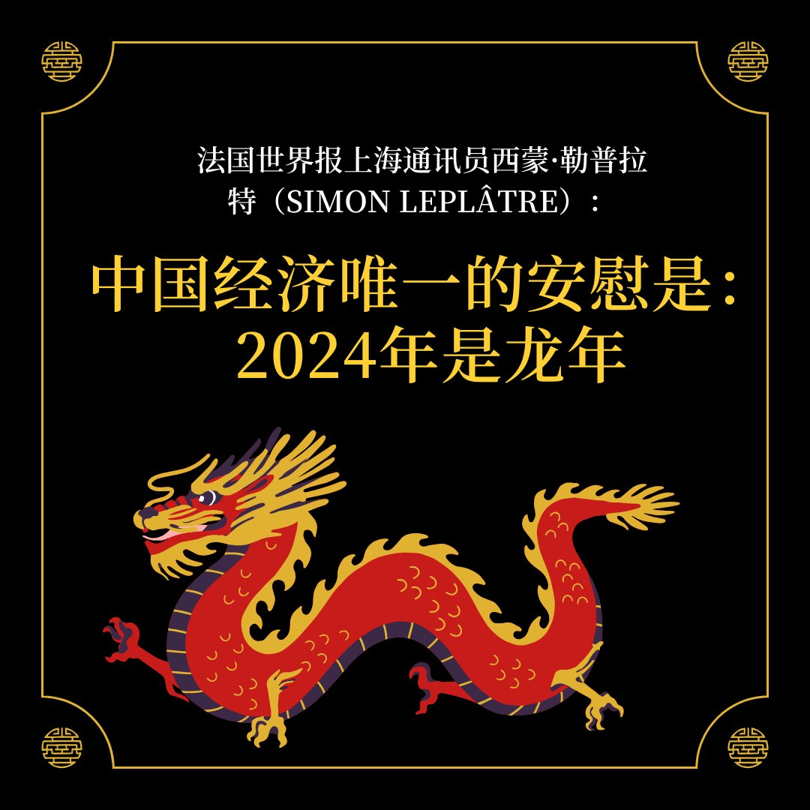
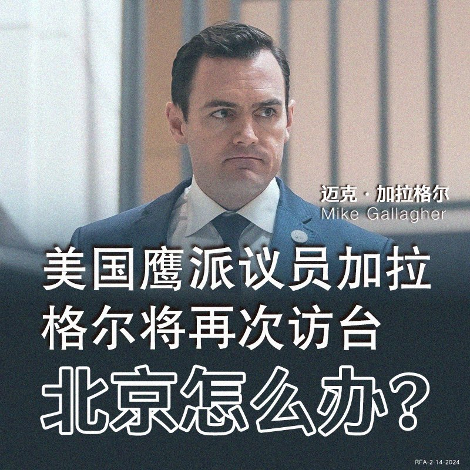
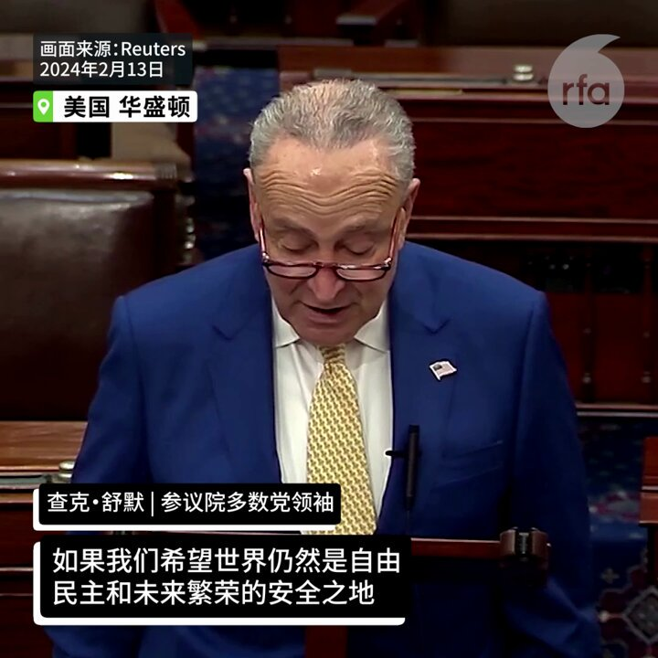
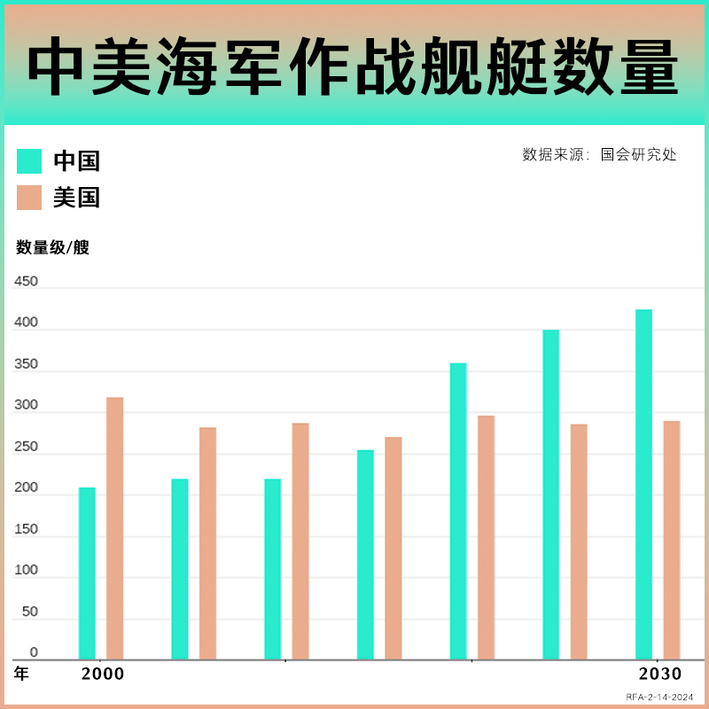
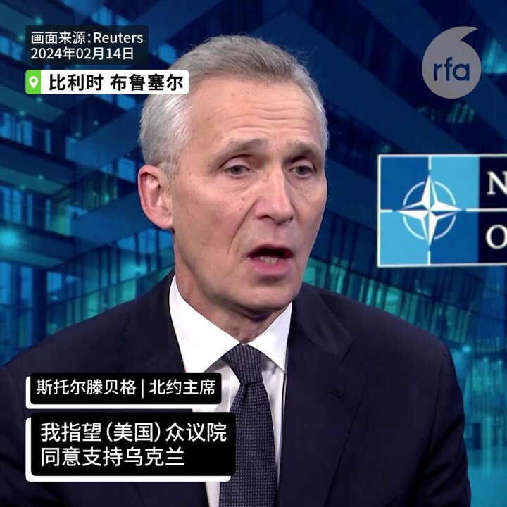

自由亚洲电台 北京时间 2024-02-15T10:10:48Z 1757950558584049914 欢迎收听和订阅播客【＃亚太报道】 https://t.co/MjLNSvVMqc
#美中战略竞争特设委员会 主席 #加拉格尔 将于下周访台；台湾纪念 #西藏抗暴65周年；“#保护卫士”推出 #制止引渡至中国援助中心；#大众汽车 参与 #新疆强迫劳动 曝光；#伦敦市长 与中国大使等同台庆新春引争议 https://t.co/ZibgcyWvoo   自由亚洲电台 北京时间 2024-02-15T10:17:56Z 1757952350168195232 RT @RFA_Chinese: 【#诚征受访人】
龙年春节刚过，您有没有发现生活在中国的年轻一代，越来越多出现“#断亲”现象，就是越来越不喜欢拜年走亲戚，甚至和很多亲戚几乎都断了联系？您觉得为什么会这样？如果您有切身体会，欢迎在评论区留言，或与我们的记者凯迪 @KittyWa…   自由亚洲电台 北京时间 2024-02-15T10:18:24Z 1757952469106073945 RT @RFA_Chinese: 在去年经历了 #失业潮 以及 #讨薪 困境的中国农民工，这个新春到底怎么过？他们内心真实的感受是什么？
本台记者王允 @Jeff23Wang 报道
https://t.co/veCcURplmD   自由亚洲电台 北京时间 2024-02-15T04:46:07Z 1757868848978497880 本周三，德国 #大众汽车（Volkswagen）向媒体表示，正与其中国合资方商量未来新疆的业务走向。根据路透社报道，这是因为德国《商报》披露，有研究显示，大众及上海汽车集团（SAIC）合资的“#上汽大众”在吐鲁番市的试车场项目，涉嫌使用 #强迫劳动。 https://t.co/q1d1u9DfWP   自由亚洲电台 北京时间 2024-02-15T05:17:26Z 1757876728389877819 据法广报道，法国世界报上海通讯员西蒙·勒普拉特（Simon Leplâtre）周二就中国经济状况在其专栏中写道，“中国经济唯一的安慰是：2024年是龙年”。
您认为，对中国来说，龙年真的好兆头吗？ https://t.co/23oH8AMxdw   自由亚洲电台 北京时间 2024-02-15T05:29:19Z 1757879718974484704 据金融时报报道，美国国会众议院“美国与中共战略竞争特设委员会”共和党籍主席迈克·#加拉格尔（Mike Gallagher）将在2月21日率团访问台湾，以表达对台湾即将上任的民进党籍总统 #赖清德 的支持。他将会见赖清德和新上任的国民党籍立法院长韩国瑜。

中国驻美国大使馆发言人刘鹏宇反对说：“北京坚决反对美国与台湾有任何形式的官方互动，以及以任何方式或借口干预台湾事务。美国在处理与台湾相关的问题时需要极度谨慎，绝不能以任何形式模糊和空洞化一个中国原则，也不能向‘台独’分裂势力发出任何错误信号。”

今年39岁的加拉格尔在担任众议员期间被视为是对华鹰派，于2023年成立跨党派的美国与中国共产党战略竞争特设委员会，不断对北京当局提出批评以及有关的反制措施，同时频繁表达对台湾的支持。上周六，他表示将于明年1月自国会退休，不会在今年参宇竞选、寻求连任。   自由亚洲电台 北京时间 2024-02-15T05:40:40Z 1757882575941709872 【美参议院通过950亿美元援助乌以台法案】
参议院多数党领袖查克·舒默喊话习近平：不要考验美国的决心！ https://t.co/bxRj6VTrxf   自由亚洲电台 北京时间 2024-02-15T05:44:43Z 1757883592833703948 今年以来中国股市的暴跌有哪些经济情况以外的特殊因素？那些被屏蔽的微博内容都说了什么？今天的 #网络博弈 节目我们请现在美国的资深财经分析人士 #秦鹏 来一起分析。

https://t.co/FICfdTR93Y   自由亚洲电台 北京时间 2024-02-15T05:47:43Z 1757884350631182816 国际人权组织"#保护卫士"最新推出 #制止将异议人士引渡至中国 的信息和援助中心，为在海外遭到中国当局跨国镇压的群体免费提供法律援助。有分析指出，这对流亡海外的异见群体而言无疑是一大利好消息。

https://t.co/2W9PtgQEEv   自由亚洲电台 北京时间 2024-02-15T02:30:10Z 1757834633109004713 专栏 | #中国最钱线：新年 #股灾--小行星撞地前那一晚  https://t.co/wltmuFemZU   自由亚洲电台 北京时间 2024-02-15T03:13:34Z 1757845555760320740 2023年，中国成为 #世界最大造船国，负责全世界一半以上的船舰制造。
据华尔街日报本周二报道，中国海军目前拥有370艘战舰，预计到2030年将增至435艘。中国的造船厂正在建造越来越先进的战舰，如装备精良的大型 “仁海级”水面战舰。它们还建造了世界上最大的海岸警卫队和捕鱼船队，以及庞大的商船队。
而未来几年内，预计美国海军的规模将保持不变，或从目前的292艘舰艇变小，退役舰艇的数量将超过服役舰艇数量，后勤保障和海上补给船队也在老化。
去年5月，美国海军少将、时任美国海军舰船项目的执行官安德森（Thomas J. Anderson）曾就此表示，美中造船的主要区别，是中国受益于庞大的商业造船业务，若是美中爆发冲突，中国海军将得利于既有的商业造船业的能力，迅速加快生产战舰，替补并修复受损船只，帮助中国解放军在战时取得巨大优势。   自由亚洲电台 北京时间 2024-02-15T03:31:30Z 1757850070194495533 #伦敦 市长萨迪克·汗（Sadiq Khan）11日出席由伦敦华埠商会主办的新春庆祝活动，更不避嫌在社交平台上，发布他和中国驻英大使 #郑泽光 及力挺《港区国安法》的商会主席 #邓柱廷 的合照，引来英国官员及海外港人的批评。
市长的回应方式，是直接关闭相关帖文的评论区。
https://t.co/ZyKEUEknQ8   自由亚洲电台 北京时间 2024-02-15T03:46:18Z 1757853792622817545 【北约秘书长：援乌不是慈善，而是投资自身安全】
北约秘书长斯托尔滕贝格2月14日敦促美国众议院通过援助乌克兰的议案。 https://t.co/Xsuwa2ImnE   自由亚洲电台 北京时间 2024-02-15T04:13:02Z 1757860521716408454 2月14日是西方传统的 #情人节，今年的这一天又恰好是龙年新春初五，在中国有 #迎财神  的习俗。中国人在情人节遇上"财神爷"，却有很多年轻人开始热衷于拥有一个 #AI情人。为什么这些年轻人选择了一个虚拟的对象，而不是有血有肉的情人？
https://t.co/mDCVZaaJA0   自由亚洲电台 北京时间 2024-02-15T00:25:30Z 1757803260591673578 下月10日是 #西藏抗暴日65周年，台湾的藏人团体展开每年一度的"#为西藏自由而骑"活动，希望通过骑乘自行车，展现藏人不放弃争取自由民主的精神，同时也为被中国压迫的不同政见人士发声。
https://t.co/vUn7wZd044   自由亚洲电台 北京时间 2024-02-15T01:22:41Z 1757817652196549047 #印尼总统大选 2月14日投票，国防部长 #普拉博沃 与现任总统 #佐科 的长子 #吉布兰 搭档的正副总统候选人，在第一轮投票中领先。
学者分析，未来其外交政策应会延续和美中等距的大国平衡关系，维持印尼自由主动的传统，在稳健中持续发展经济。
https://t.co/cWXwYXM2st   