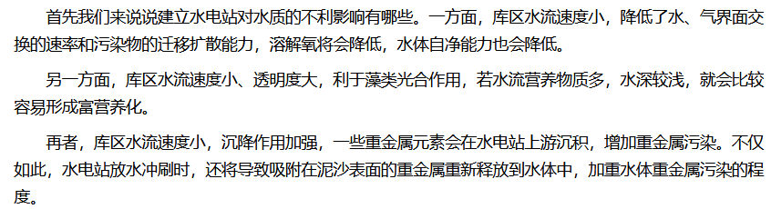
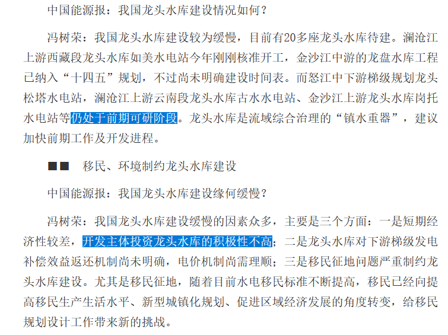

谁将十万横扫三江 北京时间 2024-02-15T14:21:29Z 1758013642531106950 藏民不理解修建水电站可能有两种原因

第一种是因为自身群体缺乏参与政治的权力、没有宗教自由，被一些信马列的“异教徒”基于宗教矛盾迫害自己这个回教徒。从政府的班子比例来看可能性较小

第二种是参考其他案例后认为修建水电站是竭泽而渔而非有益于当地发展，且当地经济发展差对政府缺乏信任，不迷信“海量专精确算”

图片参考同样是同为堤坝式水电站的水质科普，藏民的担忧并不是空穴来风。
但是此次岗托水电站是龙头水电站，根据去年9月的人民日报刊登报道，岗托水电站仍然在前期可研阶段，下游各梯级电站对龙头水库的补偿收益不明确，导致龙头水电站地区不想垫资建设。从这来分析，当地政府可能并不急于对这类群众运动采取删除报道，甚至可能会有意鼓动

https://t.co/my82Iwy26c   谁将十万横扫三江 北京时间 2024-02-15T11:55:04Z 1757976796715479161 RT @MisakaNo8964: 当然，在“没有司法独立的中华人民共和国”

2014年暴力执法殴打踩死讨薪农民工妇女的警察王文军得到了公检法党政机关干部的大量包庇和轻判，

受害者家属上访被当局各种阻挠、胁迫和绑架，网络视频被大量封锁🤗法医甚至都不是独立的而是和公安局穿一条…   谁将十万横扫三江 北京时间 2024-02-15T12:04:41Z 1757979217881636964 RT @jakobsonradical: 近日，多名拼多多离职员工爆料称，拼多多涉嫌滥用竞业限制协议。员工若离职跳槽到对手企业，动辄被起诉赔偿数十万，甚至高达数百万。一离职等于给企业白打工。
该消息被中国多家媒体报道，但目前被删帖。资本在黑社会的保护下，能不厉害吗？ https…   谁将十万横扫三江 北京时间 2024-02-15T12:21:31Z 1757983451117142397 Simple point. Kansas City shooting.  The shooting lasted less than two minutes. There were HUNDREDS of armed and trained police officers ONSITE at this shooting.  And STILL 22 people were shot and 7 have life threatening injuries, with at least one person killed.  Clearly a “good guy with a gun” is NOT a solution to these mass shootings.  But a crude gun ban will not solve the problem. If you don’t believe it, you can go to Ju County in China. There were no legally made guns, 14 people died, and there was no media supervision. Reducing violent injuries relies on the social security system to increase humanistic care, not other   