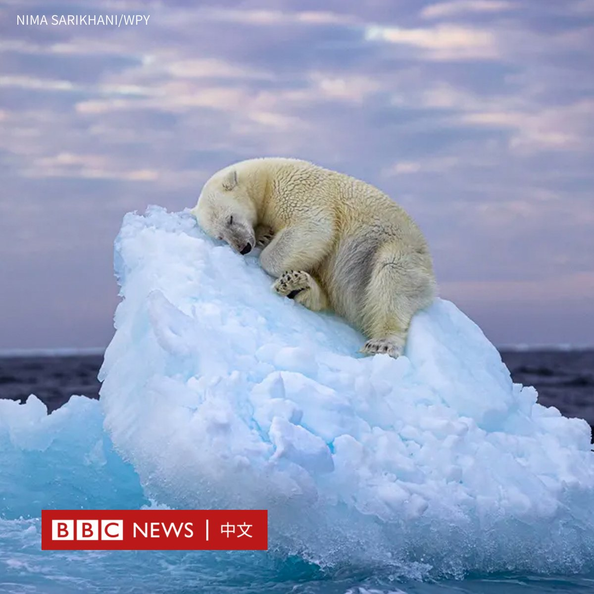
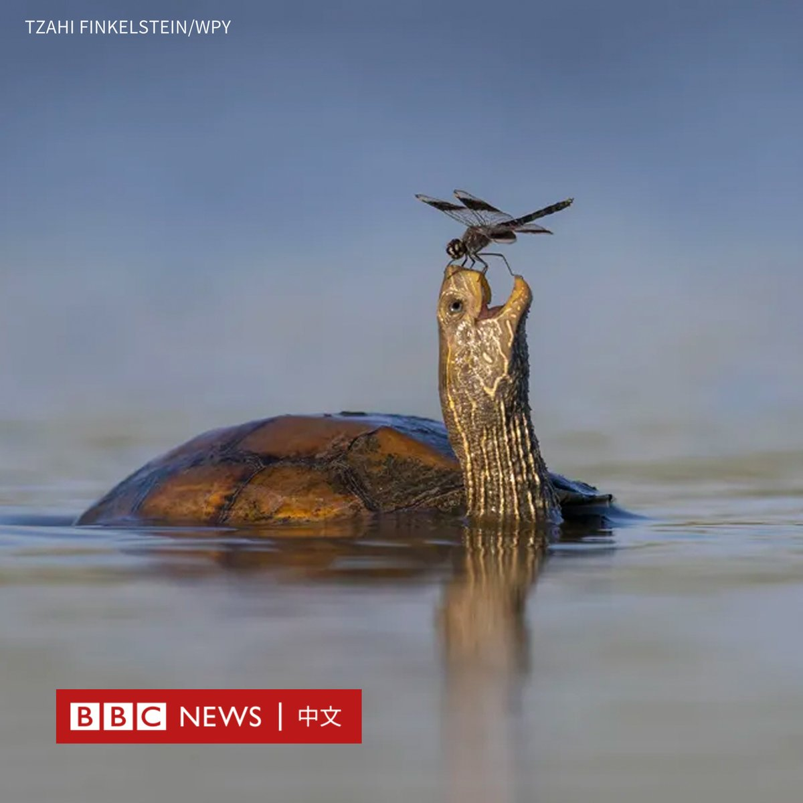
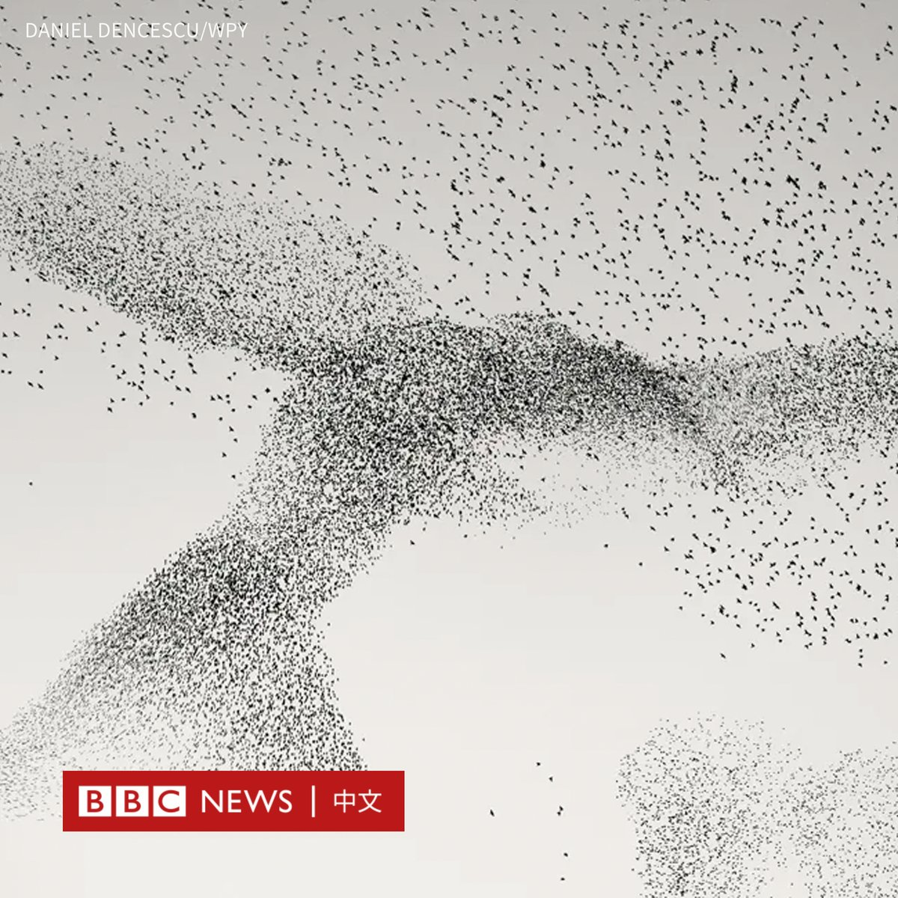
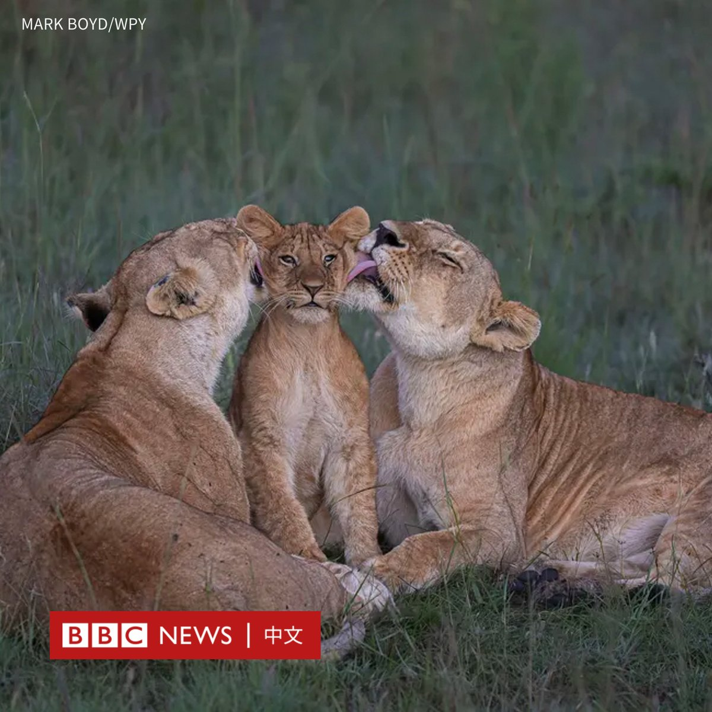

D英国广播公司BBC 北京时间 2024-02-14T15:14:10Z 1757664514588410070 一只在冰山上沉睡的北极熊的照片，成为今年年度野生动物摄影（Wildlife Photographer of the Year）民众选择奖的得主。

这张照片题为《冰床》（Ice Bed），由英国摄影师尼玛·萨里卡尼（Nima Sarikhani）在挪威斯瓦尔巴群岛海域的浓雾中，寻找北极熊三天后捕捉到。

自然历史博物馆馆长道格拉斯·古尔（Douglas Gurr）博士说：“萨里卡尼令人惊叹和心酸的照片让我们看到了地球的美丽和脆弱。”

该奖项邀请来自世界各地的摄影和自然爱好者从25张照片中投票选出获胜者。组织者说，有超过7.5万人参加了投票，创下纪录。

除了获胜作品之外，还有四幅受到评委“高度赞扬”的决赛入围作品。这五幅照片将在伦敦自然历史博物馆展出至6月30日。   D英国广播公司BBC 北京时间 2024-02-14T13:51:13Z 1757643637918408975 在中国正为该国日益下降的结婚人数寻找解决方案之际，越来越多的中国年轻女性转而与人工智能（AI）男友建立“虚拟恋情”。

一些人表示，现实生活中与男生约会太麻烦，而这种应用程式可以根据个人偏好，定制完美伴侣以寻找情感慰藉。 https://t.co/V2lkxnjglw   D英国广播公司BBC 北京时间 2024-02-14T10:18:35Z 1757590128716136855 “不要有眼神接触。”

在萨尔瓦多总统纳伊卜·布克莱（Nayib Bukele）成功连任的几天后，BBC罕见地获准进入这名总统发起的扫荡黑帮行动中的巨型监狱。

政府表示，这座巨大的监禁中心可以关押多达四万名囚犯，但人权观察组织最近的一份报告批评其存在普遍的侵犯人权行为。 https://t.co/YEQ2LCnX9l   