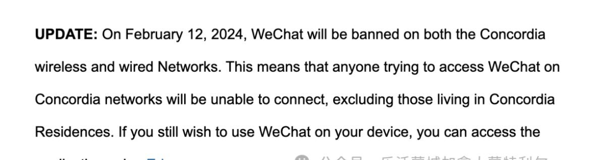
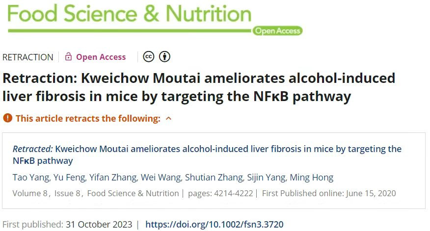

Petrichor 北京时间 2024-02-14T07:05:57Z 1757541651713610221 得买多少瓶茅台酒做试验，长期喝，分几个对比组，还要多喝，才能看出效果。每10年8年，效果不显著。还不能喝到假茅台。这样研究为领导喝茅台寻找理论根据，不伤肝，领导还可以多多喝茅台。   Petrichor 北京时间 2024-02-14T09:52:48Z 1757583640689606689 据媒体报道，加拿大各大学从现在开始全面封杀微信，在校园内全面禁止微信的使用！因为微信监控用户信息，经常封禁用户。

中国早就或者说一直封杀西方社交媒体例如Google，YouTube、Facebook、instragram等，现在西方国家开始醒悟过来，开始限制中国软件了。政治不利国与国之间人民的交流，中共不愿自己人民了解真实的世界，建立防火墙，中国开始被世界孤立，只能重新落后。   Petrichor 北京时间 2024-02-14T09:57:32Z 1757584830785569276 人民警察爱人民 https://t.co/JQIqMphlIn   Petrichor 北京时间 2024-02-14T10:09:19Z 1757587797085454689 Don't touch it. Stop touching it. ….. Stop touching it. https://t.co/BiSSoAKtEO   Petrichor 北京时间 2024-02-14T07:27:46Z 1757547139473797407 昨天（2月7日，周三）上午，美国联邦调查局大批警察包围了洛杉矶华人聚居的柔似密（Rosemead）几处民宅，搜出大量冰毒，大批华人被要求坐在民宅外的空地上等待调查。其中5人已经被捕。
陈阳强（Yangqiang Chen，音译），45 岁，家住蒙特利公园市
陈杰（Jie Chen，音译），40 岁，家住柔似密
陈美美（MeiMei Chen，音译），41 岁，家住柔似密
何国荣（Guorong He，音译），50岁，家住柔似密
何亦恩（Yien He，音译），32 岁，家住柔似密

还有 1 名华人被关在路易斯安那州的移民拘留所，此人是54 岁的陈星云（Xingyun Chen）。另外，还有一名华人仍然在逃，该人是44 岁的林祖兴（Zuxing Lin，音译），家住柔似密。

这些华人平日做出爱党爱国的样子，其实尽干坏事，给华人丢脸。抓起来，放牢里去。   Petrichor 北京时间 2024-02-14T08:33:35Z 1757563704399245514 这政治觉悟比1975年梁家河村那位强，弄个清华大学化工系的录取通知单，可是他一天没有干过化工。40岁之前全部靠走后门。 https://t.co/Mc5XbHqUOg   Petrichor 北京时间 2024-02-14T03:42:23Z 1757490420609671338 “喝茅台不伤肝！”  
中国一些大学的研究可信吗？
2020年6月15日，宁夏医科大学冯育、西南医科大学杨思进及广州中医药大学洪明灯在Food Science & Nutrition 在线发表题为“Kweichow Moutai ameliorates alcohol-induced liver fibrosis in mice by targeting the NFκB pathway”的研究论文，结论是喝贵州茅台酒不会导致肝硬化，理由是他们研究发现“贵州茅台酒能有效抑制胶原沉积，减轻肝纤维化”。

经过学界3年多的争论，现在这篇论文终于被撤稿，理由当然是数据不可靠。明显是给茅台酒做虚假广告之嫌。哪有喝烈性酒不伤肝的！   