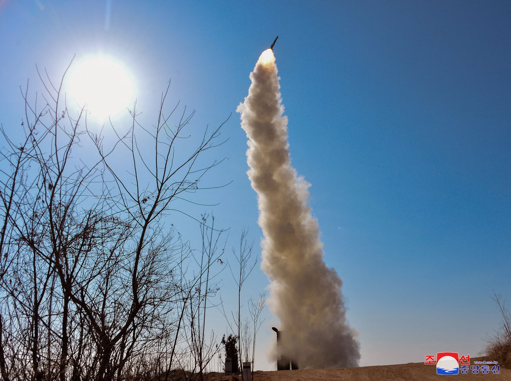
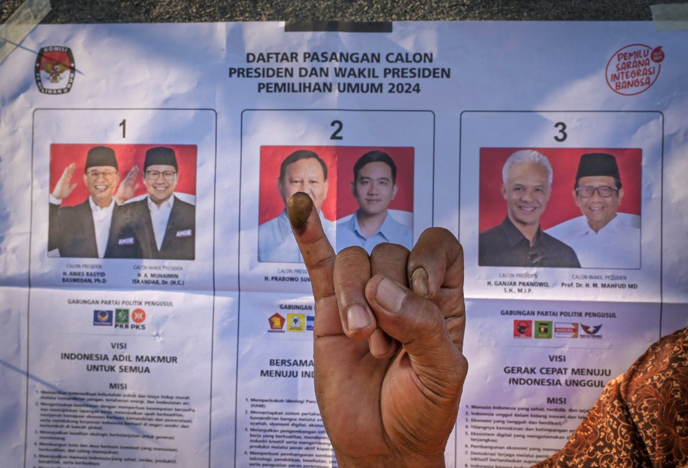
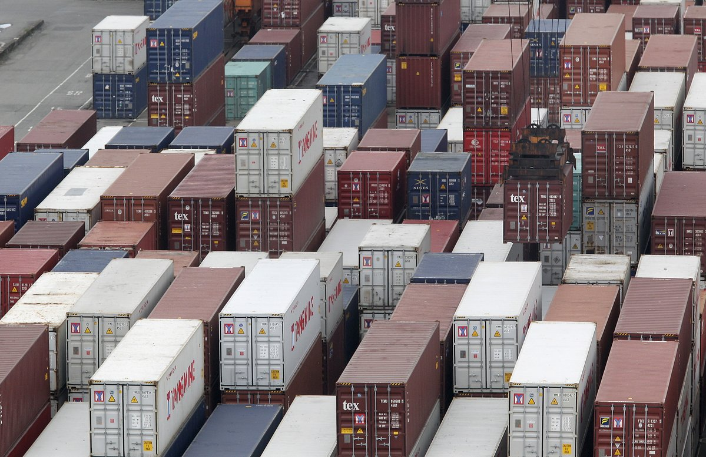
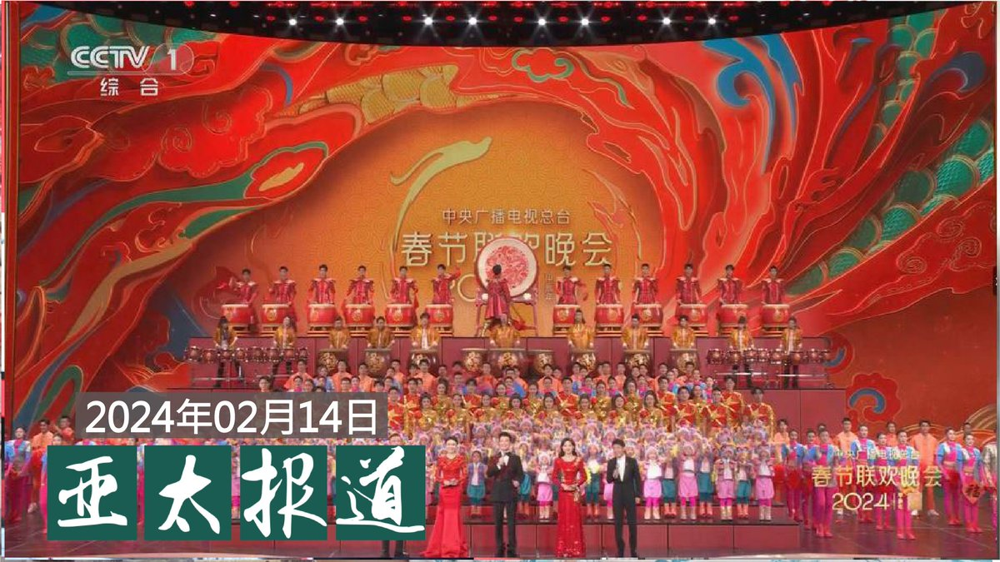

自由亚洲电台 北京时间 2024-02-14T20:48:31Z 1757748656856240397 RT @RFA_Chinese: 【"钢琴事件"余波未了  Dr.K戳穿"小粉红"虚妄】
伦敦火车站钢琴师Dr.K  @brenkav 接受本台记者吕熙专访说，希望能与 #黄明志 合作，一起以艺术抗击极权。他透露目前仍受 #小粉红 滋扰，但他不会退缩。 https://t.co…   自由亚洲电台 北京时间 2024-02-14T20:48:57Z 1757748765660717103 RT @RFA_Chinese: 【#诚征受访人】被高利率压到喘不过气? 没有收入缴不出房贷? 还是碰到烂尾楼?
如果您有买房的心酸故事想要吐槽，请在评论区留言，联系记者徐薇婷 @stacyhsu_dc ，或电邮 fankui@rfa.org，谢谢！ https://t.co/…   自由亚洲电台 北京时间 2024-02-14T20:49:39Z 1757748941242675684 RT @RFA_Chinese: 2月12日，央视最新一期 “#天下足球”删掉了 #梅西 的所有镜头！片头梅西捧起大力神杯的镜头被替换成德国队长 #拉姆 捧杯的镜头。
但细心的网友很快发现拉姆曾公开批评过中国的人权问题。
网友评论：本来以为又赢了一回，没想到换上来的更加“#反华…   自由亚洲电台 北京时间 2024-02-14T21:16:15Z 1757755633930022952 RT @RFA_Chinese: 【盘点那些上不了春晚的歌儿】
过去一年见证了民间音乐创作者与中国审查机构线上和线下的博弈交锋，多首脍炙人口的流行曲，因其浓厚的政治意味而受到播放限制。#大梦 般的后疫情社会，我们是否都成为了 #罗刹海市 的 #西楼儿女?… https://t.…   自由亚洲电台 北京时间 2024-02-14T21:41:15Z 1757761927294411146 RT @RFA_Chinese: 中国官媒说 #央视春晚 平均收视在30%以上。
本台在X做的民调发现，69.2%的民众表示自己“没看”春晚；有24.9%的民众表示看了春晚，但“不喜欢”；只有约6%的民众表示，“喜欢”今年的节目。https://t.co/G2Bj3AoZhx   自由亚洲电台 北京时间 2024-02-14T16:42:19Z 1757686695900946768 【今年第五次 朝鲜向东部海域发射多枚巡航导弹】https://t.co/18uyeb2l9w https://t.co/wHgPeTEv0s   自由亚洲电台 北京时间 2024-02-14T14:46:18Z 1757657501837992390 【印尼举行总统大选】
【三组候选人竞争2亿选民】
超过2亿选民14日将从三组候选人中，投票选出现任总统佐科的接班人。三组正副总统候选人分别是：大印尼运动党党魁，国防部长普拉博沃与现任总统佐科的长子吉布兰；印尼斗争民主党（PDIP）和其他两个政党提名的原任中爪哇省长甘查尔与政治、法律与安全统筹部长马福德，原任雅加达特区首长阿尼斯与民族复兴党主席穆海敏。
https://t.co/s6FByFHdQ3   自由亚洲电台 北京时间 2024-02-14T16:06:01Z 1757677563437330746 【中国拿ECFA经济施压台湾 为何效应递减？】
中国在台湾总统选举前、后，相继放话要重新审视是否紧缩或继续 #ECFA（#海峡两岸经济合作架构协议）。然而，随着中国经济下行，台湾对中国贸易依赖度大幅下滑，中国动辄对台祭出“以商逼政”的策略还能奏效吗？https://t.co/Zj2BhibnmX https://t.co/Atg2lgxEWZ   自由亚洲电台 北京时间 2024-02-14T10:55:18Z 1757599368847266219 RT @RFA_Chinese: 【"钢琴事件"余波未了  Dr.K戳穿"小粉红"虚妄】
伦敦火车站钢琴师Dr.K  @brenkav 接受本台记者吕熙专访说，希望能与 #黄明志 合作，一起以艺术抗击极权。他透露目前仍受 #小粉红 滋扰，但他不会退缩。 https://t.co…   自由亚洲电台 北京时间 2024-02-14T10:57:46Z 1757599990262775948 RT @RFA_Chinese: 中国官媒说 #央视春晚 平均收视在30%以上。
本台在X做的民调发现，69.2%的民众表示自己“没看”春晚；有24.9%的民众表示看了春晚，但“不喜欢”；只有约6%的民众表示，“喜欢”今年的节目。https://t.co/G2Bj3AoZhx   自由亚洲电台 北京时间 2024-02-14T10:55:38Z 1757599450824937749 RT @RFA_Chinese: 【#诚征受访人】
龙年春节刚过，您有没有发现生活在中国的年轻一代，越来越多出现“#断亲”现象，就是越来越不喜欢拜年走亲戚，甚至和很多亲戚几乎都断了联系？您觉得为什么会这样？如果您有切身体会，欢迎在评论区留言，或与我们的记者凯迪 @KittyWa…   自由亚洲电台 北京时间 2024-02-14T12:11:25Z 1757618522404913408 RT @RFA_Chinese: 【#诚征受访人】被高利率压到喘不过气? 没有收入缴不出房贷? 还是碰到烂尾楼?
如果您有买房的心酸故事想要吐槽，请在评论区留言，联系记者徐薇婷 @stacyhsu_dc ，或电邮 fankui@rfa.org，谢谢！ https://t.co/…   自由亚洲电台 北京时间 2024-02-14T10:07:51Z 1757587426783175155 【#诚征受访人】
龙年春节刚过，您有没有发现生活在中国的年轻一代，越来越多出现“#断亲”现象，就是越来越不喜欢拜年走亲戚，甚至和很多亲戚几乎都断了联系？您觉得为什么会这样？如果您有切身体会，欢迎在评论区留言，或与我们的记者凯迪 @KittyWang5 联系，或电邮 ankui@rfa.org，分享您的经历。 https://t.co/wHatTcEZdM   自由亚洲电台 北京时间 2024-02-14T06:38:49Z 1757534820777742477 美国密苏里州立大学国际关系与战略研究教授克里斯托弗·福特（Christopher Ford）在研讨会上指出，北京目前越发将贸易武器化，并试图通过对投资者、企业家等施加经济压力，以左右他国的政策动向。https://t.co/c8wjKCF1Q7   自由亚洲电台 北京时间 2024-02-14T08:00:09Z 1757555290516717678 欢迎收听和订阅播客【＃亚太报道】 https://t.co/MjLNSvVMqc
#央视春晚 观感调查；遭 #欠薪 劳动者如何过年？；“#拆墙运动”发起新春联署；#中国股市 缘何 #繁花 落尽？ https://t.co/5sgIFOJm4J   自由亚洲电台 北京时间 2024-02-14T05:01:26Z 1757510314847821963 在本周二美国华盛顿智库哈德逊研究所座谈会上，#黎智英 教父、曾任美国前总统小布什文胆的《华尔街日报》编辑William McGurn表示，黎案审讯期间，92歲的香港荣休主教陈日君曾坐在黎妻李韵琴身旁聆听，此举是〝告诉全香港他的立场，以及他认为什么是正确的事〞。

https://t.co/hNRIvFgdvR   自由亚洲电台 北京时间 2024-02-14T06:03:59Z 1757526053772206417 中国官媒说 #央视春晚 平均收视在30%以上。
本台在X做的民调发现，69.2%的民众表示自己“没看”春晚；有24.9%的民众表示看了春晚，但“不喜欢”；只有约6%的民众表示，“喜欢”今年的节目。https://t.co/G2Bj3AoZhx   自由亚洲电台 北京时间 2024-02-14T06:05:45Z 1757526500977332444 在去年经历了 #失业潮 以及 #讨薪 困境的中国农民工，这个新春到底怎么过？他们内心真实的感受是什么？
本台记者王允 @Jeff23Wang 报道
https://t.co/veCcURplmD   自由亚洲电台 北京时间 2024-02-14T03:22:56Z 1757485527685648763 据海外维权网13日消息，原香港支联会主席、前香港立法会议员、香港总工会前秘书长 #李卓人 已遭监禁1032天，日前在狱中度过其67岁生日，这是他第三年在监狱里度过生日。 https://t.co/FdBYBFT3PT   自由亚洲电台 北京时间 2024-02-14T00:45:38Z 1757445937990185284 【#诚征受访人】被高利率压到喘不过气? 没有收入缴不出房贷? 还是碰到烂尾楼?
如果您有买房的心酸故事想要吐槽，请在评论区留言，联系记者徐薇婷 @stacyhsu_dc ，或电邮 fankui@rfa.org，谢谢！ https://t.co/f97eyGttVU   自由亚洲电台 北京时间 2024-02-14T01:29:31Z 1757456982414385293 RT @asiafactcheckcn: 【查核回顾】
【中国还是开发中国家吗？ 】

初四快乐🎉大家开工了吗？

去年六月，美国参议院通过《终止中国发展中国家地位法案》。中国外交部发言人回应时重申，中国处于发展中国家地位有事实依据及国际法基础。

🔎经查，国际社会对于 #发展…   自由亚洲电台 北京时间 2024-02-14T01:29:45Z 1757457040153145758 RT @asiafactcheckcn: 【事实查核】
【每年有十万人被贩卖到美国？ 】

本篇回顾去年6月的一篇查核。美国国务院批评港府打击人口贩卖不力，引发港府不满，反指美国才是全球最大的人口贩运国家，声称美国公布的数据显示，每年有多达十万名人口受害者被卖到美国。

❌经查…   自由亚洲电台 北京时间 2024-02-14T01:31:36Z 1757457509202248185 德国化工巨头 #巴斯夫（BASF）上周宣布撤出中国新疆的决定后，德国联合政府的执政党派人士对此表示欢迎，并呼吁 #大众汽车 也采取同样的步骤。https://t.co/Qn1Ns9zZc7   自由亚洲电台 北京时间 2024-02-14T02:15:12Z 1757468478091513909 今年 #加拿大 将继续派遣军舰前往 #台湾海峡巡防。中国驻加大使提出警告：如果加拿大继续破坏一中原则，中加两国无法进行正常军事对话。另外，台湾驻加代表则强调台湾海峡是公海，国际船隻有自由航行权。
https://t.co/bW3jeK2I70   自由亚洲电台 北京时间 2024-02-14T00:17:55Z 1757438966616281323 港府就《#基本法》第二十三条立法如箭在弦，多项罪名均针对在海外从事香港事务的倡议者。自由亚洲电台记者专访两名分别在英国和台湾为香港做国际游说，打"国际线"的年轻倡议者，了解来势汹汹的新法对国际倡议者的影响以及他们坚持为港人发声的原因。

https://t.co/wgkMIZd3Fg   