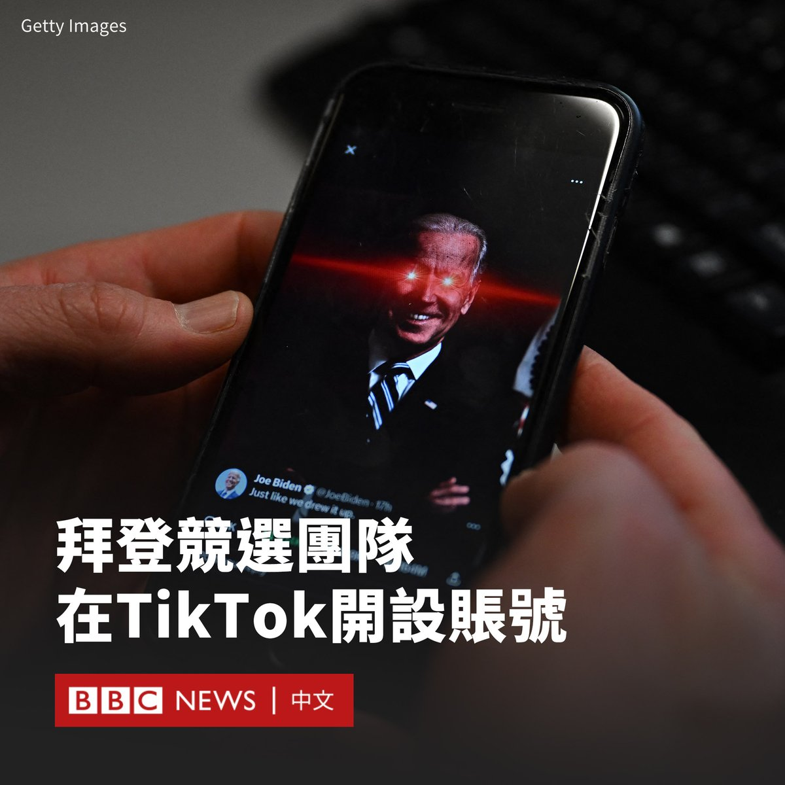

D英国广播公司BBC 北京时间 2024-02-13T14:12:42Z 1757286658054008847 中国足球坛近月传出震撼消息，男足前主教练、球星李铁在官媒纪录片中承认贪污。这是中国足球十多年来最大规模打击腐败行动的一部分。

在新一轮反腐运动之下，足球产业专家向BBC中文解读根深蒂固的腐败问题为何一直难以解决。https://t.co/O34gPr13Xk   D英国广播公司BBC 北京时间 2024-02-13T11:59:32Z 1757253145389113699 尽管大多数美国政府设备和网络因安全担忧无法使用TikTok，但美国总统拜登（Joe Biden）的竞选团队近日在该社交平台上开设账号。

拜登的竞选团队在周日（2月11日）的超级碗比赛期间，以用户名“bidenhq”开设了账户。

在一段配文为“哈哈，嘿，伙计们”（lol hey guys）的影片中，拜登以快问快答形式回答了助手们询问他对这场比赛的偏好。

最后，他被要求在特朗普（Donald Trump）和拜登之间做出选择。他回答说：“别逗了，（是）拜登。”

拜登的助手告诉美国媒体，其TikTok账户将由拜登的竞选团队运营，而不是总统本人。不过，该决定随即受到一些两党议员的批评。

拜登于2022年签署法案，禁止大多数联邦政府设备使用TikTok。几个州也发布了限制措施。

TikTok由中国公司字节跳动所有。美国国会两党议员曾呼吁全面禁用这款应用程式，理由是担心用户数据被北京当局获取。

尽管如此，TikTok在美国年轻人中仍然广受欢迎，拜登政府希望在今年11月的大选中激发这一群体的投票欲望。

对拜登来说，与年轻选民建立联系成为关键议题。拜登81岁的年龄成为很多选民主要担忧的因素。民意调查显示，预计将在11月投票的选民中，多达75%的人认为他年龄太大，不适合担任总统。   D英国广播公司BBC 北京时间 2024-02-13T09:55:20Z 1757221889096003726 随着新加坡、马来西亚和泰国近期陆续对中国游客实行免签证政策，许多中国人选择前往这些东南亚国家度过春节假期。

据中国媒体报道，在中国旅游平台携程上，在农历新年期间前往这三个国家的出行预订量比2023年增长了15倍以上。 https://t.co/Dnky384AOb   