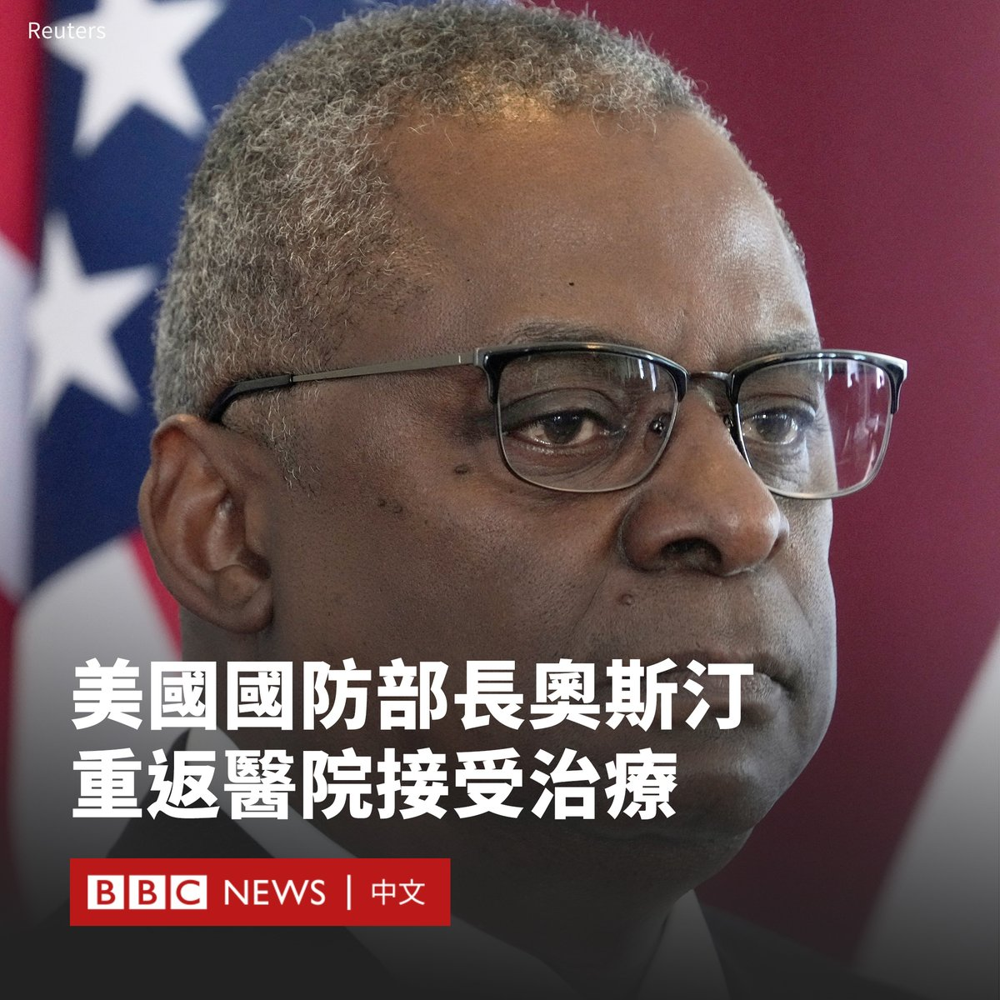

D英国广播公司BBC 北京时间 2024-02-13T20:23:37Z 1757380000326545852 以色列突袭加沙地带南部的拉法市，营救出两名被哈马斯关押的人质。加沙的哈马斯卫生部门称，以军此次行动导致至少67名巴勒斯坦人死亡。https://t.co/dzlUchAcjs   D英国广播公司BBC 北京时间 2024-02-13T15:56:47Z 1757312850807374253 美国国防部长劳埃德·奥斯汀（Lloyd Austin）在数月内第三次入院后，取消了前往北约总部的行程。

70岁的奥斯汀目前被送往华盛顿特区一家医院的重症监护病房。五角大楼称，他正面临“紧急的膀胱问题”。

五角大楼在一份最新声明中说，他们预计奥斯汀能够在当地时间周二（2月13日）前恢复履职。目前，他的职责已移交给他的副手。

声明说，奥斯汀在医院接受了全身麻醉下的非手术治疗，以解决膀胱病症。五角大楼表示，预计他将在沃尔特里德医院的重症监护室度过住院看护期，但并未说明住院时间将有多久。

奥斯汀于去年12月22日接受了前列腺切除手术，以治疗前列腺癌。今年1月初，他因并发症在医院住院了半个月，而他被指向白宫隐瞒消息数日之久，这引发了政治震动和调查。

五角大楼发言人帕特·莱德（Pat Ryder）少将表示，奥斯汀“目前的膀胱问题预计不会改变他预期的完全康复。他的癌症预后仍然良好”。

奥斯汀原定于周三（2月14日）出席在比利时布鲁塞尔举行的乌克兰防御接触小组（UDCG）会议，并在次日出席由北约领导人延斯·斯托尔滕贝格（Jens Stoltenberg）主持的北约防长会议。

奥斯汀的办公室对BBC说，他计划以虚拟会议方式参加这些预定会议。   D英国广播公司BBC 北京时间 2024-02-13T14:12:42Z 1757286658054008847 中国足球坛近月传出震撼消息，男足前主教练、球星李铁在官媒纪录片中承认贪污。这是中国足球十多年来最大规模打击腐败行动的一部分。

在新一轮反腐运动之下，足球产业专家向BBC中文解读根深蒂固的腐败问题为何一直难以解决。https://t.co/O34gPr13Xk   D英国广播公司BBC 北京时间 2024-02-13T11:59:32Z 1757253145389113699 尽管大多数美国政府设备和网络因安全担忧无法使用TikTok，但美国总统拜登（Joe Biden）的竞选团队近日在该社交平台上开设账号。

拜登的竞选团队在周日（2月11日）的超级碗比赛期间，以用户名“bidenhq”开设了账户。

在一段配文为“哈哈，嘿，伙计们”（lol hey guys）的影片中，拜登以快问快答形式回答了助手们询问他对这场比赛的偏好。

最后，他被要求在特朗普（Donald Trump）和拜登之间做出选择。他回答说：“别逗了，（是）拜登。”

拜登的助手告诉美国媒体，其TikTok账户将由拜登的竞选团队运营，而不是总统本人。不过，该决定随即受到一些两党议员的批评。

拜登于2022年签署法案，禁止大多数联邦政府设备使用TikTok。几个州也发布了限制措施。

TikTok由中国公司字节跳动所有。美国国会两党议员曾呼吁全面禁用这款应用程式，理由是担心用户数据被北京当局获取。

尽管如此，TikTok在美国年轻人中仍然广受欢迎，拜登政府希望在今年11月的大选中激发这一群体的投票欲望。

对拜登来说，与年轻选民建立联系成为关键议题。拜登81岁的年龄成为很多选民主要担忧的因素。民意调查显示，预计将在11月投票的选民中，多达75%的人认为他年龄太大，不适合担任总统。   D英国广播公司BBC 北京时间 2024-02-13T09:55:20Z 1757221889096003726 随着新加坡、马来西亚和泰国近期陆续对中国游客实行免签证政策，许多中国人选择前往这些东南亚国家度过春节假期。

据中国媒体报道，在中国旅游平台携程上，在农历新年期间前往这三个国家的出行预订量比2023年增长了15倍以上。 https://t.co/Dnky384AOb   