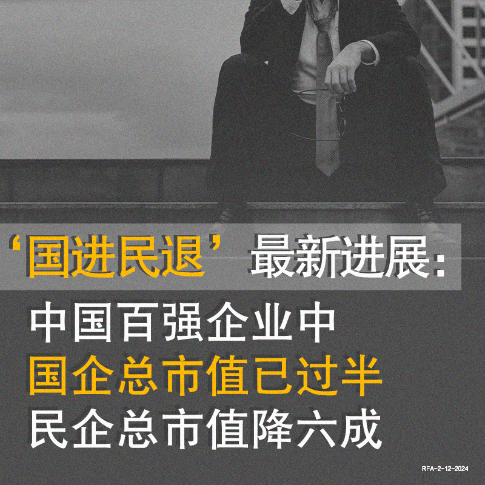
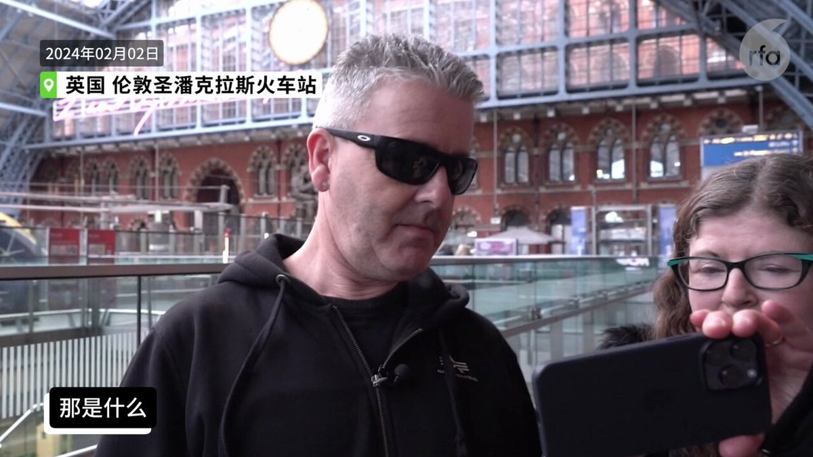
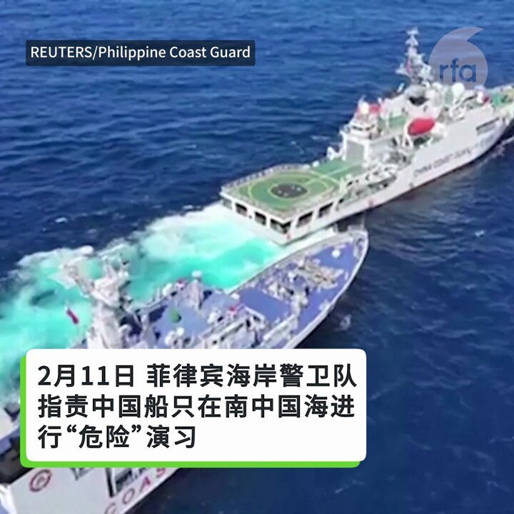
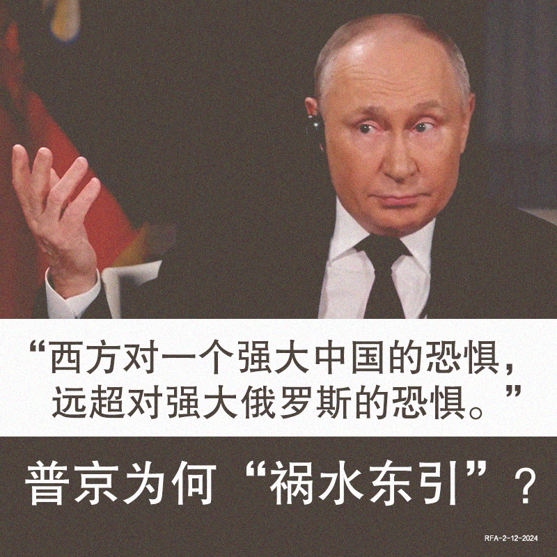
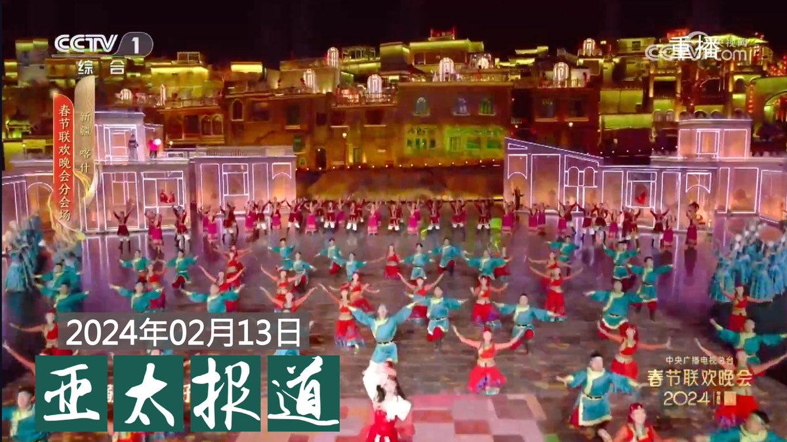

自由亚洲电台 北京时间 2024-02-13T11:38:04Z 1757247742638801103 RT @RFA_Chinese: 【"钢琴事件"余波未了  Dr.K戳穿"小粉红"虚妄】
伦敦火车站钢琴师Dr.K  @brenkav 接受本台记者吕熙专访说，希望能与 #黄明志 合作，一起以艺术抗击极权。他透露目前仍受 #小粉红 滋扰，但他不会退缩。 https://t.co…   自由亚洲电台 北京时间 2024-02-13T09:18:14Z 1757212550037487692 RT @RFA_Chinese: 【#央视春晚 民调】
您看了今年央视的 #龙年春晚 了吗? 喜欢吗？为什么？哪些节目精彩，哪些不如人意，有没有反映您真实的生活呢?
欢迎选择，并在评论区分享您对央视春晚的观感。您的金句可能被我们的报道采用。谢谢！   自由亚洲电台 北京时间 2024-02-13T09:28:24Z 1757215108647010740 【此言不虚：“#理直气壮做强做优做大国有企业”】
据日经报道，美国智库彼得森国际经济研究所分析 #中国百强企业 的市值，发现在截至2023年底的两年半时间里，#国企 在总市值中所占的比例已经从2021年的31%上升到50%，#民企 总市值下降了约60%。
您看好中国经济前景吗？ https://t.co/zXK8sxgXXC   自由亚洲电台 北京时间 2024-02-13T10:15:57Z 1757227075516109081 【"钢琴事件"余波未了  Dr.K戳穿"小粉红"虚妄】
伦敦火车站钢琴师Dr.K  @brenkav 接受本台记者吕熙专访说，希望能与 #黄明志 合作，一起以艺术抗击极权。他透露目前仍受 #小粉红 滋扰，但他不会退缩。 https://t.co/RzCa1HTnMu   自由亚洲电台 北京时间 2024-02-13T06:51:35Z 1757175644746875252 菲律宾指责中国在黄岩岛附近进行危险演习 https://t.co/JUTVM3vB4j   自由亚洲电台 北京时间 2024-02-13T06:51:46Z 1757175690674495985 据日本经济新闻报道，中国股市显示出停止下跌迹象，春节前一周记录1年零3个月以来的最高涨幅，主要归功于被称为“国家队”的政府资金的购买支持和强硬的股价措施。报道分析认为，从“国家队”的行动中似乎可以看出目标是吸引个人投资者。
您认为呢?您分析，国家的购买干预能否导致中国股市的全面复苏？ https://t.co/ZaVvFjGQqO   自由亚洲电台 北京时间 2024-02-13T06:55:38Z 1757176665321689223 【普京示警西方 矛头对准中国】
2月8日，#普京 接受美国媒体人Tucker Carlson采访时说，俄罗斯并非美国的敌人，中国才是美国的最大威胁。无论人口还是经济规模，俄罗斯都远远落后于中国，拜登政府为何把矛头指向俄国？
普京说得对吗？说好的“同志加朋友”，为何“背刺”中国呢？
https://t.co/AX8423e2Ha https://t.co/hpJr6e94FL   自由亚洲电台 北京时间 2024-02-13T06:59:36Z 1757177663649624335 评论 | #余杰：斯大林认为，波兰的菁英阶层会是他将波兰苏维埃化的拦路石，所以必须消灭掉。如今，作为斯大林学生的习近平，在 #新疆 实行的政策，就用类似的方式来对付没有“归化”的维吾尔人。习近平和他的打手陈全国使用的手段，更加绵密、精致和毒辣。 https://t.co/EcuPxgCWK5   自由亚洲电台 北京时间 2024-02-13T07:03:35Z 1757178664846795255 #404共和国 | 再回首: 中国 #人权律师 20年之苦难历程 — 观影《辩护人: 中国人权律师20年》有感https://t.co/pRv3nZJtJY   自由亚洲电台 北京时间 2024-02-13T08:00:08Z 1757192899454996498 欢迎收听和订阅播客【＃亚太报道】 https://t.co/MjLNSvVMqc

#央视春晚 首次设立 #喀什分会场；山东 #日照 疑似发生暴力事件；南京异议人士 #史庭福 被正式逮捕；香港将加装数千部监控维稳；拜登竞选团队开通 #TikTok 帐号引批评。 https://t.co/Rdsr8f1xly   自由亚洲电台 北京时间 2024-02-13T08:15:19Z 1757196717382853027 #崔天凯：中国不会掉入 #台海战争 陷阱  https://t.co/H6rVVKai8G   自由亚洲电台 北京时间 2024-02-13T04:36:59Z 1757141774575841777 #拜登 政府在一年前颁布法律，禁止联邦工作人员在政府设备中使用 #TikTok。
不过，在周日的美国职业 #橄榄球总决赛 当晚，拜登竞选团队令人意外地在TikTok上发布了第一部视频，此举立即引发舆论关注。
既然禁不掉，不如好好利用？#您怎么看？https://t.co/OiS3zcew4c   自由亚洲电台 北京时间 2024-02-13T04:41:01Z 1757142787483385937 评论｜王丹 @wangdan1989： 新春之际，按理说应当喜气洋洋，但这张照片中每一桌上坐着的那个警卫士兵，却不经意间暴露了在祥和的表面之下，中共高层内部的刀光剑影。还有什麽比这幅画面，更能暴露出中共内部的紧张气氛的呢？
#习近平 

https://t.co/lj22CymHAM   自由亚洲电台 北京时间 2024-02-13T06:07:30Z 1757164552200831100 专栏 | #夜话中南海：#董军 — 普京和伊绍古为习近平培养出来的国防部长 https://t.co/rSG4TwvKIF   自由亚洲电台 北京时间 2024-02-13T02:58:55Z 1757117092816379930 从大年初一（2月10日）起，互联网上盛传山东日照 #莒县 洛河镇一村庄发生重大凶案的消息。有官方背景的香港媒体也就此发出相关报道，但很快被删除。截至目前，中国社媒上的有关消息仍受到严密屏蔽。以下是本台记者王允 @Jeff23Wang 整理的可确认信息。

https://t.co/QR7LHNTXTE   自由亚洲电台 北京时间 2024-02-13T03:17:53Z 1757121866668314625 【#央视春晚 民调】
您看了今年央视的 #龙年春晚 了吗? 喜欢吗？为什么？哪些节目精彩，哪些不如人意，有没有反映您真实的生活呢?
欢迎选择，并在评论区分享您对央视春晚的观感。您的金句可能被我们的报道采用。谢谢！   自由亚洲电台 北京时间 2024-02-13T01:46:52Z 1757098962287301116 中国 #产能过剩，正在全向世界输出 #通缩！
《金融时报》发出警告。https://t.co/WVhDJRsDAT   自由亚洲电台 北京时间 2024-02-13T00:22:10Z 1757077648017113312 日前被公安跨省传唤的南京异议人士 #史庭福 仍被扣押在新疆。据了解，他因为涉嫌寻衅滋事已遭正式逮捕。 https://t.co/oIFKDHTFjQ   