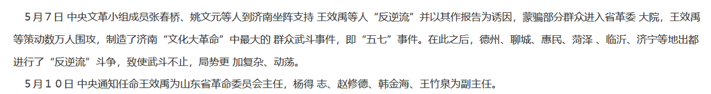

谁将十万横扫三江 北京时间 2024-02-13T16:31:02Z 1757321470852915285 1967年2月3日，在文化大革命的洪流中，以山工总(山东省革命工人造反总指挥部，总指挥为韩金海)为首的造反派联合原青岛市副市长王效禹夺取了山东省委的权力，并向中央文革报喜。

之前之后一段时间，全国各省夺权成风，终于实现了所谓“全国山河一片红”，即全国各省的行政权力都落入造反派也就是中央文革、毛泽东之手，这是时代背景。

但当时山东还有一个最大的工人造反组织“山工联”(山东工人革命造反联合指挥部，以产业工人为主)，山工联与山工总（由中小工矿企业甚至街道办企业的造反组织构成）属不同派系，互相指责对方为保皇派，自己才是造反派。但山工总支持王效禹，并抱上了中央文革的大腿，所以成为了山东省造反派夺权的主力，山工联被排除在外。

不仅如此，山工总又利用中央文革，把“山工联”打成反动组织，几个小时后又宣布山工联总部是反动组织。这么一搞，山工联当然很不爽，于是在1967年5月3日，策动大批下属所谓造反派冲进并占领了省委大院，又夺了王效禹的权。

但王效禹及山工总毕竟是中央文革认可并支持的造反组织，其夺权是中央认可的，岂能由着山工联这样胡为？
于是王效禹在中共中央，中央文革支持下，指挥山工总，联合济南军区司令员杨得志，山东军区政治部副主任赵修德，在1967年5月7日这天，率军攻进山东省委大院，把山工联这帮人赶了出去，重新掌握了权力。十天后，人民日报发表中央政治局通过的对山东省军事管制的嘉奖令。

这就是所谓的“五七大捷”。1949到2024年的中央政府都支持的，五七大捷   谁将十万横扫三江 北京时间 2024-02-13T14:04:43Z 1757284647447527773 RT @EricLiu_USA: 来美国第一个月，总结一下
1. 交通秩序混乱，满街都是闯红灯电瓶车；
2. 车不让人，哪怕看见你走斑马线也赌你会惜命闪开；
3. 后车看你打灯并线会紧贴前车不让你并进去，如果你并到他前面他会觉得吃了大亏，一整天如丧考批。
4. 不系安全带不用儿…   谁将十万横扫三江 北京时间 2024-02-13T14:21:39Z 1757288910638686488 RT @whyyoutouzhele: 《乌鲁木齐中路》白纸运动纪录片 Shanghai White Paper Protests Documentary/导演PLATO https://t.co/Fnnm14j0g6   谁将十万横扫三江 北京时间 2024-02-13T00:59:36Z 1757087067996369032 RT @whyyoutouzhele: 突发
约1小时前，重庆解放碑，一辆云A牌照的红色坦克300暴力冲警，连撞数车，最后被警民合力制服。 https://t.co/UiNcGI1zGM   谁将十万横扫三江 北京时间 2024-02-13T01:02:57Z 1757087911768642031 RT @SnowFlakeZero: 斯大林这么宽宏大量，杀托洛茨基全家干什么呢？

斯大林对反动派倒一向宽宏大量，北伐战争期间要求中共服从蒋介石不许搞苏维埃，西班牙内战期间让西共支持资产阶级议会民主反对工人夺权，二战后让法国共产党放下武装放弃革命走进议会

在破坏革命这方面，…   谁将十万横扫三江 北京时间 2024-02-13T01:16:52Z 1757091411638599919 RT @whyyoutouzhele: 2月11日，一位博主讲述自己的祖辈曾经在1960年饿死在除夕晚上，唤起了大家的“不正确记忆” https://t.co/BPCk0z5E4O   