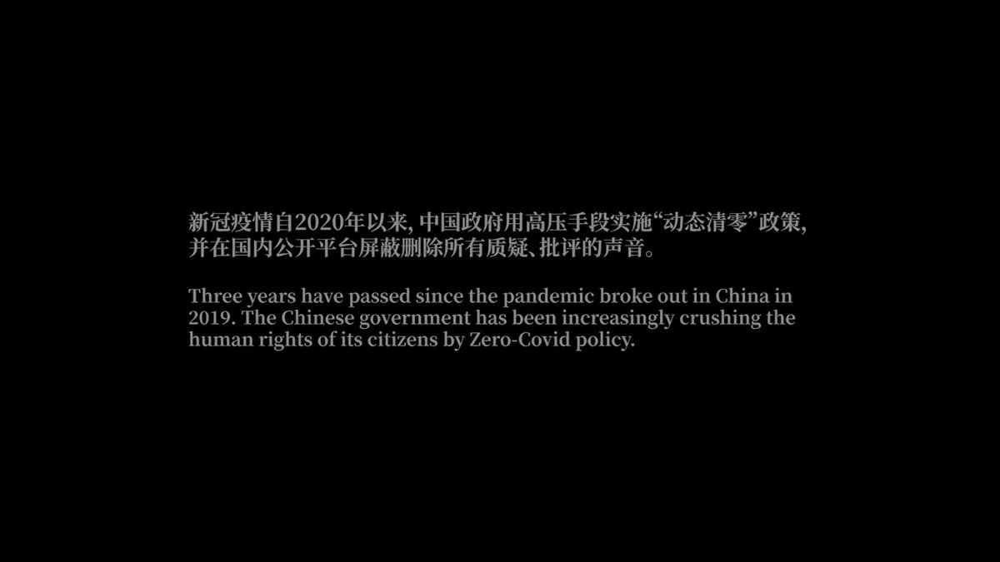
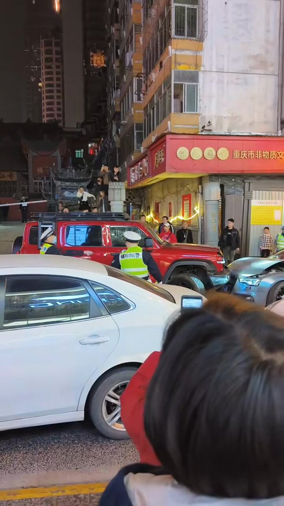

谁将十万横扫三江 北京时间 2024-02-13T14:04:43Z 1757284647447527773 RT @EricLiu_USA: 来美国第一个月，总结一下
1. 交通秩序混乱，满街都是闯红灯电瓶车；
2. 车不让人，哪怕看见你走斑马线也赌你会惜命闪开；
3. 后车看你打灯并线会紧贴前车不让你并进去，如果你并到他前面他会觉得吃了大亏，一整天如丧考批。
4. 不系安全带不用儿…   谁将十万横扫三江 北京时间 2024-02-13T14:21:39Z 1757288910638686488 RT @whyyoutouzhele: 《乌鲁木齐中路》白纸运动纪录片 Shanghai White Paper Protests Documentary/导演PLATO https://t.co/Fnnm14j0g6   谁将十万横扫三江 北京时间 2024-02-13T00:59:36Z 1757087067996369032 RT @whyyoutouzhele: 突发
约1小时前，重庆解放碑，一辆云A牌照的红色坦克300暴力冲警，连撞数车，最后被警民合力制服。 https://t.co/UiNcGI1zGM   谁将十万横扫三江 北京时间 2024-02-13T01:02:57Z 1757087911768642031 RT @SnowFlakeZero: 斯大林这么宽宏大量，杀托洛茨基全家干什么呢？

斯大林对反动派倒一向宽宏大量，北伐战争期间要求中共服从蒋介石不许搞苏维埃，西班牙内战期间让西共支持资产阶级议会民主反对工人夺权，二战后让法国共产党放下武装放弃革命走进议会

在破坏革命这方面，…   谁将十万横扫三江 北京时间 2024-02-13T01:16:52Z 1757091411638599919 RT @whyyoutouzhele: 2月11日，一位博主讲述自己的祖辈曾经在1960年饿死在除夕晚上，唤起了大家的“不正确记忆” https://t.co/BPCk0z5E4O   