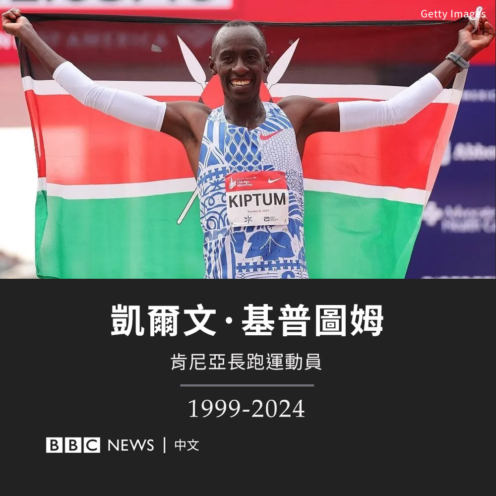

D英国广播公司BBC 北京时间 2024-02-12T15:00:00Z 1756936173279133757 去年2月，土耳其发生7.8级强震，造成五万多人死亡。在如此大规模的死亡人数背后，有数十起与建筑缺陷和非法改建有关的指控被提出。

在地震中失去多名亲人的诺卡尔女士决定自己展开调查。她认为，许多生命原本可以被挽救。 https://t.co/Am2evcEMrd   D英国广播公司BBC 北京时间 2024-02-12T12:02:47Z 1756891575014334613 男子马拉松世界纪录保持者、24岁的肯尼亚长跑选手凯尔文·基普图姆（Kelvin Kiptum）在肯尼亚的一场交通事故中身亡。

基普图姆和他的教练、卢旺达运动员热尔韦·哈基兹马纳（Gervais Hakizimana）在肯尼亚西部一条公路上的车祸中丧生。

基普图姆在2023年取得了惊人的突破，打破了同样来自肯尼亚的埃利乌德·基普乔盖（Eliud Kipchoge）所创下的纪录。

去年10月，基普图姆在芝加哥以2:00:35的成绩跑完了42公里，超越了基普乔盖的成绩。

警方表示，事故发生时，基普图姆是司机，车辆“失控翻滚，两人当场死亡”。

法新社援引一位发言人的话说，另有一名女乘客受伤，已被“紧急送往医院”。

四年前，由于买不起自己的鞋，基普图姆穿着借来的鞋参加了第一次大型比赛。他曾表示，他没有钱去参加田径训练，但他在2022年后迅速成名。

就在上周，他的团队宣布，基普图姆将在鹿特丹马拉松比赛中尝试在两小时内跑完全程——这是公开赛中从未实现过的成绩。

世界田径协会主席塞巴斯蒂安·科（Sebastian Coe）向基普图姆致敬，称其是“一位令人难以置信的运动员，留下了令人难以置信的遗产，我们将深深怀念他”。   D英国广播公司BBC 北京时间 2024-02-12T10:23:17Z 1756866535782846605 德国总理肖尔茨（Olaf Scholz）在访问华盛顿期间会见了他的“替身”——一名美国参议员。

2月8日，他会见了来自特拉华州的联邦参议员克里斯·库恩斯（Chris Coons）。库恩斯用德语开玩笑道：“谁是谁”。

在他们发布的照片中，两人有着几乎一模一样的秃顶、两侧灰白的头发和咧嘴的微笑。

除了长相酷似，两人年龄也相似，分别为60岁和65岁，就连身高也相近。

“很高兴再次见到我的分身。”总理肖尔茨在X上写道。

肖尔茨此次赴华盛顿，还会见了美国总统拜登（Joe Biden），他们一起敦促美国国会议员批准一项因国会僵局而被搁置的乌克兰军事援助计划。   D英国广播公司BBC 北京时间 2024-02-12T09:00:01Z 1756845581597626820 随着龙年的到来，全球各地的华人都举办了盛大的活动，辞旧迎新。🐉 https://t.co/I7BoAOcYnj   