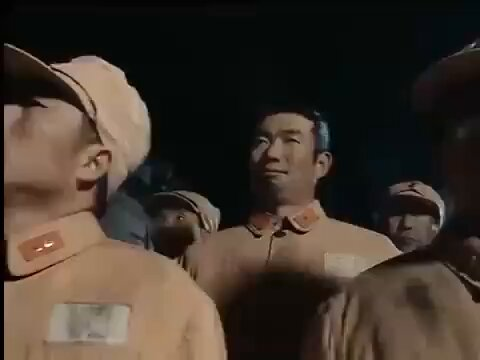

Petrichor 北京时间 2024-02-12T05:47:57Z 1756797244966080894 形势一样，只是现在没人敢这么说话了。
当年老蒋还是太妇人之仁了。
美国当时没有全力支持国民党，是不是早就肠子悔青了，几年后就爆发朝鲜战争，之后又是越南战争。1945-1949年之间，若美国全力支持蒋介石的国民政府，后来的朝鲜战争、越南战争以及现在与中共的凉战都可避免了。美国当年领导人糊涂啊，一失足成千古恨。
此外，如果中共当年被消灭，中国人民也不会经历那么多苦难和政治运动了，没三反五反、没大跃进后饿死几千万人、没文革10年内斗、没8964屠杀、没200斤的瞎折腾。中国早就融入世界，成为其中没有意识形态隔阂的重要一员。   