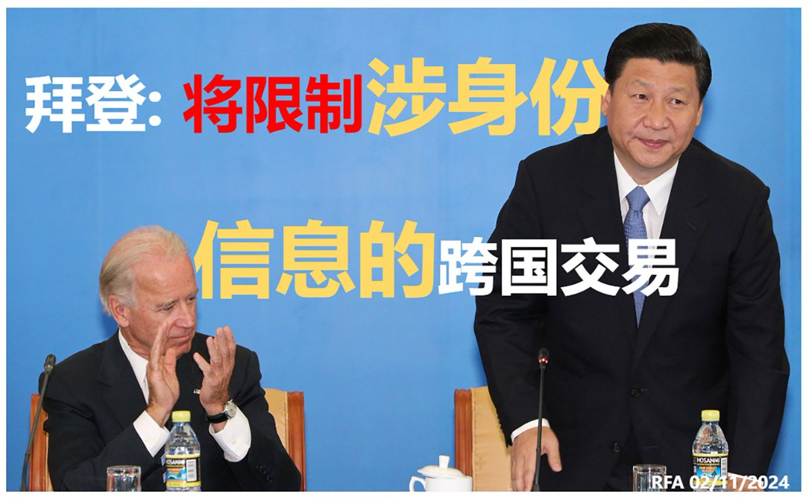

自由亚洲电台 北京时间 2024-02-12T08:15:31Z 1756834382306828584 拜登政府即将签署政令，限制涉及超过100万人身份信息的跨国交易，以免中国运用这些个人数据训练AI #人工智能，危害美国国家安全。同一时间，中国《#人民日报》发表社论《美方莫把“国家安全”当作万金油》。
详阅：https://t.co/dnLgUsCPad https://t.co/LGgfQAnTWu   自由亚洲电台 北京时间 2024-02-12T05:01:07Z 1756785458321752098 因2011年抗议自焚而被捕的四川 #阿坝格尔登寺 僧人，洛桑格桑与洛桑贡确被关押6年后获释。
详阅：
https://t.co/WDwyCgdYNe   自由亚洲电台 北京时间 2024-02-12T05:22:29Z 1756790836187025779 RT @RFA_Chinese: 【经济差过九年前，广州人: 今时唔同往日】
广州一项民调显示，2023年 #广州 市民对经济状况的满意度跌至2015年水平，仅55%；多达20项指标满意度下降。市民对“民营企业发展”满意度更跌穿至三成，为2008年以来最低。《#2023年 广州…   自由亚洲电台 北京时间 2024-02-12T05:33:12Z 1756793531920789652 台湾驻芝加哥办事处与印第安纳、明尼苏达等州近50位政要以预录影片向 #台湾 及侨界拜年，期许台湾与 #美国 中西部在 #龙年 建立更紧密的伙伴关系。
详阅：
https://t.co/XCH3iK1Ha0   自由亚洲电台 北京时间 2024-02-12T06:06:49Z 1756801990946943174 【港府: 市民示威集会权一直无变】香港警务处处长 #萧泽颐 表示，#港人 申请游行条件在23条立法后不会改变；又表示不排除在即将安装的超2000台闭路监控电视中，使用人脸识别。
详阅：
https://t.co/mZT1206KS4   自由亚洲电台 北京时间 2024-02-12T00:24:24Z 1756715820649246838 【中国欲入TPP，日本政府有分歧】
立宪民主党 #太荣志：中国加入TPP有助于稳定日中关系。
日本首相 #岸田文雄：需要看中国有否有满足TPP高标准的能力。
详阅：
https://t.co/7UuL9Gz3He   自由亚洲电台 北京时间 2024-02-12T00:41:25Z 1756720101443645760 中国从1月24日起全面停止向立陶宛公民发放入境签证，可能同立陶宛议会代表团最近访问台湾有关。#立陶宛 外长向中国外长询问事宜，但没得到任何回应。
详阅：
https://t.co/BX2cyYxdur   自由亚洲电台 北京时间 2024-02-12T01:01:49Z 1756725235041141163 【英国企业在华违反两国劳工法】#Flexicare 集团在东莞的全资企业 #富利凯 要求学生工每天工作13个小时，并以扣工资手段胁迫学生工不能离职，涉嫌违反中国法律，及触犯英国现代奴役法案和公共采购要求。
详阅：https://t.co/ti4jHxNWGU https://t.co/X00Hh6QhW0   自由亚洲电台 北京时间 2024-02-12T01:20:36Z 1756729965347787019 【私募“股神”曹欣离世，投资曾涉数十项目】曹欣于1月31日因“个人心理健康原因”离世，年仅34岁。#曹欣 是天理资产管理有限公司创始合伙人，专长科技产业股权投资 #基金管理。
详阅：https://t.co/gd7gJABvzn   自由亚洲电台 北京时间 2024-02-12T01:53:28Z 1756738235789705462 武汉市基督教爱国会和 #基督教 协会将对市内教堂进行为期半个月的排查，重点检查是否存在未经批准，擅自编印图书报刊及内部资料，有无传播使用 #非法出版物 的情况。
详阅：
https://t.co/znIQLjtqLH   自由亚洲电台 北京时间 2024-02-12T02:21:20Z 1756745248921817122 【中国扰台手段有变：少派军机多放气球】中国国家主席 #习近平 近期发表有关统一台湾是“历史必然”等强硬言论后，中方改变对台骚扰策略：侵扰军机由去年9月的单日最高103架次，降至大选后最高33架次；而对 #台湾 空飘气球的数量却在增加。
详阅：
https://t.co/p6OA0P3kEv   