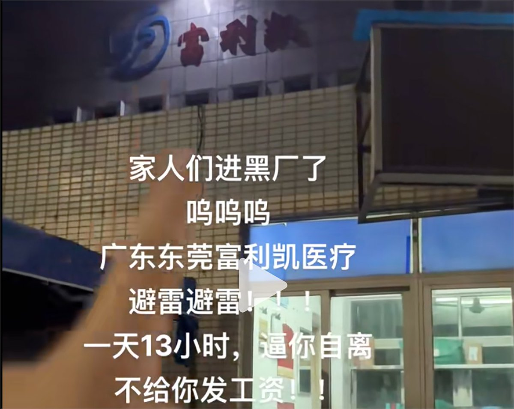

自由亚洲电台 北京时间 2024-02-12T00:41:25Z 1756720101443645760 中国从1月24日起全面停止向立陶宛公民发放入境签证，可能同立陶宛议会代表团最近访问台湾有关。#立陶宛 外长向中国外长询问事宜，但没得到任何回应。
详阅：
https://t.co/BX2cyYxdur   自由亚洲电台 北京时间 2024-02-12T01:01:49Z 1756725235041141163 【英国企业在华违反两国劳工法】#Flexicare 集团在东莞的全资企业 #富利凯 要求学生工每天工作13个小时，并以扣工资手段胁迫学生工不能离职，涉嫌违反中国法律，及触犯英国现代奴役法案和公共采购要求。
详阅：https://t.co/ti4jHxNWGU https://t.co/X00Hh6QhW0   自由亚洲电台 北京时间 2024-02-12T01:20:36Z 1756729965347787019 【私募“股神”曹欣离世，投资曾涉数十项目】曹欣于1月31日因“个人心理健康原因”离世，年仅34岁。#曹欣 是天理资产管理有限公司创始合伙人，专长科技产业股权投资 #基金管理。
详阅：https://t.co/gd7gJABvzn   自由亚洲电台 北京时间 2024-02-12T01:53:28Z 1756738235789705462 武汉市基督教爱国会和 #基督教 协会将对市内教堂进行为期半个月的排查，重点检查是否存在未经批准，擅自编印图书报刊及内部资料，有无传播使用 #非法出版物 的情况。
详阅：
https://t.co/znIQLjtqLH   自由亚洲电台 北京时间 2024-02-12T02:21:20Z 1756745248921817122 【中国扰台手段有变：少派军机多放气球】中国国家主席 #习近平 近期发表有关统一台湾是“历史必然”等强硬言论后，中方改变对台骚扰策略：侵扰军机由去年9月的单日最高103架次，降至大选后最高33架次；而对 #台湾 空飘气球的数量却在增加。
详阅：
https://t.co/p6OA0P3kEv   