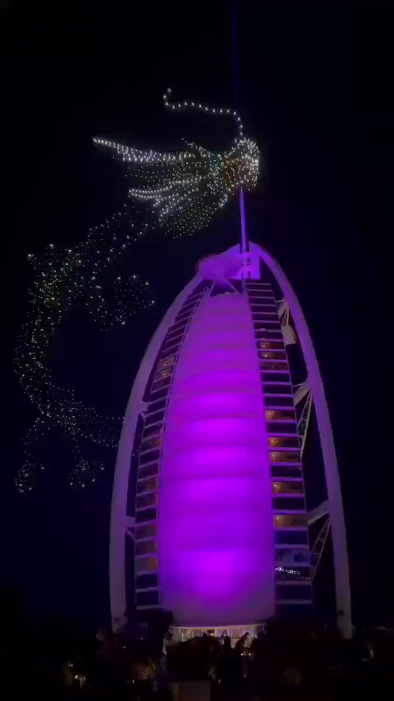

Petrichor 北京时间 2024-02-11T14:46:19Z 1756570340732367015 阿拉伯塔酒店，因外形酷似船帆，又称迪拜帆船酒店，今年过春节了，用了1500个无人机，摆出龙的造型。该酒店位于阿联酋迪拜海湾，以金碧辉煌、奢华无比著称。酒店建在离沙滩岸边280米远的波斯湾内的人工岛上，仅由一条弯曲的道路连接陆地，酒店共有56层，321米高。 https://t.co/LuRKRKpjmB   Petrichor 北京时间 2024-02-11T07:09:42Z 1756455429113078063 小流氓
世风日下 https://t.co/sZwrQm9XoK   Petrichor 北京时间 2024-02-11T02:22:42Z 1756383204049580270 1979年1月28日，中国农历新年大年初一，按习惯，中国人一般不出远门，一家老少，围坐一起，团聚过年，然而，45年前的今天，一个75岁的中国老人，却选择这一天，开启了一个转变古老中国的历史进程，他的访美为中国赢得发展的35年。他说的对，与美国关系搞好的，都过上好日子。 https://t.co/pXybNiLsNy   