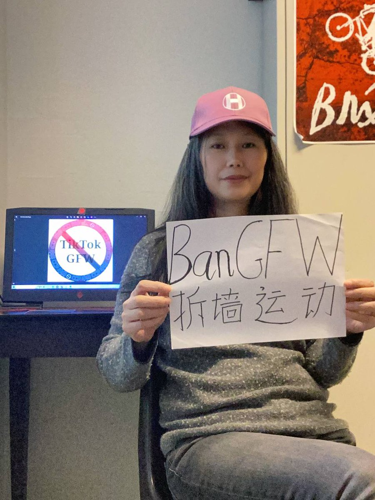

拆墙运动公号 北京时间 2024-02-11T22:29:40Z 1756686946363990252 #拆墙运动  行动 #签署（更新）

我们身处一个信息飞速传播的时代，互联网已经成为我们获取信息、交流思想的主要渠道之一。然而，对于许多中国网民来说，他们无法自由地访问全球互联网，而是被中国政府设置的互联网防火墙（Great Firewall）所阻挡。这种严格的审查制度严重侵犯了中国人民的基本人权，限制了言论自由和新闻自由，阻碍了思想交流和文化交流。
为了呼吁国际社会关注中国互联网审查问题，我们发起了"拆墙运动"。我们坚信，每个人都有权利自由访问信息和表达自己的观点，不应受到任何形式的审查和限制。
在这个关键时刻，我们需要您的支持和参与，让我们共同为打破中国互联网防火墙而努力。

我们的目标是：
1. 呼吁中国政府放宽互联网审查，保障人民的言论自由和新闻自由。
2. 向国际社会传达中国互联网审查的现状，引起更多人的关注和关心。
3. 支持那些在中国和海外为言论自由和网络自由而奋斗的勇士们。

拆墙运动：打破信息封锁，争取网络自由
拆墙运动是一场为了打破中国互联网防火墙而发起的民间运动。这堵所谓的“防火长城”限制了中国大陆超过10亿的网民访问全球互联网，阻碍了他们获取自由信息、表达意见和与世界交流的权利。这不仅是一个技术障碍，更是一种对言论自由和基本人权的侵犯。
运动的核心目标是通过集体行动，向中国政府表明我们坚决反对这种信息封锁，并争取恢复网络自由。我们相信每个人都应该有权利访问全球互联网，并自由地获取和分享信息，而不受政府的干扰和审查。

运动的策略和行动
1. 集体声援和示威游行： 我们计划组织示威游行和集会，向公众和政府表达我们的诉求，吸引更多关注和支持。
2. 国际宣传和舆论压力： 我们将通过国际媒体和社交媒体平台，向全球传播我们的信息，争取国际社会对中国互联网封锁问题的关注，并增加对中国政府的舆论压力。
3. 法律挑战和维权行动： 我们将寻求法律援助，挑战中国政府的网络审查制度，保护网民的言论自由和个人权利。
4. 技术对抗和翻墙工具开发： 我们已经有翻墙工具的开发和使用，帮助中国网民绕过互联网防火墙，访问全球互联网。

加入我们的行动，让我们携手，为打破信息封锁，争取网络自由而战！
如果你对言论自由、网络自由和人权问题感兴趣，如果你认同我们的目标和价值观，那么请加入我们的行动！无论你是普通网民、人权活动家、记者、程序员还是法律专家，你的参与都将对我们的运动产生积极的影响。

联系我们
如果你想了解更多信息或加入我们的行动，请访问我们的官方网站:https://t.co/Rk8tf5mGU6，关注我们的社交媒体账号:https://t.co/EVfkhsi1B7，或直接发送邮件至ldl69375976@gmail.com 。我们期待与你一起为网络自由而努力！

作为加入者，你将成为拆墙运动的奠基人之一，我们将建立合作备忘录，为打破信息封锁、争取网络自由而努力。你的名字将被列在我们的网站上，成为我们运动的支持者和见证者。

简介版合作备忘录 
请至少配合成为随手转发义工哦……
1 我方每週會發布本週動態進展匯報兩百秒左右的小視頻，請您在推特上不吝轉發。如果您也是YouTube 播主請您協力貼片在您节目作为片尾發布。
2 共同拓展牆內粉絲交流群 我方和您共同建設時政播報群和播主粉丝福利群工具为potato chat 和 teleguard ，無需翻牆同位替換微信。
3 为您的墙内粉丝提供免梯下载站服务，包括不限于软件工具和教程。提供数字IP网页下载，和SYNV同步网盘免梯無痕自助下載。
也可以协助播主建立网盘下载空间，彼此共同传播。
4 為您的粉絲提供技術輔導，促使其無障礙使用Twitter🐦，游🐰，以便直接訂閱您的頻道。
5 电商导购代购，e-sim卡 海外电话卡及其套餐，Google voice ，以及引荐相关通讯数码设备以便科学上网互联互通。
在此递进基础上可以开展电报群进一步互动。
6 为您的粉丝提供免梯网址直接看游兔政评频道福利，或促进您进入合作推广的频道。
7 协助搜集筑墙者恶人榜和因翻墙获罪的受害者的情资，充实到节目中帮助习禁评讲好墙国故事。
恶人榜相关情资记录到下载站想墙内可以阅读也可接纳各种爆料。

您可以如何参与：
1. 在我们的签名运动中签署支持书，表达您的态度和诉求。
2. 分享我们的宣传资料和社交媒体信息，让更多人了解我们的运动。
3. 参加我们组织的活动和集会，与我们一起发声，为言论自由呐喊。

立即行动：
现在就加入我们的行列，与我们一起为中国人民的言论自由和新闻自由而战！让我们共同努力，拆除中国互联网防火墙，为自由的网络空间而奋斗！

联系我们
联系方式：+45 71540359
如果你想了解更多信息或加入我们的行动，请访问我们的官方网站：https://t.co/Rk8tf5mGU6，关注我们的社交媒体账号https://t.co/usLIBmABaL，拆墙运动 丹麦 刘栋玲 Dongling @Ldl076ya 组织发起 冰岛 周锋 @ziyoufujian 起草发起
我们热切期待你的加入！

加入我们的行动
如果你相信言论自由、网络自由和人权，如果你认为信息封锁是对人类自由的威胁，那么请加入我们的行动！防火墙是中共建立的柏林墙，但就像东德西德最终推翻了柏林墙一样，我们也有能力推翻这道阻碍我们自由呼吸的枷锁。
拆墙运动号召全球正义人士一起努力，打破中共建立的信息封锁，争取真正的网络自由。作为加入者，你将成为我们运动的奠基人之一，见证历史的发展，为未来的自由而战！

签名：[你的名字/化名 概括介绍自己]
在这段文字后面加上你的签名，表示你的支持和加入，从 "除习”开始，为拆墙运动添砖加瓦
发送到  ldl69375976@gmail.com
我们会到我们的官网公示
签名：
1、化名周顺平，
一名坚定的反共人士。我支持并加入拆墙运动！在自己能力范围内参与拆墙，让真相早日大白于天下 
2、魏小鹏，在香港反送中运动时开始翻墙，虽然自小就觉得所生活的社会有种种问题，翻墙后才发现中共是多么残暴，我究竟生活在怎样的地狱中。拆倒那面无耻的遮羞墙，唤醒更多中国人！
3、签名：Beacon Bright 烽烨
概括介绍:沦陷区南宁人，公益行动三十年，助学孤寡老人麻风病人关爱抗战老兵等，目睹经历各种压迫和黑暗，异见人士，遭中共迫害。
拆墙运动(BanGFW)总部秘书处秘书长，行动组主要成员,一人一推，恶人榜义工
中国公民进步党筹委会成员
因在老挝万象进行拆墙运动，主发起人乔鑫鑫被中共违法跨国抓捕回国关押，遂逃亡至今。
致力推翻邪恶独裁中共
2024,希望各位继续关注拆墙运动，在保证安全的前提下，向墙内外说明防火墙的危害，让世界明白，因为被封控信息和思想而愚昧的十四亿人会对这个世界造成什么样的危害，不断对邪恶的政权施压，让防火墙倒塌，让建墙者被审判，让邪恶独裁政权倒台，让拆墙运动发起人乔鑫鑫自由，让世界看到中国，让中国拥抱世界…
4、王向东，鉴定的民主人，拒绝信息封锁，要求新闻自由，言论自由，支持拆墙运动。
5、陈思明，因在国内参加民运活动遭受政治迫害于2023年7月逃离中国，现在加拿大获得政治庇护。
6、林生亮，恶人榜发起人，人权捍卫者，
7，一人一推团体及发起人
黄家驹《长城> https://t.co/uNXL8z4WvK   拆墙运动公号 北京时间 2024-02-11T22:23:21Z 1756685356420726809 RT @min_fan19356: 如果大陆中国没有防火墙的话，就既使再有一万个象中共那样的政权，也被网民给推翻了。正因为有防火墙，才能让邪恶的中共政权得以延续到现在，因为掌握枪杆子的人是有思想控制的，一但握枪杆子的人醒了，其抬高一寸枪口不算，他们甚至会调换回枪口的！   拆墙运动公号 北京时间 2024-02-11T23:32:55Z 1756702866276864309 RT @LinShengliang: #突發事件 關於傳聞山東莒重大槍殺事件發生的消息，早在當天當時2.10收到牆內網友爆料，苦於沒有其他信息佐證沒有及時發佈，真假自行判斷。是否又一起 #田建明 事件？繼續關注。 https://t.co/hZQyTcDal4   拆墙运动公号 北京时间 2024-02-11T22:03:14Z 1756680295779123393 RT @gaiyuyin: 麻烦当地朋友求证一下啊，地点山东莒县漯河镇宅科村
传大年初一重大枪杀事件，据说21死   拆墙运动公号 北京时间 2024-02-11T13:51:14Z 1756556477303549996 RT @lisaxinsohradio: 🌻『我从小是一个爱哭的女孩，总渴望得不到的温暖，所以很多时候不够坚强。而这一生很多的坚持、不愿意屈服於所谓的权利，直到如今，还勉强坚强的扛起这一生中喜欢做的事情的责任。』

这是“拆墙运动”的共同发起人刘栋玲写给我的一段话。在乔鑫鑫被中…   拆墙运动公号 北京时间 2024-02-11T13:53:30Z 1756557049318518788 感谢子涵对我的采访，同时感谢子涵对 #拆墙运动 的支持   拆墙运动公号 北京时间 2024-02-11T02:59:02Z 1756392345543618607 RT @LinShengliang: 停止賣慘比慘，停止口炮和販賣焦慮，中國的進步需要每個中國人付出勇氣和行動，前行者販賣勇氣和智慧。 https://t.co/nu1TJoncsm   