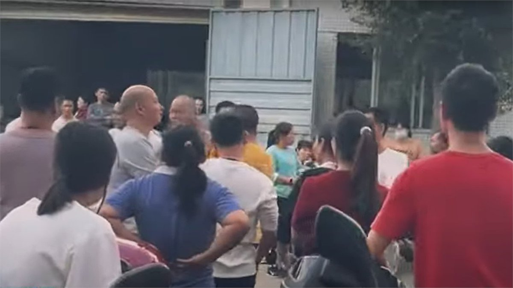

自由亚洲电台 北京时间 2024-02-11T12:02:28Z 1756529106768875579 台湾驻美代表 #俞大㵢 表示，中国试图通过“欺骗窃取”的在芯片技术上与台湾匹敌，但尽管投入巨资，仍未成功。
详阅：
https://t.co/LT1amT0UB8   自由亚洲电台 北京时间 2024-02-11T09:41:15Z 1756493569131471109 世界各地 70 多名政治家联署了一封信，要求巴斯夫 #BASF 退出新疆地区。压力之下，巴斯夫承诺“在几个月内”从新疆撤资，并剥离 #库尔勒 两家合资企业股份。
详阅：
https://t.co/y2QdqbWWYj   自由亚洲电台 北京时间 2024-02-11T10:16:03Z 1756502326158745736 RT @RFA_Chinese: 【美日三航母军演，美国能否应对三个战场？｜#兵家常事】https://t.co/JjYNiCaPRa
1月31日，两艘 #美国航母 和 #日本 的一艘 #直升机护卫舰 在台湾东部的菲律宾海举行 #美日军演。随着乌克兰战争的进行，和中东局势不断恶…   自由亚洲电台 北京时间 2024-02-11T06:39:47Z 1756447902795219366 法国金融检察署（#PNF）对华为（#Huawei）法国办事处突击搜查，被指与潜在的贪污指控有关。
详阅：
https://t.co/DZXbHXKiAM   自由亚洲电台 北京时间 2024-02-11T07:32:34Z 1756461183865925782 【台海气球破单日纪录，一气球不知所踪】
台湾 #国军 在台海周边侦察 #中国 解放军机5架次、军舰4艘次，逾越海峡中线气球8枚，其中更有1枚在台湾上空消失，1枚穿越 #台湾 北部。
详阅：
https://t.co/fpreN2XJUN   自由亚洲电台 北京时间 2024-02-11T08:35:08Z 1756476930910495133 中国民复党创始人邵明亮获刑4年获释后又一次被捕；#邵明亮 2019年-2023年服刑期间其一只手被打残废，出狱后仍遭监控。
详阅：
https://t.co/n9XJ4gYsYS   自由亚洲电台 北京时间 2024-02-11T04:51:02Z 1756420534856733034 【智库: 在美中国企业安插中共代表进董事会】
继佛州对中国人推行“禁房令”失败后，#美国优先政策研究所 AFPI正致力推动其他各州立法禁止中国企业或人士拥有农地。智库表示，“#中国企业 来美国赚钱可以，但不希望让中共致富”。
详阅：
https://t.co/qvGZOpId3m   自由亚洲电台 北京时间 2024-02-11T05:02:35Z 1756423441001922862 RT @RFA_Chinese: 【自由亚洲电台台长方贝恭祝大家新春快乐！】
谢谢大家的支持与厚爱！在全球威权主义抬头的背景下，自由亚洲电台普通话部将风雨兼程，为大家提供及时、基于事实的新闻。 https://t.co/FiJYH85WSa   自由亚洲电台 北京时间 2024-02-11T05:02:49Z 1756423499826999626 RT @RFA_Chinese: 【春晚变军演? 作战部队舞台持枪迈正步】#解放军 卫戍66477装甲部队头戴钢盔、身着土黄色迷彩服的官兵首次持枪上春晚唱军歌。舞台上还能看到新式战机、坦克、潜水艇，以及 #抢滩登陆 和导弹齐射等影像。
详情：
https://t.co/S6qm…   自由亚洲电台 北京时间 2024-02-11T05:36:40Z 1756432018341032314 在国会的压力下，美国公用事业公司 #杜克能源 计划将中国电池制造商 #宁德时代 生产的储能电池从美国海军陆战队 #CampLejeune 基地移除，并逐步淘汰宁德时代产品。
详阅：
https://t.co/Cv4JLGuxC7   自由亚洲电台 北京时间 2024-02-11T02:30:20Z 1756385125313437837 【除夕夜“白纸老人”被维稳】福州仓山访民 #唐兆星 准备离家绕道去北京时被上渡派出所三个稳控人员控制，车票被撕毁，手机被抢走。
详阅：
https://t.co/sHMO7ymWu5   自由亚洲电台 北京时间 2024-02-11T03:32:13Z 1756400700135821314 【春晚变军演? 作战部队舞台持枪迈正步】#解放军 卫戍66477装甲部队头戴钢盔、身着土黄色迷彩服的官兵首次持枪上春晚唱军歌。舞台上还能看到新式战机、坦克、潜水艇，以及 #抢滩登陆 和导弹齐射等影像。
详情：
https://t.co/S6qm6Y5YMN   自由亚洲电台 北京时间 2024-02-11T00:33:48Z 1756355799419384157 RT @RFA_Chinese: 【盘点那些上不了春晚的歌儿】
过去一年见证了民间音乐创作者与中国审查机构线上和线下的博弈交锋，多首脍炙人口的流行曲，因其浓厚的政治意味而受到播放限制。#大梦 般的后疫情社会，我们是否都成为了 #罗刹海市 的 #西楼儿女?… https://t.…   自由亚洲电台 北京时间 2024-02-11T00:47:02Z 1756359128841072829 【年产值超20亿，却无法补偿员工?】广东 #惠州 隆裕鞋厂因年末搬厂补偿问题引发工人罢工；隆发鞋业是台湾五大制鞋企业之一，隆典集团旗下的全资子公司。罢工前不久，《南方+》还曾发表过一篇专题，报道 #隆裕 和 #隆发 两家鞋厂员工人数多达7500人，一年造100万双 ...
详阅：
https://t.co/EcdaUM28HS https://t.co/mrBDGpfnWw   自由亚洲电台 北京时间 2024-02-11T01:29:24Z 1756369789310677213 杭州市体育局表示目前因“众所周知的原因”、“赛事举办条件不成熟”，取消阿根廷足球队的杭州赛事。
梅西（#LionelMessi）此前在香港表演赛时因“出现伤痛”，全程没有登场。然而三天后却在日本的表演赛中上场，使风波进一步升级。
详阅：
https://t.co/HOVIFxw1aD   自由亚洲电台 北京时间 2024-02-11T00:21:25Z 1756352681315057952 “一位中国人去理发并得到了同样的免费服务。可是第二天，理发师看到的既不是12朵玫瑰，也不是一打甜甜圈，而是12个中国人在店外等候免费理发...... 无论国外的制度和习惯习俗有多完美，一旦遇到聪明的中国人，就会变味，并且与制度设计的初衷大不相同”。— #周嘉
详阅：
https://t.co/XZJ0Ornxky   