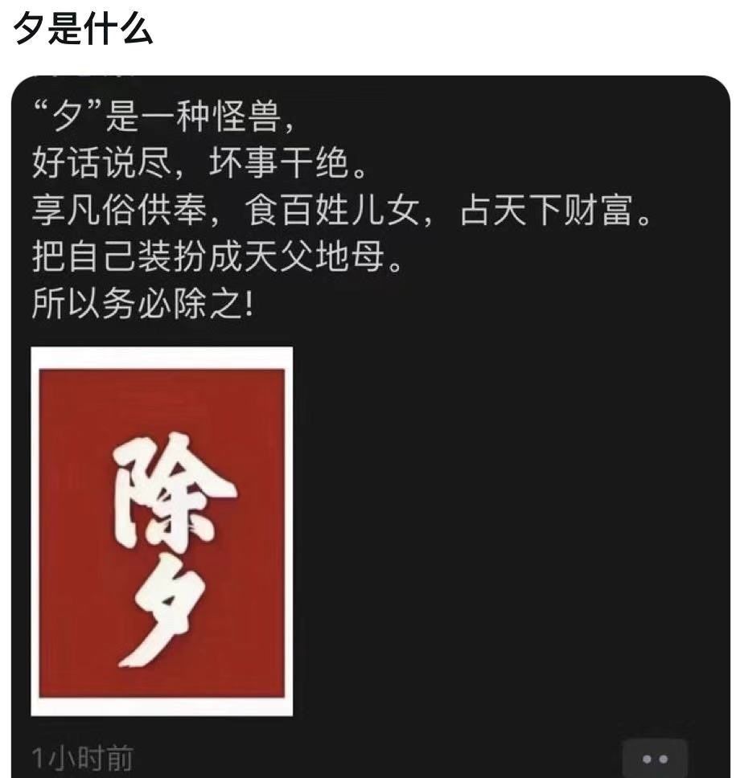
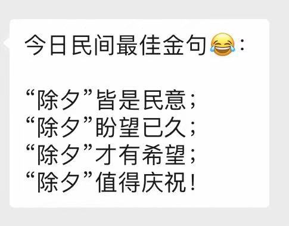

Petrichor 北京时间 2024-02-10T23:43:16Z 1756343080876208554 现在还这么穷的地方，非洲也没有了。

要不是出了个毛泽东，他也不会这么穷。例如，台湾从来没个毛泽东，即使山区农民也很体面的生活着。

从物质到精神，他们都是一无所有。
他穷，却不知道为什么穷。把给他们制造贫穷的人作为大救星的神歌颂着，这就天地所不容。 https://t.co/Aq2k4Micew   Petrichor 北京时间 2024-02-10T13:01:13Z 1756181504202297634 中国历史上所有帝王中，在世时被国内外人民诅咒最多的是哪位？

到饭店吃年夜饭，隔壁桌上人说不是秦始皇、不是秦二世、不是王莽……那还能有谁呢？ https://t.co/spDxlbVOr0   Petrichor 北京时间 2024-02-10T13:43:09Z 1756192056882364657 美国总统在白宫过中国春节。
中国国家主席何时在中南海过圣诞节？
海纳百川，有容乃大。
抵制这、抵制那，拔网线，建高墙，孤家寡人，井中风景独好，有意思吗？ https://t.co/8aVD2FbsTy   Petrichor 北京时间 2024-02-10T13:59:15Z 1756196109230158163 他们是无产阶级先锋队，是党培养出来的干部。 https://t.co/TZk0LCnaY2   Petrichor 北京时间 2024-02-10T06:22:51Z 1756081250953990430 普京说：按购买力平价计算，中国的GDP已经超过美国，并且认为俄罗斯跟中国有悠久的历史，绵长的边界，是好邻居！

这话不怀好意。1. 继续抬举习近平，让习近平云里雾里的，继续犯浑，以为东升西降，美国不行了，被超越了。2. 中国是好邻居，任俄罗斯欺负，拿走许多领土，还认俄爹。   