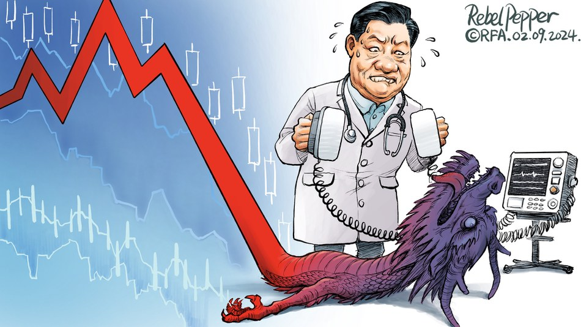
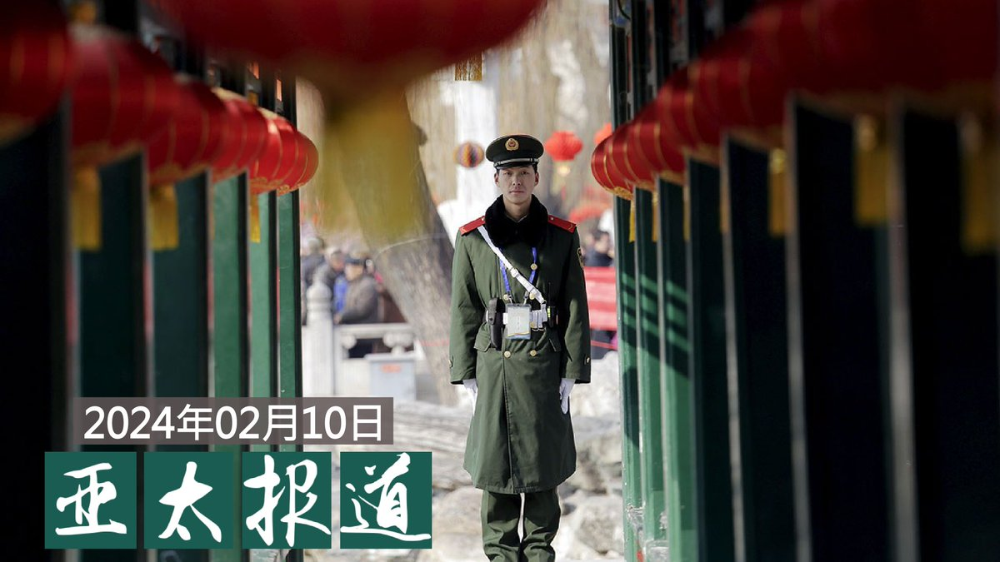
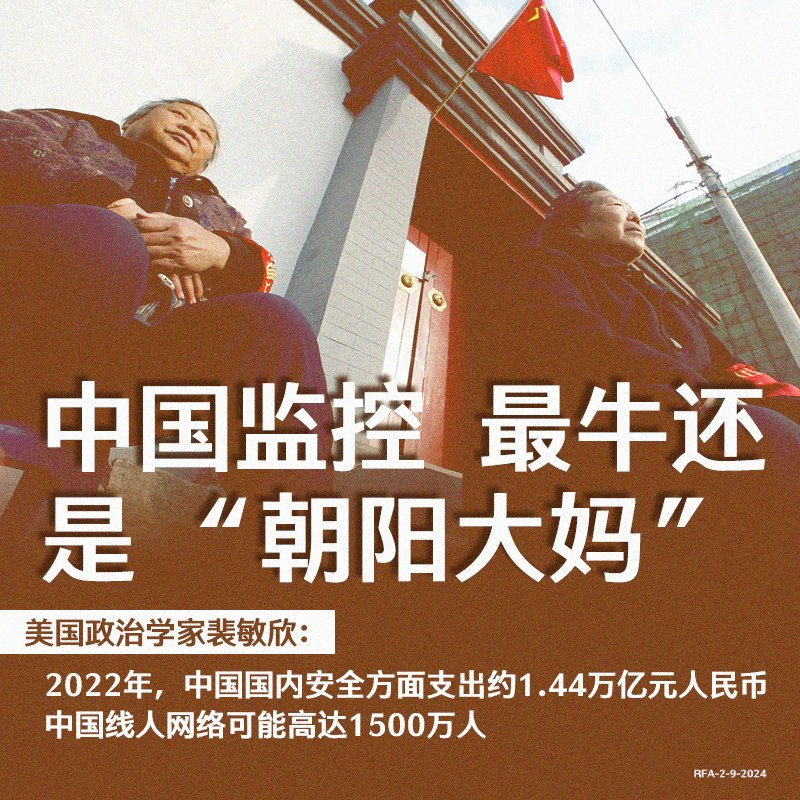
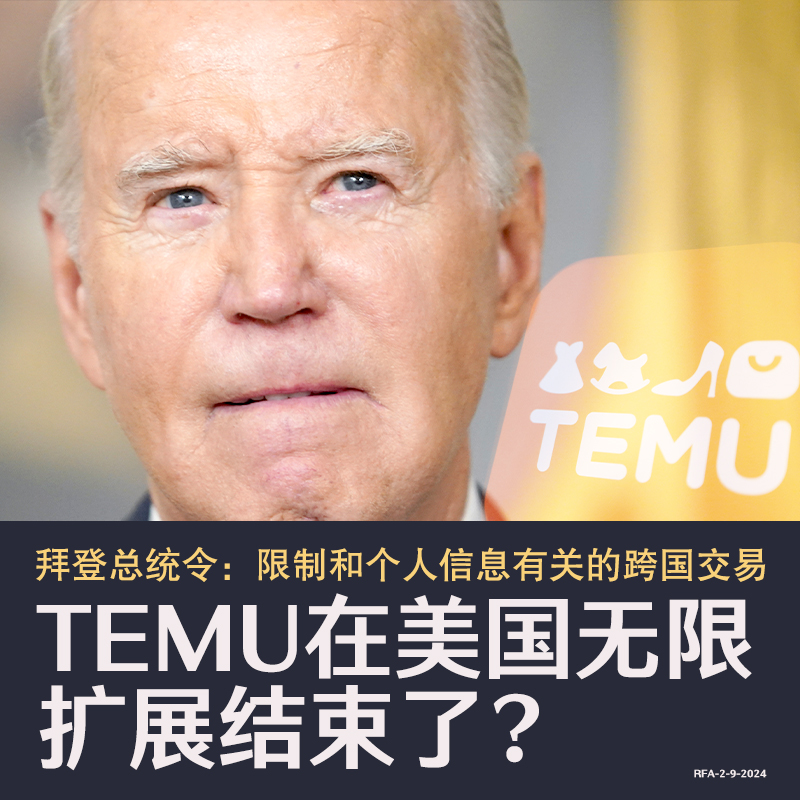

自由亚洲电台 北京时间 2024-02-10T21:00:02Z 1756302002202595752 【美日三航母军演，美国能否应对三个战场？｜#兵家常事】https://t.co/JjYNiCaPRa
1月31日，两艘 #美国航母 和 #日本 的一艘 #直升机护卫舰 在台湾东部的菲律宾海举行 #美日军演。随着乌克兰战争的进行，和中东局势不断恶化，美国到底有没有能力同时应对多场战争？ https://t.co/T8eDRTxjAO   自由亚洲电台 北京时间 2024-02-10T22:04:58Z 1756318341524758985 https://t.co/teU6Nu0jqP   自由亚洲电台 北京时间 2024-02-10T11:16:34Z 1756155166468796627 中国的央视 #春晚 节目9日晚直播。据报道，央视上个月宣布将在新疆 #喀什 设 #春晚分会场。这也是春晚举办41年来首次在 #南疆 地区设分会场，广受关注。

https://t.co/IFqxoXoRVY   自由亚洲电台 北京时间 2024-02-10T11:19:19Z 1756155859241984334 评论 | 何清涟 @HeQinglian：时隔十年 两场中国 #股灾 的异与同  https://t.co/6F65VIOlR9   自由亚洲电台 北京时间 2024-02-10T11:23:58Z 1756157032388854151 【#变态辣椒：龙拖经济后腿】
中国领导人习近平竭尽全力，要在大吉大利的龙年复苏世界第二大经济体。在数十年高速发展之后，中国经济已减速进入缓慢发展的时期。批评人士认为，中国经济存在着结构性问题，例如巨大的地方政府债务、跌跌不休的房地产以及习近平本人的国家安全至上方针。这一方针凸显了对科技界及富裕企业家的的打压，也体现在对外国投资者造成的恐惧。因此，习近平的短期措施对中国经济来说将无济于事。   自由亚洲电台 北京时间 2024-02-10T11:59:27Z 1756165961999130946 RT @RFA_Chinese: 【中国监控技术牛，“朝阳大妈”更牛！】
人人都说中国 #监控技术 独步天下，但美国政治学家 #裴敏欣 近日在《外交事务》杂志发文指出，中国监控最成功之处在于“劳动密集型”的人力监控网络。… https://t.co/tQkpMEalLY   自由亚洲电台 北京时间 2024-02-10T08:00:08Z 1756105734813855926 欢迎收听和订阅播客【＃亚太报道】 https://t.co/MjLNSvVMqc
#中国政治犯 家属思念狱中亲人； #拜年 祝愿与现实差距多远？；#广州社调 凸显 #民企 经济持续恶化；美国投资公司助长中国军事和监控能力；首份中国当局 #跨国镇压流亡藏人 报告发布。 https://t.co/oZk3UkVLwz   自由亚洲电台 北京时间 2024-02-10T09:09:24Z 1756123166970159262 【盘点那些上不了春晚的歌儿】
过去一年见证了民间音乐创作者与中国审查机构线上和线下的博弈交锋，多首脍炙人口的流行曲，因其浓厚的政治意味而受到播放限制。#大梦 般的后疫情社会，我们是否都成为了 #罗刹海市 的 #西楼儿女? 今天，让我们一起回顾过去的兔年里，塑造了这个时代集体回忆的音乐，并问一问自己，你是否真正的快乐？
详阅：https://t.co/UNLxGUXwsX   自由亚洲电台 北京时间 2024-02-10T04:36:58Z 1756054604238733659 伴随美中竞争日趋升级，美国总统拜登为亚太事务专家 #坎贝尔 在白宫国安会设立了 #印太协调员 这个新职位后，坎贝尔更将在今年七月接替计划退休的副国务卿舍曼，成为美国国务院的二当家。从"#亚洲沙皇"到副国务卿，坎贝尔将如何影响美国的对华政策呢？

https://t.co/3DZQoYvKtk   自由亚洲电台 北京时间 2024-02-10T05:17:00Z 1756064679011446789 带领 #黎智英 国际律师团队的御用大律师Caoilfhionn Gallagher说，《#苹果日报》被关闭是一次 “由国家支持的盗窃行为”，一家非常成功的媒体企业和一个坚持公义的企业家被无端扼杀；而目前有三十万加拿大公民和两百家加拿大公司在香港，渥太华需要警告他们在中国经商的风险。
https://t.co/EKiZy3lXEx   自由亚洲电台 北京时间 2024-02-10T05:43:42Z 1756071397464387929 向赫扎尔 #行贿 者，包括中国企业 #深圳新世界 集团旗下的深圳新世界投资有限公司。对其八项罪名指控均成立。参与行贿的该公司所有人 #黄伟 也受到指控，目前在逃，据信身处中国。https://t.co/uogw0w2Ai9   自由亚洲电台 北京时间 2024-02-10T05:47:31Z 1756072361151860763 美国国会近日公布的一份最新报告显示，美国创投公司对中国关键科技领域的投资，助长了中国的军事及监控能力。同时有消息传出，美国政府将对跨国企业向中国传递数据的问题祭出新一轮监管措施。随着华盛顿收紧与北京的科技互动，这将对美中关系及两国经济前景带来什么影响呢？
https://t.co/LTQrgoqaNc   自由亚洲电台 北京时间 2024-02-10T05:57:46Z 1756074941407985958 【中国监控技术牛，“朝阳大妈”更牛！】
人人都说中国 #监控技术 独步天下，但美国政治学家 #裴敏欣 近日在《外交事务》杂志发文指出，中国监控最成功之处在于“劳动密集型”的人力监控网络。
他估算，2022年，中国国内安全方面（包括常规警察、国家安全部、人民武装警察、法院、检察院和监狱）的支出约1.44万亿元人民币左右，大致与总防御开支相当。
除去保密的国安人员外，根据公开资料，中国的公安人数大概在200多万人，其中负责国内监视的政治安全保卫人员预计在6至10万人。
但中国有可能多达1500万的有偿和无偿的“线人”，占人口的百分之一。   自由亚洲电台 北京时间 2024-02-10T06:01:00Z 1756075751080665183 据彭博社报道，拜登即将签署的新命令，限制和 #个人信息 有关的 #跨国交易，避免敌对国取得危害美国安全的个人数据，包括美国公民的财务信息、基因信息、声纹、甚至是键盘使用习惯。
美国情报机构担心，中国政府借此建立美国官员的详细档案，并可能会运用这些数据训练人工智能，占得先机。
这是否意味着 #中国电商 平台在美国疯狂发展到头了？   自由亚洲电台 北京时间 2024-02-10T06:02:59Z 1756076254250385795 专栏 | 夜话中南海：习近平和董军分别透露了什么样的中俄关系？ — 普通话主页 https://t.co/bHQruHppaK   自由亚洲电台 北京时间 2024-02-10T06:08:34Z 1756077656901103748 “公民实验室”（The Citizen Lab）周三（7日）发布一份报告发现，欧洲、亚洲和拉丁美洲有 100 多家伪装成当地新闻媒体的网站，正在进行影响力活动，宣传 #亲中 内容，而背后推手则是中国一家公关公司。

https://t.co/VieAsiX38U   自由亚洲电台 北京时间 2024-02-10T02:37:39Z 1756024579992981869 #英国 首相府周三（7日）举办农历新年酒会，连续第二年邀请在英港人出席，但并不包括六位被港府悬红通缉的在英港人，而获邀参与的港人也比去年少。 有出席者认为，英国当局或不想新春活动变得"政治化"。
https://t.co/rZ3UE4iiQ5   自由亚洲电台 北京时间 2024-02-10T03:20:26Z 1756035346230374832 #梅西 缺阵香港　主办方Tatler Asia 公开举办这次活动的损益表，披露公司现正面对的巨额亏损和财政负担，预计退款合共5600万港元，最终亏4300万港元。https://t.co/jNa7SjcdpB   自由亚洲电台 北京时间 2024-02-10T03:29:58Z 1756037744822738977 中国国家移民管理局2月9日发布公告，自即日起，扩大部分国家人员 #免签入境海南 事由，包括因商贸、访问、探亲等需要，免签入境可达30天。之前实施的相关国家人员入境海南旅游免签30天的政策继续有效。

 https://t.co/PvTzv5JFNk   自由亚洲电台 北京时间 2024-02-10T01:34:53Z 1756008780934869206 随着农历春节到来，澳大利亚多个城市举办“相约今宵2024 #澳洲春晚”活动。 由于主办单位中有与中国统战部门有关系的华侨社团，因此引来港独组织前往场外抗议，声援被中国法院判处死缓的澳籍华人作家 #杨恒均。 其中在墨尔本，有示威者受到肢体袭击。

https://t.co/pI4wV0CQH1   自由亚洲电台 北京时间 2024-02-10T02:05:55Z 1756016592217936245 中国著名人权律师 #高智晟 已〝被失踪〞逾六年。2月8日甲辰龙年除夕前一天，他的妻子 #耿和 写了一封300多字的家书，表达她对丈夫长达2370天的思念。即使她知道，这封信送不到高智晟的手中。

https://t.co/npoX8huR9M   