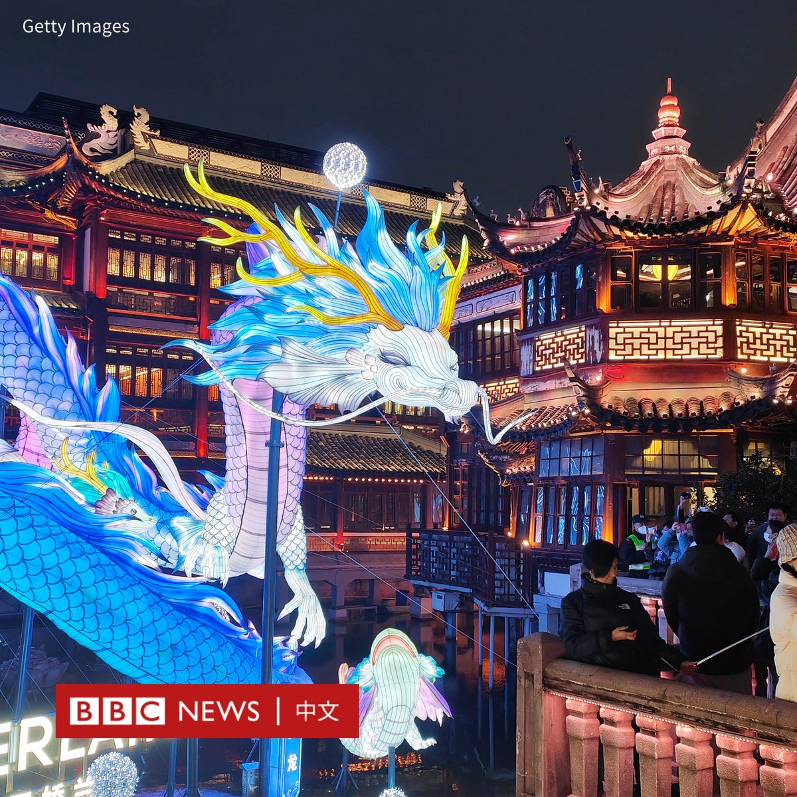
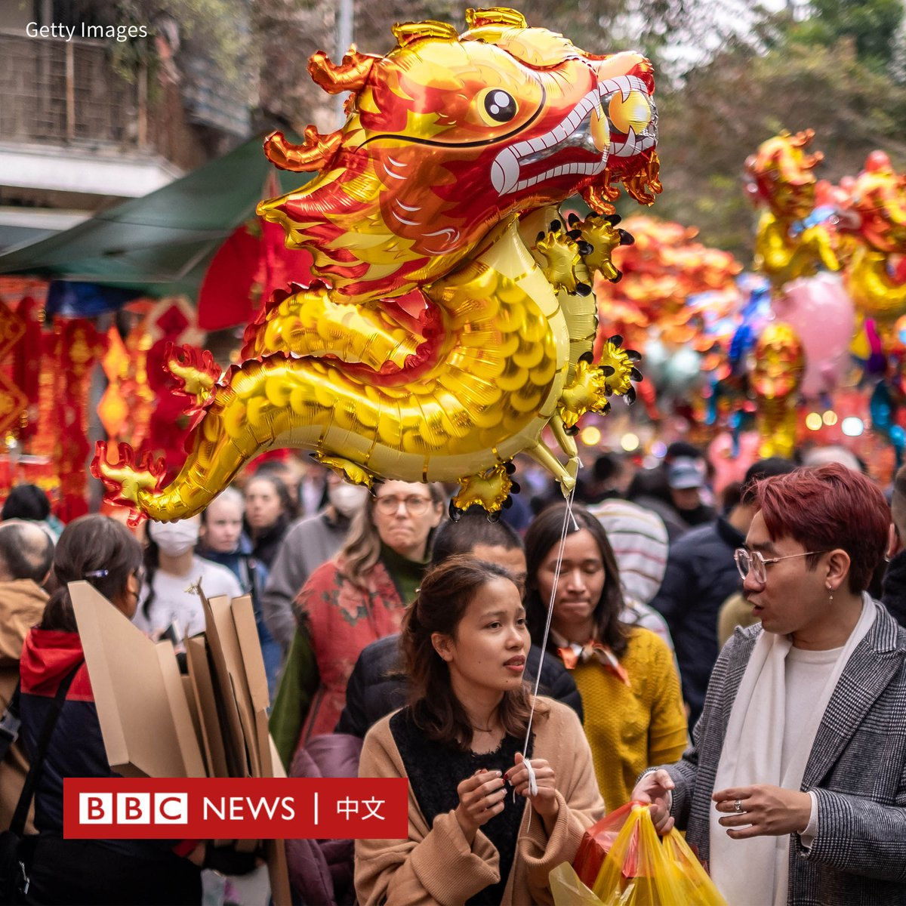
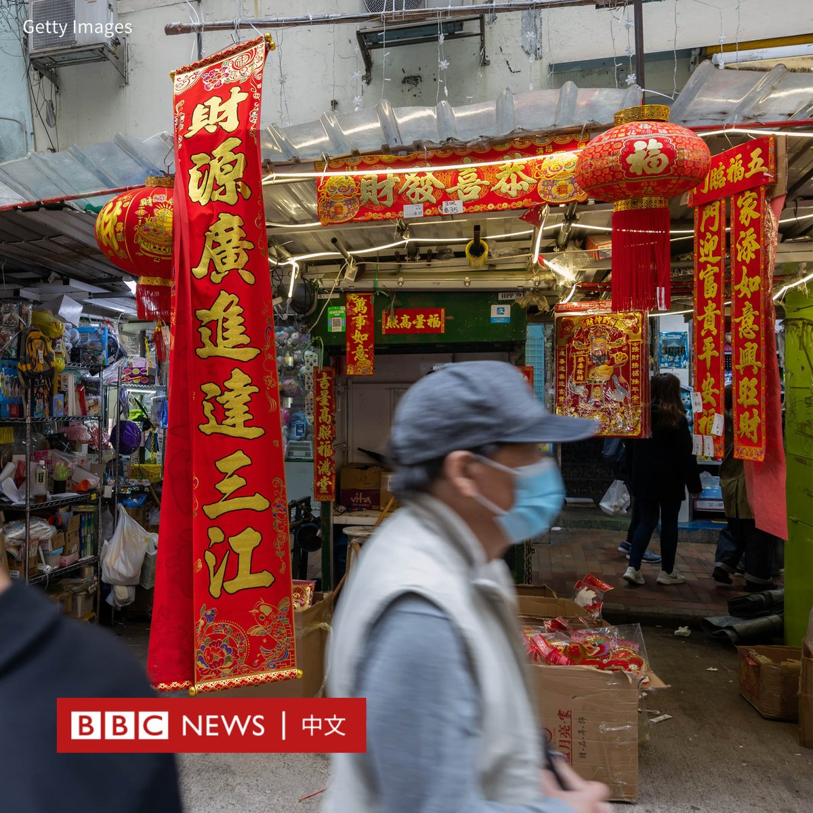
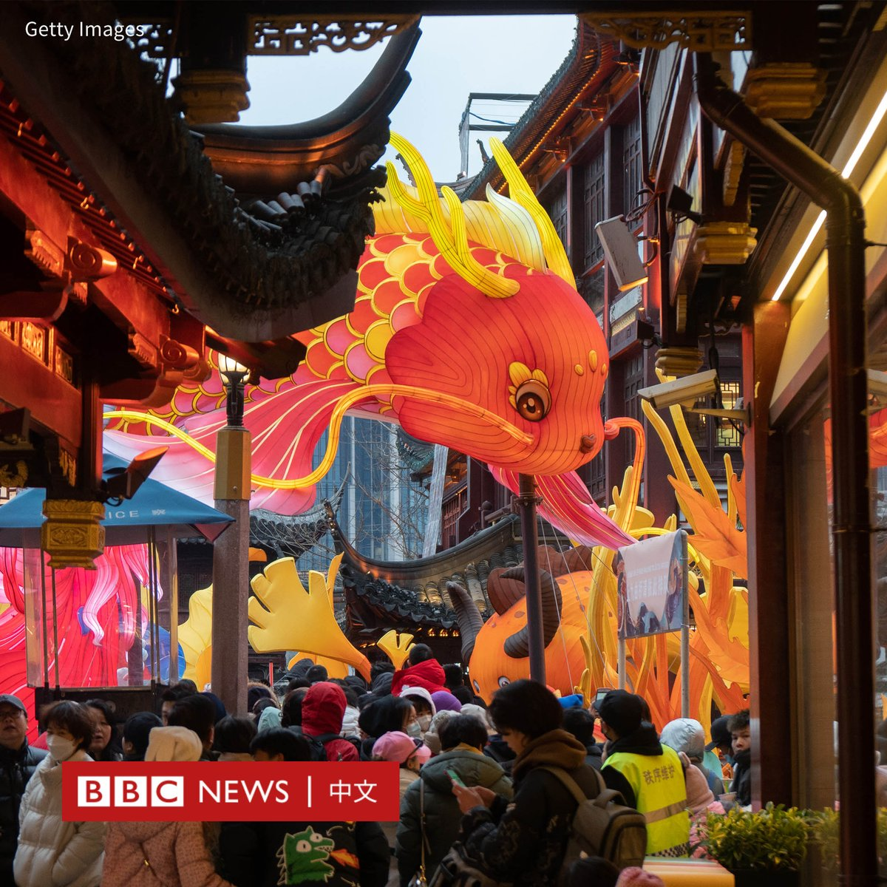
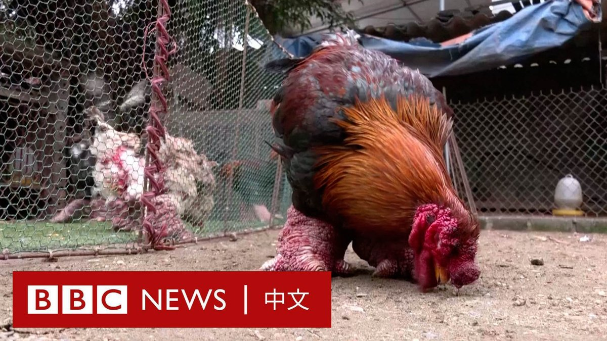
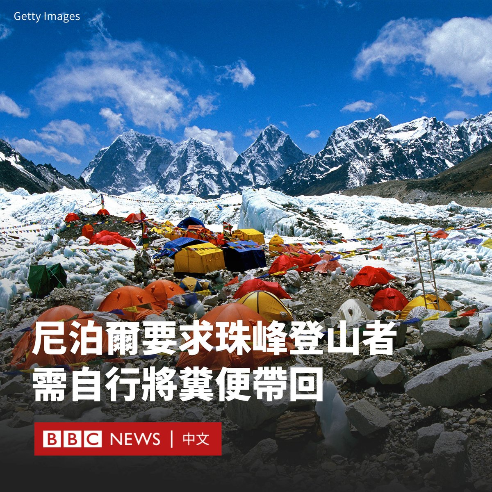
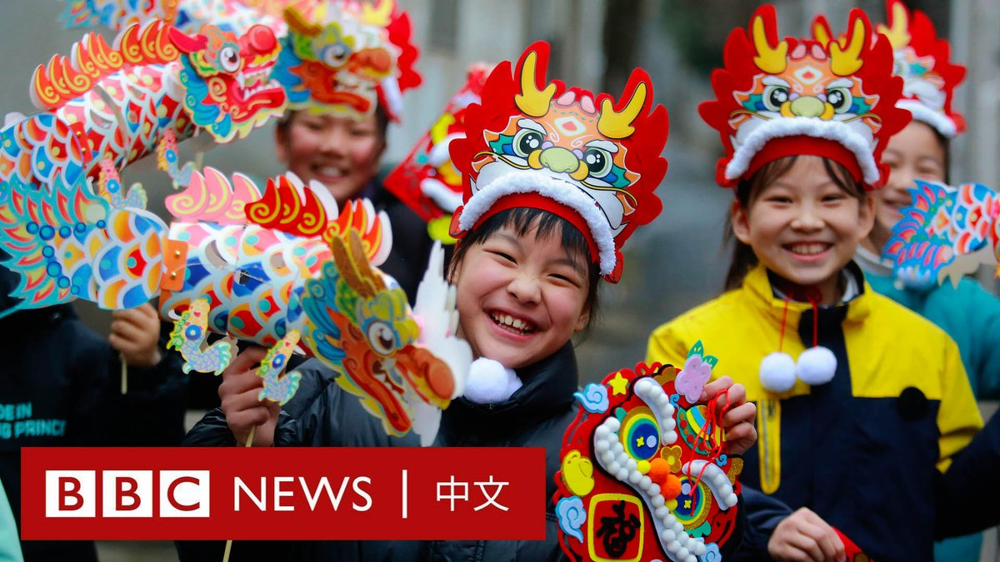

D英国广播公司BBC 北京时间 2024-02-09T20:56:02Z 1755938605699141783 中国官方媒体呼吁民众将“龙”的英文译为“loong”，而摒用“dragon”。报道指，西方龙是“口吐烈焰+巨翅长鳞+烈性如火”，形象负面，中国龙则是“马头+鹰爪+鱼鳞+鹿角+蛇身+没有翅膀”，代表好运吉祥。因此，“Loong”更贴近中国龙的原意。https://t.co/yriuvvlqy3   D英国广播公司BBC 北京时间 2024-02-09T19:40:49Z 1755919677652705294 全球华人以及越南和韩国等国正在迎来一年中最重要的节日——农历新年（春节）。很多城市都已张灯结彩，庆祝龙年的到来。

尽管龙是中国十二生肖中传说的动物，但在传统文化中拥有举足轻重的地位，其被视为是水中之王，掌控着降雨和台风，寓意吉祥与权势。

你是如何辞旧迎新的？欢迎与我们分享。🧨📷🧧 https://t.co/Il78H4487u   D英国广播公司BBC 北京时间 2024-02-09T17:20:46Z 1755884434623013201 二十多万名在台湾工作的越南移工如何庆祝新年，一解乡愁呢？BBC记者访问了一家越南人在嘉义开办的文化中心，以及一位在高雄买房的越南妈妈。https://t.co/BruEaqNZS8   D英国广播公司BBC 北京时间 2024-02-09T15:40:00Z 1755859074166693894 当龙与鸡结合，会发生什么？🐲🐔

龙年来临，越南人庆祝新年的美食“龙鸡”格外受到欢迎。这种鸡是越南的一种珍贵鸡种，它们有粗大的双腿，并长有深红色的鳞，犹如龙爪。 https://t.co/GeIdzPU1da   D英国广播公司BBC 北京时间 2024-02-09T13:25:22Z 1755825194613051859 在很多中国人踏上春节返乡路的同时，一些背井离乡的年轻人对于回家过年一事变得“三思而后行”，甚至有人为了逃避“热情的亲戚”而选择在外地过年。“过年不回家”成为了社交媒体上热议的话题。https://t.co/Zwa4usFv4N   D英国广播公司BBC 北京时间 2024-02-09T11:05:52Z 1755790085726073076 尼泊尔当局表示，攀登珠穆朗玛峰（Mount Everest）的人现在必须清理自己的粪便，并将其带回大本营进行处理。

巴桑拉穆农村自治市主席明玛·夏尔巴（Mingma Sherpa）告诉BBC：“我们的山已经开始散发臭味。”

这座覆盖珠峰大部分地区的自治市已经推出了关于粪便管理的新规定，以作为正在实施的更广泛保护措施的一部分。

由于极端温度，珠穆朗玛峰上留下的排泄物并不能完全降解。明玛说：“我们收到投诉，说岩石上可以看到人类粪便，一些登山者生病了。这有损我们的形象，是不可接受的。”

试图攀登珠峰和附近的洛子峰的登山者，将被要求在大本营购买所谓的“便袋”，这些便袋将在登山者“返回时进行检查”。

据估计，一名登山者平均每天会排出250克粪便。很少有攀登者把排泄物装在可生物降解的袋子里带回来，这可能需要数周时间。

尽管没有官方数据，但据非政府组织萨迦玛塔污染控制委员会（Sagarmatha Pollution Control Committee）估计，在珠峰底部的一号营地和顶峰附近的四号营地之间，大约有三吨人类排泄物。

斯蒂芬·凯克（Stephan Keck）是一名组织珠峰探险活动的国际山地向导。他说，位于世界第四高峰洛子峰及最高峰珠峰之间的南坳，有着“露天厕所”之称。

凯克表示，因为当地受强风横扫，冰雪很少，“所以你会看到到处都是人的粪便”。

在当局授权下，萨迦玛塔污染控制委员会目前正在采购约8000个便袋，用于预计抵达的400名外国登山者和800名支持人员。它们含有化学物质和粉末，可以使人类粪便凝固，减少其气味。   D英国广播公司BBC 北京时间 2024-02-09T09:03:00Z 1755759168190103741 在庆祝农历新年的中国和全球各地，亿万民众正在迎接“龙年”的到来。

龙是古代中华十二生肖之一。不过，在亚洲其他地方，生肖中的动物也有所不同。你知道有哪些不同吗？ https://t.co/cXeYd3GJnn   