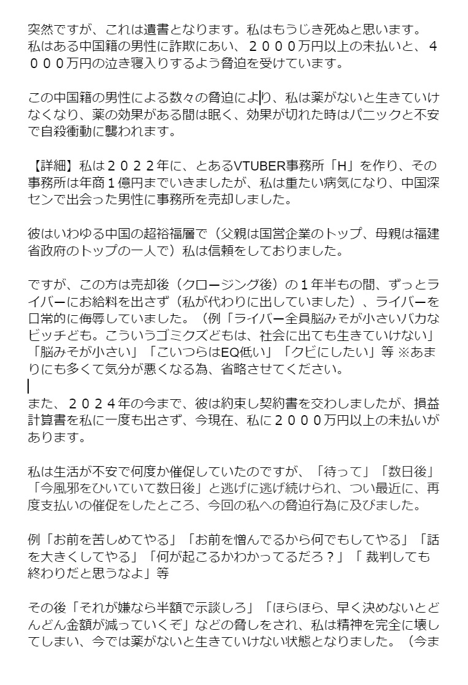
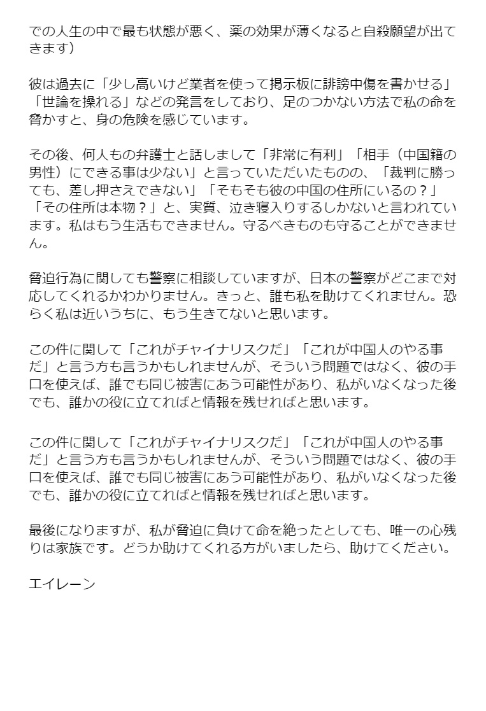

谁将十万横扫三江 北京时间 2024-02-09T22:33:04Z 1755963028640817292 RT @BitYoutube: 私は死のうと考えています。中国籍の男性に、あるVTUBER事務所「H」を２０２２年に売却しましたが、この男性から脅迫と、２０００万以上を未払い、そして４０００万の泣き寝入りを強要されています。 https://t.co/zftLYQGwJo   谁将十万横扫三江 北京时间 2024-02-09T21:49:27Z 1755952049634816106 RT @dagongxinwen: 在中国工作的朝鲜人“像奴隶一样受剥削” 据报发生骚乱 上月有报道称，在中国打工的朝鲜人因被拖欠薪金爆发骚乱，他们发现自己的工资被用来为平壤制造武器。

朝鲜人抗议的事件几乎闻所未闻，该国近乎完全控制了其公民，公开提出异议可能会被处决。… ht…   谁将十万横扫三江 北京时间 2024-02-09T13:46:52Z 1755830605521223884 RT @Glory_and_Dream: 我的天，这简直是赛博复刻伊朗伊斯兰革命期间左派犯过的错误……

1979年伊斯兰革命前后，伊朗的自由派和左派对霍梅尼是持赞许态度的，伊朗共产党的继承者伊朗人民党就说霍梅尼是“开明教士”，伊朗自由运动领导人巴扎尔甘也选择和霍梅尼合作。…   谁将十万横扫三江 北京时间 2024-02-09T14:21:04Z 1755839211608178881 RT @CDTChinese: 在一个不幸的社会里，敢于抗衡权力的人不可能是幸福的。 https://t.co/DRZzu7lwoL   谁将十万横扫三江 北京时间 2024-02-09T11:29:38Z 1755796066862342531 RT @lilaoshizuikeai: 1个月前新闻就已经说了梅西不保证出场。一般这种说辞意思其实就是说签的合同就是不上场。
那我主观臆测一下问题应该是在主办方的合同上。坊传报价是上梅西900万不上梅西400万。估计主办方就选了个折中的方式——两头忽悠。… https://t…   谁将十万横扫三江 北京时间 2024-02-09T08:27:50Z 1755750318737178723 百年了，还是这套义和团逻辑 https://t.co/kFhLhEeIfd   