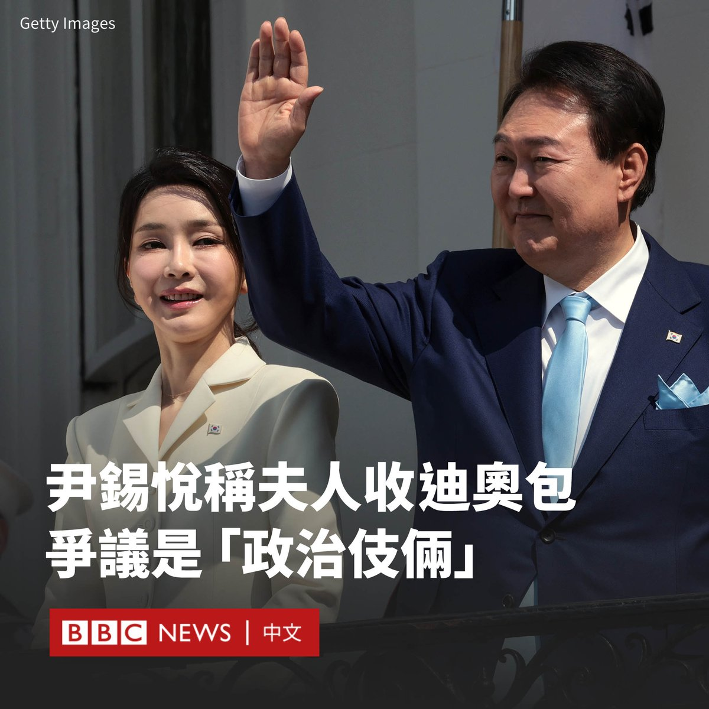
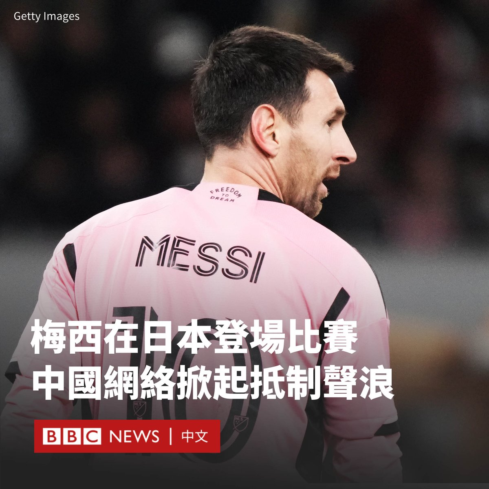
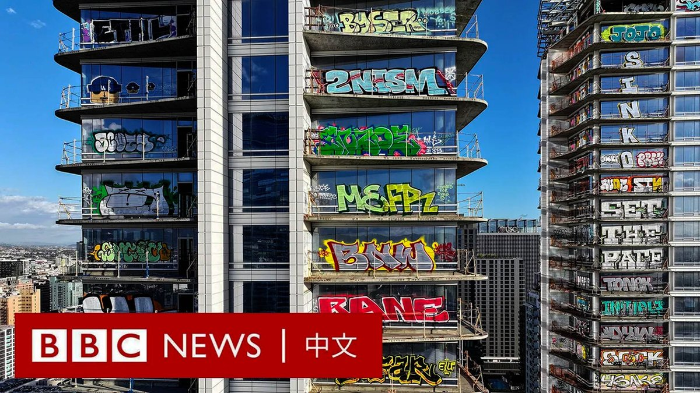

D英国广播公司BBC 北京时间 2024-02-08T19:35:05Z 1755555847218819407 这次演习设定在台湾发生紧急军事情况，模拟日美联军如何应对。演习不仅使用了未经修改的实际地图进行模拟作战，还首次将中国设定为“假想敌”。一些分析人士视此举为对北京发出的政治信号。https://t.co/FfsSztj4Jg   D英国广播公司BBC 北京时间 2024-02-08T14:50:28Z 1755484222054449466 一只2200美元的迪奥（Dior）手袋所引发的争议正不断在韩国延烧，给第一夫人金建希和力图在四月份的选举中赢得国会控制权的总统尹锡悦带来危机。

在首次针对该问题的公开评论中，尹锡悦表示，其夫人金建希被拍到接受奢侈品包礼物“令人遗憾”。但他没有对此道歉，并指这是“政治伎俩”。

尹锡悦在韩国KBS电视台的一档访谈节目中表示，“如果可以称之为问题的话，那就是她无法冷酷地拒绝他，这有点令人遗憾。”

但他强调，这段影片是用隐藏的摄像机偷拍，并时隔一年后在国会选举前夕予以发布，其本身就是一种“政治伎俩”。

这段影片是一位名叫崔在永（音译）的韩裔美国牧师在2022年9月用隐藏在手表里的摄像头拍摄的。一年多后，YouTube上的一个名为“首尔之声”的频道首次发布了该影片。

影片显示，崔在永在总统府外金建希的私人办公室里拜访了她，并向她赠送了据称是由“首尔之声”准备的礼物，该事件随即引发轩然大波。

反对党呼吁总统办公室就金建希涉嫌违反韩国反贪污法做出解释。该法规定公职人员及配偶一次性接受超过约750美元的礼物属于违法行为。

尹锡悦在节目中解释说，崔在永与妻子的父亲是同乡，以这种交情而联系上门。他表示会要求其妻子为人处世时划清界限，以防今后再度发生类似事件。

反对党共同民主党表示，尹锡悦没有真诚道歉。发言人权七胜说：“总统的无耻态度令人绝望。”

当地媒体报道称，总统办公室确认收到了这个手袋，并表示它“正在作为政府财产进行管理和储存”。

上周盖洛普韩国（Gallup Korea）的一项民意调查显示，尹锡悦的支持率已降至29%，为九个月来的最低水平。51岁的第一夫人的相关丑闻是受访者表示反对的原因之一。

该事件也造成了执政党国民力量党内的分歧。一位政党领导人将金建希比作法国因穷奢极欲而闻名的王后玛丽·安托瓦内特（Marie Antoinette）。   D英国广播公司BBC 北京时间 2024-02-08T12:34:57Z 1755450119879893308 球王梅西（Lionel Messi）上周缺阵香港表演赛事件持续发酵，随着周三（2月7日）梅西在另一场东京举行的友谊赛中上场，中国互联网上掀起了对他的抵制声浪。

香港政府再次要求主办方及球队作“合理解释”，为什么梅西在香港因伤缺阵，“三天后在日本却活跃自如上阵，而且作不短时间激烈运动”。

周三晚，梅西所在的迈阿密国际（Inter Miami）与日本联赛冠军神户胜利船（Vissel Kobe）在90分钟0比0战平，最终神户胜利船在点球大战以4比3险胜。

这场在东京国立竞技场进行的友谊赛，梅西开赛时坐在板凳上，现场近三万名球迷不时高喊“梅西”，试图让他出场。梅西在下半场第60分钟替补出场，在场上亮相约30分钟。

在中国社交平台微博上，梅西在日本出场的消息一度登上热搜榜首位。许多网民要求梅西解释为什么“区别对待”香港和日本，还有网民指责他“不尊重中国”，呼吁广告商与他解约。

“不尊重粉丝，浪费大家的热情，永远不要来！”一名中国网友写道。

香港立法会议员霍启刚在微博发文称，梅西在日本的表现“无疑是在我们香港球迷伤口上撒盐”，希望梅西、国际迈阿密及主办方给公众一个交代。

但也有网友表示，体育比赛本就有很多不确定因素，各方应该澄清当时签订的具体合约条款，用法律途径解决问题。

据香港媒体报道，香港消费者委员会已接获825宗与梅西事件相关的投诉，涉及总金额逾559万港元（72万美元）。许多购买高价门票的球迷仍然要求退款。

在日本的比赛进行前，梅西的认证账号发布了一篇声明，指其“很遗憾因为腹股沟有伤没能在香港站的友谊赛中出场，我的伤处发肿并有痛感”。

“希望有天我们有机会回来，为香港地区的球迷朋友倾力献上比赛。”声明写道。“给所有人一个拥抱，提前祝大家龙年大吉。”

但这条帖子并没有能安抚球迷的情绪，尤其是其发帖IP地址显示位于中国四川省，引发很多网友质疑其是否是梅西本人所写。

在香港的比赛举行后，迈阿密国际主教练马蒂诺（Gerardo Martino）曾在记者会上解释，梅西没有上阵是为了避免其受伤。

“我知道球迷们对于梅西和苏亚雷斯的缺席非常失望，我们对此道歉，但这是我们根据他们的伤情一起做出的决定。”他说，并指梅西出现内收肌伤情。   D英国广播公司BBC 北京时间 2024-02-08T09:47:23Z 1755407949197947213 一栋位于洛杉矶市中心的豪华公寓大楼上星期被发现画满涂鸦，该栋建筑物尚未完工，已被弃置五年以上。

当地警方说有超过十人进入大楼，大部分成功逃逸，共两人被捕。 https://t.co/HT3gVypBib   