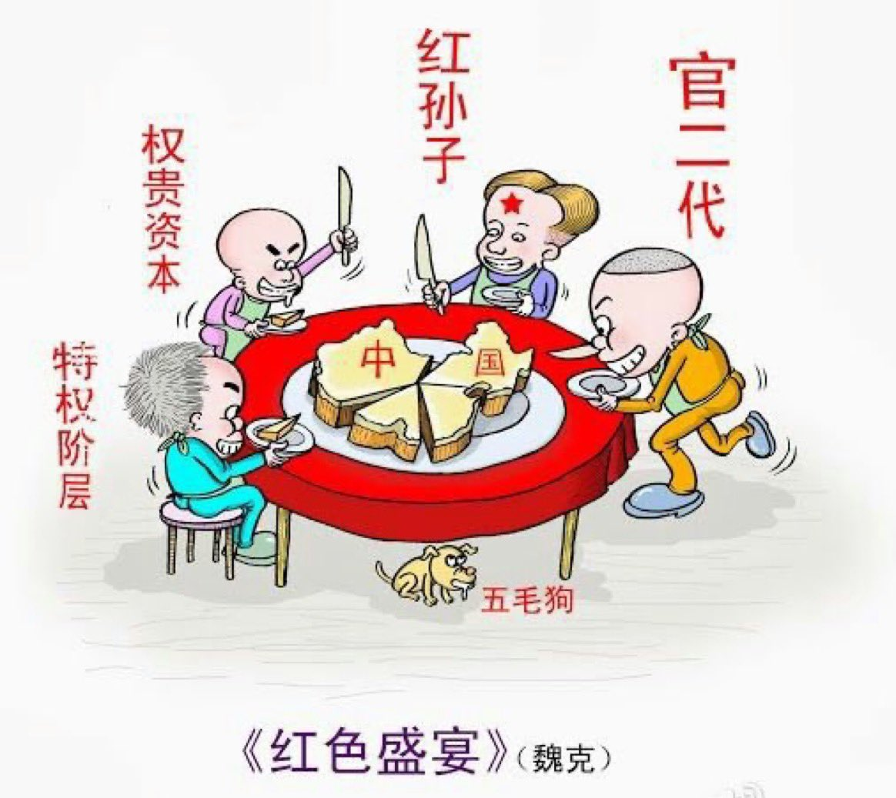
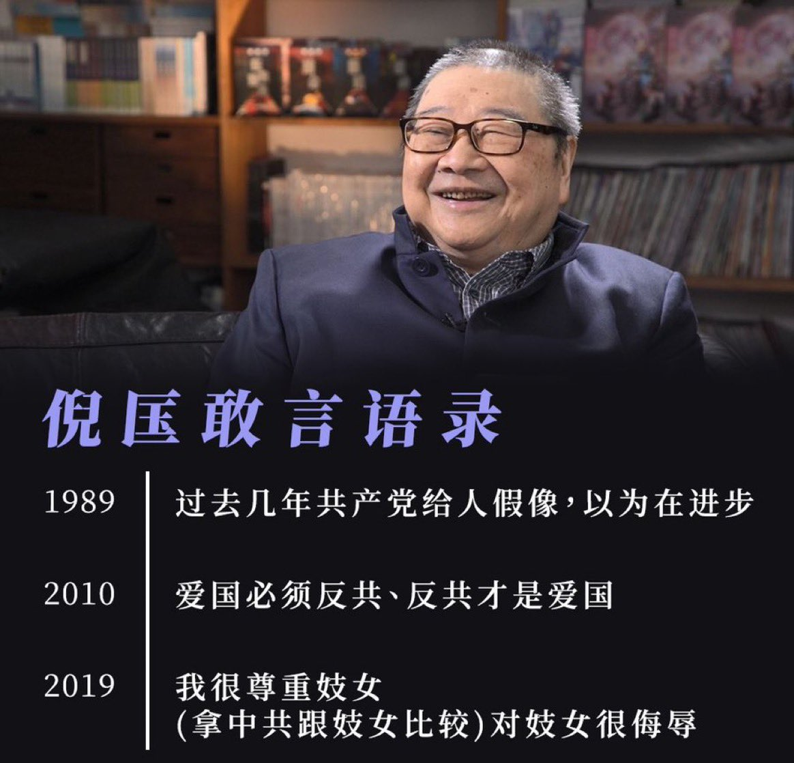
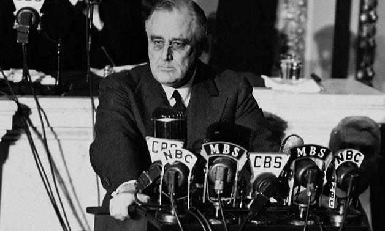
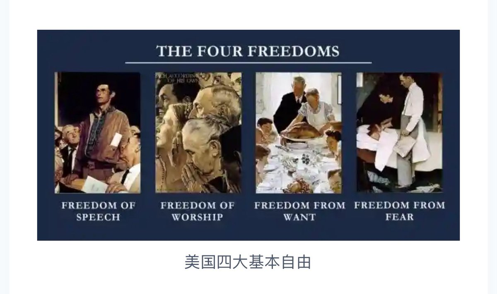

Ivy未央 北京时间 2024-02-08T13:34:57Z 1755465219663413540 到底谁才是中国的主人？
中国人民哪里是国家主人了? 
中共历来宣布, 对中国领导一切, 主宰一切, 一切姓党
请问五毛们: 即是主人, 那么你们有选票吗? 有监督权吗? 有财政支配权吗? 有自己的土地吗？有评论独裁的言论自由吗？为什么微信怕中共, 翻墙上网也怕中共?
连个屁都不敢放，有这样窝囊的主人吗？ https://t.co/Mn97jCEwUZ   Ivy未央 北京时间 2024-02-08T10:08:00Z 1755413137908498732 倪匡认为中共完全违反了人类的历史文明，“共产党最可怕之处是要洗脑，控制别人的思想意志，人在共产党的制度里只会变成完全服从的机械。”
每当听人说共产党进步了，他就说：“人家问食人部落领袖现在怎样了？他说我们进步了，用餐刀吃人肉。共产党现在的所谓进步就是用餐刀吃人肉。” https://t.co/5JIHELKNEB   Ivy未央 北京时间 2024-02-08T07:43:10Z 1755376688664289439 转）全世界都不要共产主义，我们要；全世界都要民主宪政，我们不要；全世界官员都没有享受特供，我们心安理得的享受；全世界都支持反独裁者的民众运动，我们不支持；全世界的人民都站起来了，我们却跪下了...

全世界都可以悼念六四，屠城的中共却不允许
中共为什么偏要与全世界不一样？ https://t.co/GqGqn9QYrs   Ivy未央 北京时间 2024-02-08T07:59:31Z 1755380802911670585 1941年，罗斯福在其“四大自由”演讲中重新定义了美国精神。
这四大自由：言论自由、信仰自由、免于匮乏和免于恐惧
这些自由的核心在于不仅限于美国国内，而是应被全世界所享有。
1948年，罗斯福去世后，他的夫人将这些理念融入《联合国人权宣言》。

知道为什么美国被誉为“灯塔国”吗？ https://t.co/qTlZbRXXiZ   