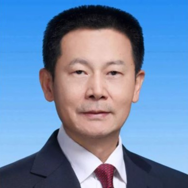

自由亚洲电台 北京时间 2024-02-08T06:06:13Z 1755352292163801523 中国新冠疫情"吹哨人" #李文亮逝世四周年，各地网友涌入社群平台悼念。
四年后的今天，中国已逐渐步出疫情，但迎来的是股市惨跌、十五年来春运最强雨雪。危机样态虽已改变，但专家认为，习近平惯于隐瞒基本真相的统治风格依然不变。
https://t.co/fqzgy0JKip   自由亚洲电台 北京时间 2024-02-08T06:11:00Z 1755353494138077661 专栏 | #军事无禁区: 法律战－中国重启 #M503航路 对台影响 https://t.co/nHnlTEIcDm   自由亚洲电台 北京时间 2024-02-08T06:13:30Z 1755354124881719482 这篇报道采访的同学都不约而同地选择匿名受访。
#吴啸雷 被判犯下网络跟踪罪、跨州传播威胁性通讯罪和缠扰罪。但人们离免于恐惧的自由，还有多远？
https://t.co/Tzpvt8M31B   自由亚洲电台 北京时间 2024-02-08T06:16:36Z 1755354905273864407 专栏 | #纵横大历史：文革系列　第七十八讲　#大串联（一） https://t.co/4G8fDxDp2z   自由亚洲电台 北京时间 2024-02-08T02:31:58Z 1755298370909016278 地主家也没余粮了！
#浦发银行 不发年终奖而是发 #一封家书 的话题冲上微博热搜。
#海关 也在收紧公务员福利，罚没旅客用品不再作为福利发给员工。https://t.co/UYzLcs3uBU   自由亚洲电台 北京时间 2024-02-08T04:17:30Z 1755324929459863939 暴雪堵路 地方政府应该承担什么角色？看看美国是怎么做的
本台记者王允 @Jeff23Wang  报道。https://t.co/RUCmc2irgE   自由亚洲电台 北京时间 2024-02-08T00:52:52Z 1755273434735743125 #危地马拉 去年十月才和 #台湾 庆祝建交九十周年，时隔三个月，上台才三周的新政府就释出考虑和北京发展正式经贸关系、和台湾维持既有关系的消息。
甘蔗有没有两头甜？
https://t.co/mp7YoxGlLX https://t.co/7hITg4X6oO   自由亚洲电台 北京时间 2024-02-08T01:51:53Z 1755288285235286083 #股市 搞不好，#证监会主席 换 #吴清
网友问：国家搞不好，换谁？
https://t.co/xuvGqwJukz https://t.co/eKBkjZZ9S2   自由亚洲电台 北京时间 2024-02-08T00:07:32Z 1755262024525685109 球王 #梅西 在 #日本 的表演赛中上场三十分钟，离场时与观众挥手，态度与 #香港 赛大不相同。
大批中国网民到梅西在各个社交平台的评论区留言表达不满，是对他个人还是借题发挥？https://t.co/SOAX4rJXld   自由亚洲电台 北京时间 2024-02-08T00:10:13Z 1755262700228334060 球王 #梅西 在 #日本 的表演赛中上场三十分钟，离场时与观众挥手，态度与 #香港 赛大不相同。
大批中国网民到梅西在各个社交平台的评论区留言表达不满，是对他个人还是借题发挥？https://t.co/1DPkBbcgQr https://t.co/U9wqbUsfxq   