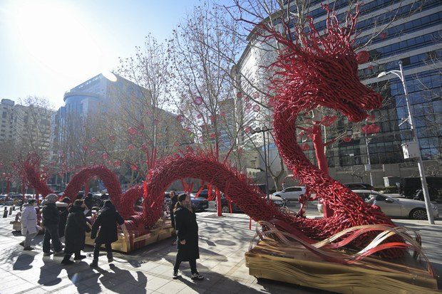
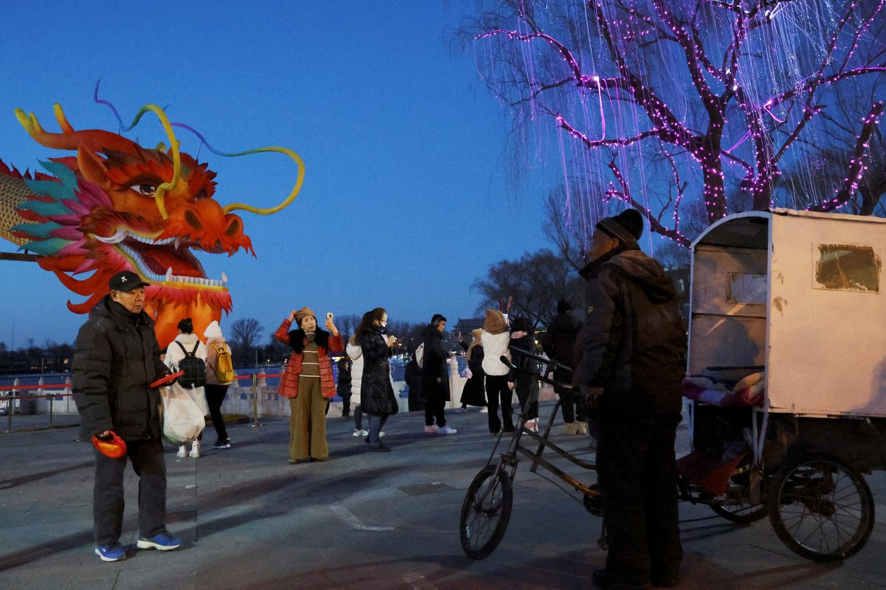
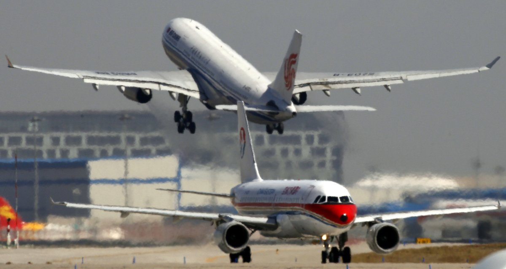
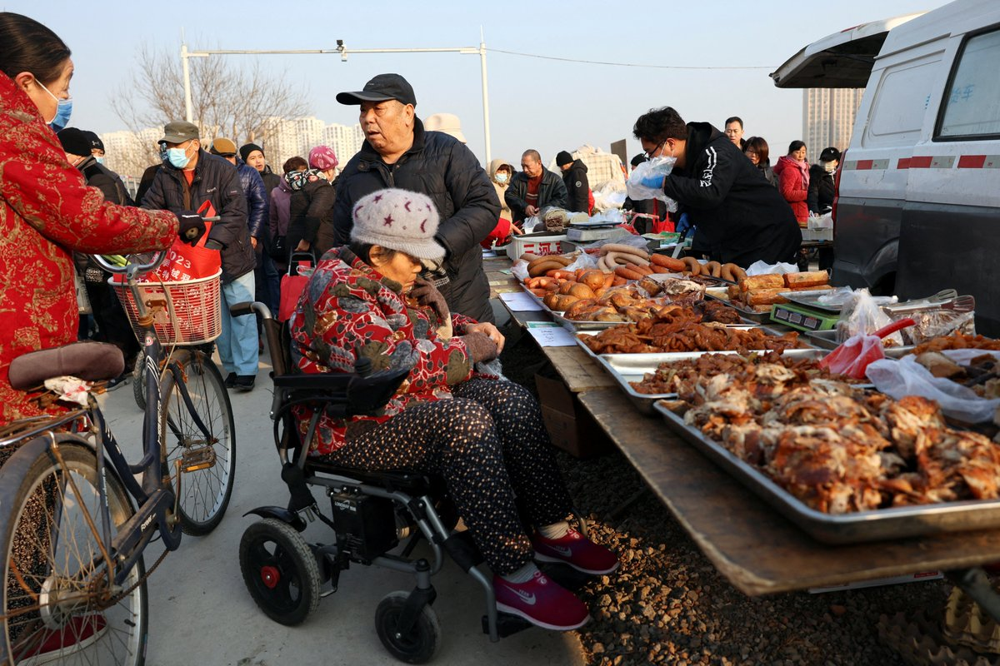
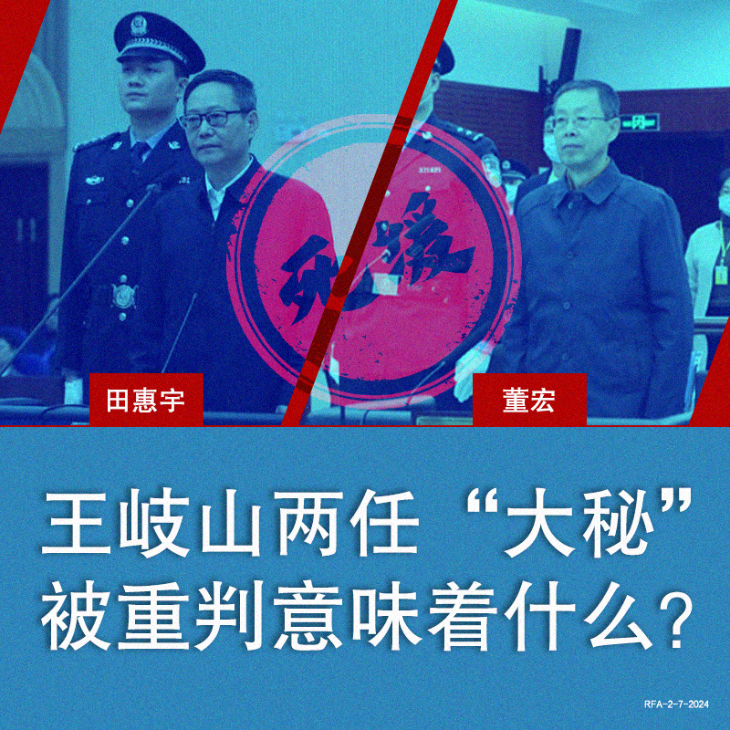
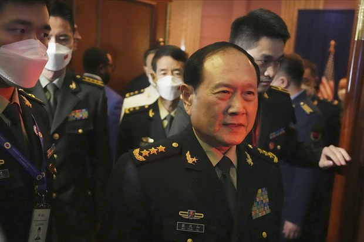
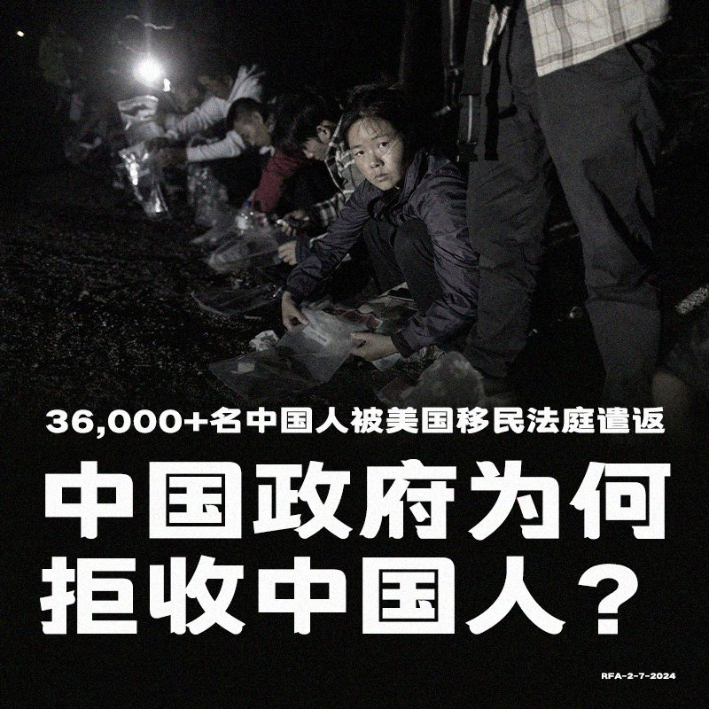
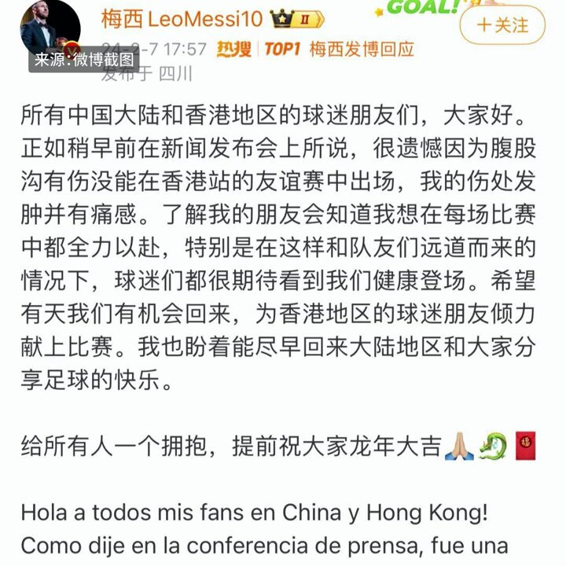

自由亚洲电台 北京时间 2024-02-08T21:43:54Z 1755588266965762174 RT @RFA_Chinese: 2022年1月28日，中央巡视组原副组长 #董宏 受贿4.63亿 被判死缓。
2024年2月5日，招商银行原党委书记、行长 #田惠宇 涉贪5亿被判死缓。
二人都曾任 #王岐山 秘书，他们被重判意味着什么？ https://t.co/oPrAyP…   自由亚洲电台 北京时间 2024-02-08T20:39:37Z 1755572088293736682 RT @RFA_Chinese: 【#诚征受访者】
2月5日以来，#A股 在跌到五年新低后，又在政府喊话干预下翻红，2亿散户 #股民 成为最大受害者。
国家队将更积极出手维稳，持股的散户打算如何处理手上股票？计划割肉杀出或是趁机抄底？
欢迎在评论区分享，如果您愿意接受采访，请留…   自由亚洲电台 北京时间 2024-02-08T21:44:29Z 1755588414680818122 RT @RFA_Chinese: 2月4日，CBS《新闻60分》报道称 #中国移民 是从墨西哥进入美国增长最快的群体 。据司法部数据，去年55%的中国移民获得庇护，而其他国家仅14%。
然而，根据移民及海关执法局数据，至少有36,000名中国人被美国移民法庭命令离开美国，中国经…   自由亚洲电台 北京时间 2024-02-08T23:50:43Z 1755620179533561992 #中国 在春节前发布最新 #经济 数据，CPI和PPI同比均下跌，连续四个月出现通缩，更有加剧的状况。与此同时，中国国家主席 #习近平 借新春前与各民主党派人士会面的机会向民企喊话，要求唱好经济光明论。https://t.co/ndBwlR3EoH https://t.co/GyKUPdCFkb   自由亚洲电台 北京时间 2024-02-08T20:41:19Z 1755572515064135881 RT @RFA_Chinese: 中国新冠疫情"吹哨人" #李文亮逝世四周年，各地网友涌入社群平台悼念。
四年后的今天，中国已逐渐步出疫情，但迎来的是股市惨跌、十五年来春运最强雨雪。危机样态虽已改变，但专家认为，习近平惯于隐瞒基本真相的统治风格依然不变。
https://t.c…   自由亚洲电台 北京时间 2024-02-08T21:44:48Z 1755588490828337213 RT @RFA_Chinese: 2月7日，#梅西道歉，就4日晚香港友谊赛未上场一事作出解释。
#迈阿密国际 4日下午在香港大球场与中国香港明星队进行表演赛，但球星梅西并未上场，引发球迷不满。2月7日，他在日本的表演赛中上场30分钟，与香港赛大不相同。
#梅西 香港行为什么“盛…   自由亚洲电台 北京时间 2024-02-08T23:53:23Z 1755620852303884404 RT @Jeff23Wang: 中国劳工阶层如何过春节？有朋友愿意接受采访吗？请私信我或加我的电报 @Wangj2025 感谢！ https://t.co/sloiP7jW13   自由亚洲电台 北京时间 2024-02-08T18:45:39Z 1755543409107034182 【两岸领导人春节谈话 】
【习近平: 风景这边独好】
【蔡英文: 台湾将持续走向世界】
中国国家主席习近平8日在春节团拜会上发表讲话说，一年来全面贯彻新发展理念，坚持稳中求进工作总基调，果断实行新冠疫情防控转段，推动经济恢复发展，经济总量超过126万亿元，粮食总产再创新高，就业、物价总体平稳，放眼全球仍然是“风景这边独好”。
台湾的总统蔡英文则是在8日晚间六点发布农历新年谈话说这是她担任总统8年任期的最后一次农历新年谈话。她相信，只要继续相互扶持，就能克服困难；只要继续团结一心，就能守护国家。新的一年，台湾将稳健向前行，持续走向世界。详细报道：https://t.co/xxeiqPQhbk   自由亚洲电台 北京时间 2024-02-08T17:21:18Z 1755522179150807257 【#梅西 在日本东京上场惹港府不满】
【港行政会议召集人要求禁梅西入境】
【环球时报：不排除有外部势力故意让香港难堪】
2月4日迈阿密国际队与香港明星队在香港进行表演赛，备受瞩目的阿根廷球星梅西（Lionel Messi）没有上场，7日在日本与神户胜利船的友谊赛上阵约30分钟，而且在场上健步如飞，还有试射和多次助攻，港府表达不满。https://t.co/fg2kwcFzvr
照片：Naoki Nishimura-USA TODAY Sports/REUTERS   自由亚洲电台 北京时间 2024-02-08T12:39:47Z 1755451333665280408 【中国片面改变M503航线】
【分析：企图将三海纳入中国势力范围】
中国日前宣布2月1日起取消M503航线自北向南飞行偏置，台湾强烈抗议，美国政府也表示反对片面改变台海现状。台湾的国防安全研究院执行长陈明祺分析，中国的企图是把台海、东海和南海纳入其势力范围。详细报道：https://t.co/NgrYgAtDB2
#M503   自由亚洲电台 北京时间 2024-02-08T12:07:48Z 1755443287308243219 【中国1月 #CPI 同比下降0.8%】
【连续四个月处于通缩区间】
中国国家统计局周四公布的数据显示，2024年1月份消费者价格指数(CPI)同比下降0.8%。降幅比上月扩大0.5个百分点，也高于市场预期。至此CPI已连续第四个月处于通缩区间。https://t.co/rjZS40FQ84 https://t.co/NEorvRR13Q   自由亚洲电台 北京时间 2024-02-08T09:17:57Z 1755400539544637850 RT @RFA_Chinese: 【#诚征受访者】
2月5日以来，#A股 在跌到五年新低后，又在政府喊话干预下翻红，2亿散户 #股民 成为最大受害者。
国家队将更积极出手维稳，持股的散户打算如何处理手上股票？计划割肉杀出或是趁机抄底？
欢迎在评论区分享，如果您愿意接受采访，请留…   自由亚洲电台 北京时间 2024-02-08T09:21:07Z 1755401338874466603 2022年1月28日，中央巡视组原副组长 #董宏 受贿4.63亿 被判死缓。
2024年2月5日，招商银行原党委书记、行长 #田惠宇 涉贪5亿被判死缓。
二人都曾任 #王岐山 秘书，他们被重判意味着什么？ https://t.co/oPrAyPHfeK   自由亚洲电台 北京时间 2024-02-08T06:19:21Z 1755355595878588606 本周三，中国官媒新华社发表了“中央领导同志看望老同志”文章，罗列了130多名被看望的中国高层元老，其中包括中共前总书记胡锦涛、前总理朱镕基、温家宝等，该名单中却没有提及前国务委员、国防部长 #魏凤和，使得外界更加相信魏凤和因为贪腐“落马”正在接受当局调查。
据台湾中央社7日报道，魏凤和现年70岁，他在去年3月卸任国务委员及国防部长职位，由李尚福接任。魏凤和卸任后受当局调查的传闻甚嚣尘上，他曾在2015年担任首任 #火箭军 司令员。由于火箭军长期存在贪腐问题，至今为止已有两任火箭军司令员周亚宁、李玉超都已经证实落马。   自由亚洲电台 北京时间 2024-02-08T06:24:21Z 1755356854492766263 2月4日，CBS《新闻60分》报道称 #中国移民 是从墨西哥进入美国增长最快的群体 。据司法部数据，去年55%的中国移民获得庇护，而其他国家仅14%。
然而，根据移民及海关执法局数据，至少有36,000名中国人被美国移民法庭命令离开美国，中国经常拒绝接收，而美国无法强迫中国接受他们。
您认为中国政府该不该接收被 #遣返 的中国人？   自由亚洲电台 北京时间 2024-02-08T08:00:10Z 1755380968016298053 欢迎收听和订阅播客【＃亚太报道】 https://t.co/MjLNSvVeAE
网友悼念 #李文亮 习政权依然我行我素；为救股市 #中国证监会 主席换人；#暴雪堵路 地方政府该承担什么角色？冰雨暴雪袭击华中，数十万辆车被困高速公路；#梅西 香港日本之行态度迥异 遭 #中国网民出征 https://t.co/M6OChpbkYc   自由亚洲电台 北京时间 2024-02-08T02:55:35Z 1755304315999171071 武汉居民李秀英本周三接受本台采访时说，这场大雪打乱了他们的行程：“现在很多人赶着回家过年，搭乘高铁因为没有电力驱动，很多人都被困在车上长达十几个小时，又冷又饿。开车走小路回家的如果是 #电动车，有的都瘫痪在路上了。” 
#雪灾  https://t.co/Sa8nmUXgtG   自由亚洲电台 北京时间 2024-02-08T03:59:17Z 1755320347803455965 最近红遍网络的 #英国钢琴家 #卡瓦纳 @brenkav（Brendan Kavanagh，又名Dr. K）受到台湾外长 #吴钊燮 邀请访问 #台湾。
https://t.co/lihfCQFjXA   自由亚洲电台 北京时间 2024-02-08T05:30:20Z 1755343260363489376 专栏 | #网络博弈: #海外自媒体台湾观选团 有哪些独到观察？ https://t.co/exACVY2hTk   自由亚洲电台 北京时间 2024-02-08T05:38:37Z 1755345344429232293 2月7日，#梅西道歉，就4日晚香港友谊赛未上场一事作出解释。
#迈阿密国际 4日下午在香港大球场与中国香港明星队进行表演赛，但球星梅西并未上场，引发球迷不满。2月7日，他在日本的表演赛中上场30分钟，与香港赛大不相同。
#梅西 香港行为什么“盛事”变成“闹剧”？“香港品牌”仍然响亮吗？
大批 #中国网民出征梅西。他们会接受梅西的道歉吗？   自由亚洲电台 北京时间 2024-02-08T06:06:13Z 1755352292163801523 中国新冠疫情"吹哨人" #李文亮逝世四周年，各地网友涌入社群平台悼念。
四年后的今天，中国已逐渐步出疫情，但迎来的是股市惨跌、十五年来春运最强雨雪。危机样态虽已改变，但专家认为，习近平惯于隐瞒基本真相的统治风格依然不变。
https://t.co/fqzgy0JKip   自由亚洲电台 北京时间 2024-02-08T06:11:00Z 1755353494138077661 专栏 | #军事无禁区: 法律战－中国重启 #M503航路 对台影响 https://t.co/nHnlTEIcDm   自由亚洲电台 北京时间 2024-02-08T06:13:30Z 1755354124881719482 这篇报道采访的同学都不约而同地选择匿名受访。
#吴啸雷 被判犯下网络跟踪罪、跨州传播威胁性通讯罪和缠扰罪。但人们离免于恐惧的自由，还有多远？
https://t.co/Tzpvt8M31B   自由亚洲电台 北京时间 2024-02-08T06:16:36Z 1755354905273864407 专栏 | #纵横大历史：文革系列　第七十八讲　#大串联（一） https://t.co/4G8fDxDp2z   自由亚洲电台 北京时间 2024-02-08T02:31:58Z 1755298370909016278 地主家也没余粮了！
#浦发银行 不发年终奖而是发 #一封家书 的话题冲上微博热搜。
#海关 也在收紧公务员福利，罚没旅客用品不再作为福利发给员工。https://t.co/UYzLcs3uBU   自由亚洲电台 北京时间 2024-02-08T04:17:30Z 1755324929459863939 暴雪堵路 地方政府应该承担什么角色？看看美国是怎么做的
本台记者王允 @Jeff23Wang  报道。https://t.co/RUCmc2irgE   自由亚洲电台 北京时间 2024-02-08T00:52:52Z 1755273434735743125 #危地马拉 去年十月才和 #台湾 庆祝建交九十周年，时隔三个月，上台才三周的新政府就释出考虑和北京发展正式经贸关系、和台湾维持既有关系的消息。
甘蔗有没有两头甜？
https://t.co/mp7YoxGlLX https://t.co/7hITg4X6oO   自由亚洲电台 北京时间 2024-02-08T01:51:53Z 1755288285235286083 #股市 搞不好，#证监会主席 换 #吴清
网友问：国家搞不好，换谁？
https://t.co/xuvGqwJukz https://t.co/eKBkjZZ9S2   自由亚洲电台 北京时间 2024-02-08T00:07:32Z 1755262024525685109 球王 #梅西 在 #日本 的表演赛中上场三十分钟，离场时与观众挥手，态度与 #香港 赛大不相同。
大批中国网民到梅西在各个社交平台的评论区留言表达不满，是对他个人还是借题发挥？https://t.co/SOAX4rJXld   自由亚洲电台 北京时间 2024-02-08T00:10:13Z 1755262700228334060 球王 #梅西 在 #日本 的表演赛中上场三十分钟，离场时与观众挥手，态度与 #香港 赛大不相同。
大批中国网民到梅西在各个社交平台的评论区留言表达不满，是对他个人还是借题发挥？https://t.co/1DPkBbcgQr https://t.co/U9wqbUsfxq   