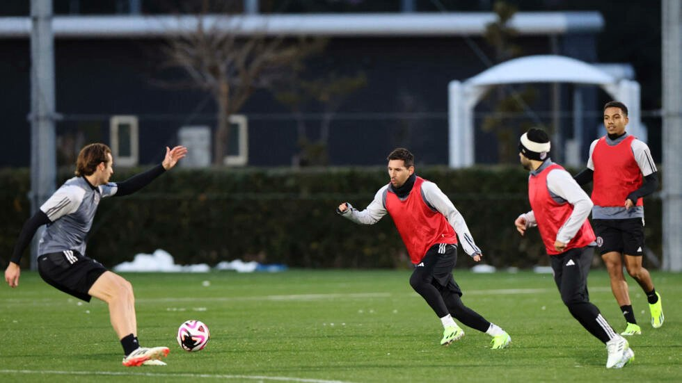
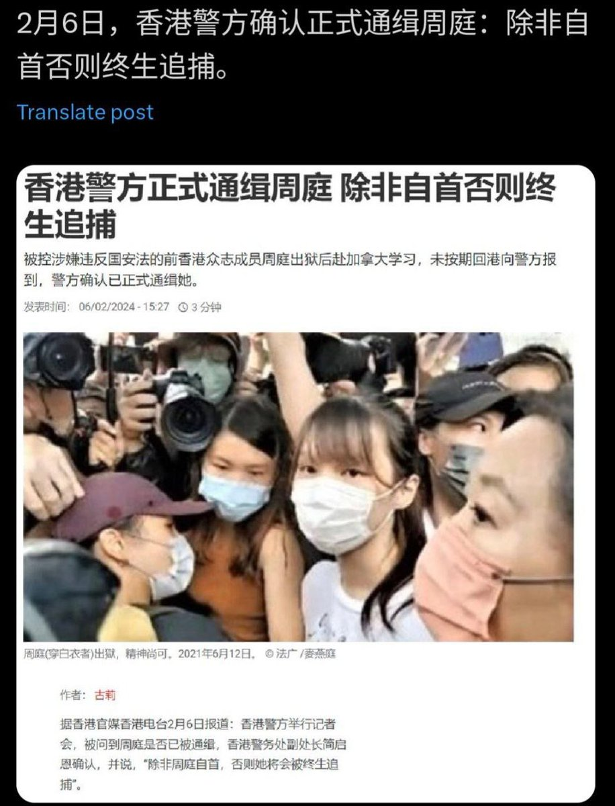
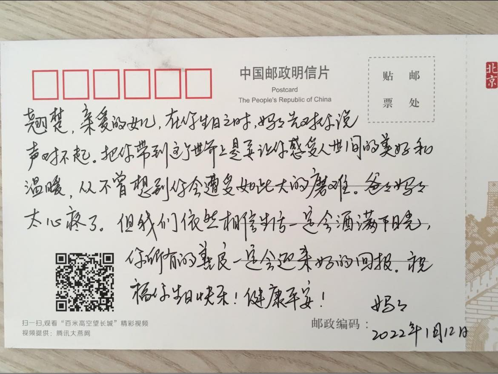

谁将十万横扫三江 北京时间 2024-02-08T12:27:30Z 1755448242723315984 RT @zkl86976526: 给你们讲个故事。
我母亲在我出柜后，一开始是强烈反对的。理由是：你想当女人，是要受很大的苦难。
90年代末，她985研究生毕业，结婚后却要承担所有家务、带孩子，因为照顾家庭而无法经营大工作项目，也是职场被领导排斥，十几年不能晋升；离婚前被丈夫家…   谁将十万横扫三江 北京时间 2024-02-08T12:35:36Z 1755450283466117254 [搞笑] 香港警方正式通缉梅西，除非自首否则终身追捕 https://t.co/5S0nPxSHaZ   谁将十万横扫三江 北京时间 2024-02-08T10:51:25Z 1755424064733364713 读李翘楚妈妈写的信，“在你生日之时，妈妈先对你说声对不起。把你带到这个世界上是要让你感受人世间的美好和温暖，从不曾想到你会遭受如此大的磨难。爸爸妈妈太心疼了”——没有语言能够描述这段文字带给我的感受，悲痛，愤怒，但不止。这段文字是关于伤害的，而人类语言极少坦诚地描述伤害。与国家暴力相遇，一个母亲决定向孩子表达悔悟——使孩子出生的悔悟，对自己以为孩子能够体验美好的天真的悔悟——还有比这更决绝更激进的控诉吗？

ps：翘楚的妈妈无法与翘楚见面，只能在高墙之外为她生日祈福。翘楚在给父母的信中提到，会给监室的人读书听。在病痛的折磨和恶劣的环境下，翘楚依然用自己的善良和美好温暖着周围的人。   谁将十万横扫三江 北京时间 2024-02-08T12:14:48Z 1755445045237567844 RT @boiledwater: ？ https://t.co/IwTVNwzGfg   