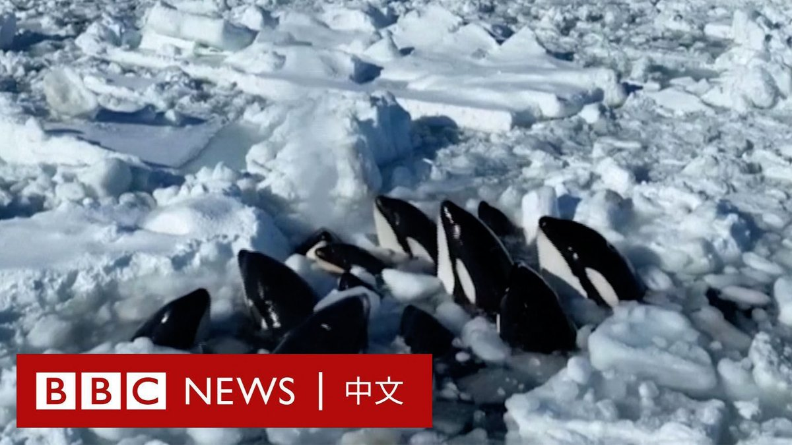
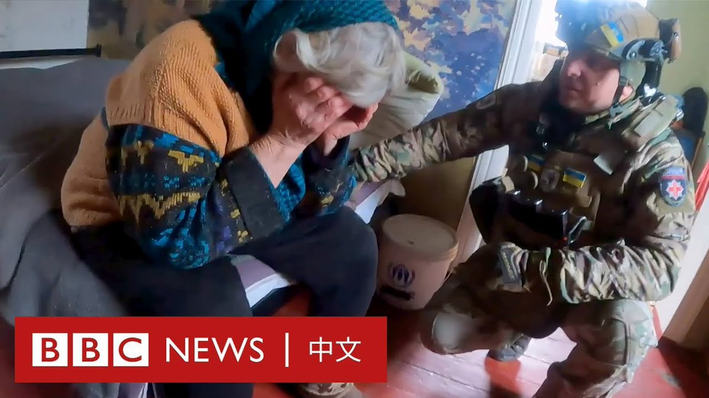

D英国广播公司BBC 北京时间 2024-02-07T19:00:32Z 1755184764984664505 美国联邦上诉法院裁定，前总统特朗普在涉嫌试图推翻2020年大选结果的案件中，不享有总统豁免权，不能免于刑事起诉。
https://t.co/flJj6g41YE   D英国广播公司BBC 北京时间 2024-02-07T16:04:38Z 1755140497197449341 踏入2024年，港股仍延续下跌态势，香港股市总市值一度被印度股市超越、港交所新股集资额跌出全球前五名。近年的政局变化也导致人才和资金外流，影响市场意愿和信心。

农历新年将至，市民对经济环境的实际感受与展望是怎么样的？ https://t.co/O2b9cgyaTM   D英国广播公司BBC 北京时间 2024-02-07T12:46:34Z 1755090654517199211 在日本北海道知床半岛海岸附近，一群虎鲸似乎被困在浮冰之中。画面显示，有十多只虎鲸聚集在一起，将头伸出水面呼吸。

据日本媒体报道，当地官员表示，由于冰层太厚，他们无法营救这些虎鲸，只能等待冰层破裂。

据报道，在2005年也发生过类似事件，当时有九只虎鲸被困在浮冰中死亡。 https://t.co/PQ818IUeXo   D英国广播公司BBC 北京时间 2024-02-07T10:12:38Z 1755051916751696380 乌克兰东部的阿夫迪伊夫卡（Avdiivka）数个月来遭俄军不断轰炸。许多居民离家躲避战火，让这个市镇的人口从战前的超过三万人减少到现今仅剩约一千人。

当地负责平民撤离的警察单位被称为“白天使”（White Angels），他们和BBC分享了过去一个月警员们劝说居民离开的经历。 https://t.co/bTEElTOTDL   